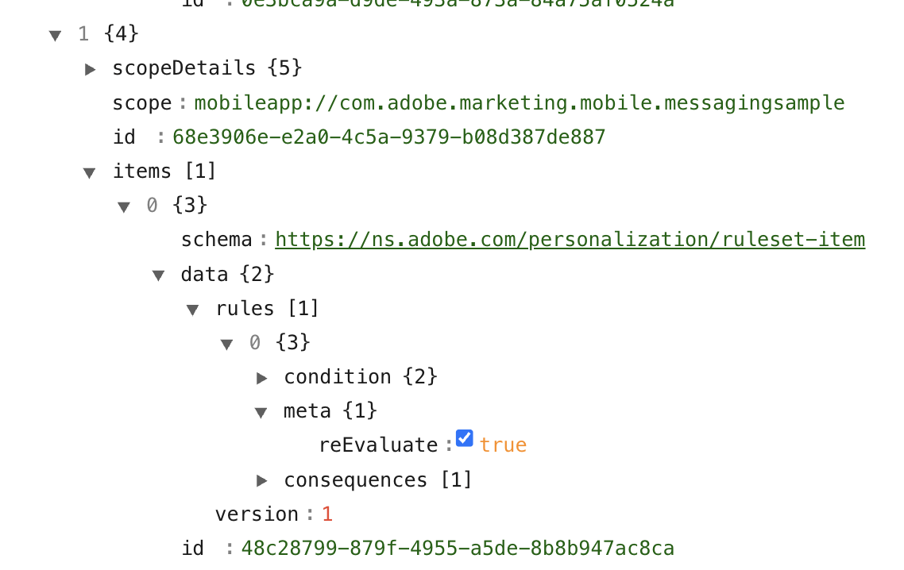

import Tabs from './tabs/rule-reevaluation.md'

# Re-evaluate in-app messages before display

## The problem we're solving

Here's a common scenario: your marketing team creates an in-app campaign with a promotional offer. A user opens the app, and the SDK fetches all active campaigns and caches them locally. So far, so good.

Now, an hour later, marketing realizes the offer had a typo, or worse - the promotion ended early. They update or stop the campaign in Journey Optimizer. But the user's app still has the old campaign cached in memory. When they trigger the message later that day, they see the outdated (or now-invalid) offer.

This happens because the SDK holds campaigns in memory until:
- The user closes and reopens the app
- Your app explicitly calls `refreshInAppMessages()` 

For most campaigns, this caching behavior is fine. But for certain campaigns - especially time-sensitive promotions or campaigns you might need to pull quickly - you need a way to verify the campaign is still valid before showing it.

That's what **Re-evaluate before display** does.

## How it works

When you enable re-evaluation for a campaign, the SDK checks back with the server before displaying that specific message. If the campaign was stopped, the content changed, or the rules were modified - the SDK fetches the latest state and only shows the message if it's still valid.

Think of it as a "double-check" before display. The tradeoff is a brief network call, but for campaigns where accuracy matters more than speed, it's worth it.

## Enabling re-evaluation in Journey Optimizer

When you're setting up your in-app message action in a campaign, you'll see a toggle called **Re-evaluate before display**. Enable it for campaigns that need this extra verification.



That's it from the campaign setup side. The SDK handles the rest automatically.

## When should you use this?

Not every campaign needs re-evaluation. Here's how we think about it:

**Use re-evaluation when:**
- The campaign has time-sensitive content (flash sales, limited offers)
- You might need to stop or modify the campaign on short notice
- The message content includes dynamic elements like pricing that could change
- You're running A/B tests and need to ensure users see the correct variant

**Skip re-evaluation when:**
- The campaign content is static and unlikely to change
- Display speed is more important than having the absolute latest content
- The campaign will run unchanged for its entire duration

## Technical details

### Rule metadata

When re-evaluation is enabled for a campaign, the rule includes a `meta` object with `reEvaluate` set to `true`:

```json
{
  "condition": { ... },
  "consequences": [ ... ],
  "meta": {
    "reEvaluate": true
  }
}
```

### SDK behavior

When a rule with `reEvaluate: true` matches an event:

1. The SDK identifies the rule as reevaluable from the `meta` property
2. The SDK refreshes campaign data from the server
3. Rules are re-evaluated with the updated campaign data
4. The message is displayed only if the rule still matches

### Code reference

The Messaging extension implements `RuleReevaluationInterceptor` internally. When a reevaluable rule is triggered, the Messaging extension refreshes campaigns from the server and calls the completion handler to trigger re-evaluation with the updated data.

<TabsBlock orientation="horizontal" slots="heading, content" repeat="2"/>

Android

<Tabs query="platform=android&function=interceptor"/>

iOS

<Tabs query="platform=ios&function=interceptor"/>

## Related documentation

- [Programmatically control the display of in-app messages](./messaging-delegate.md)
- [In-App Messaging API Reference](../api-reference.md)
