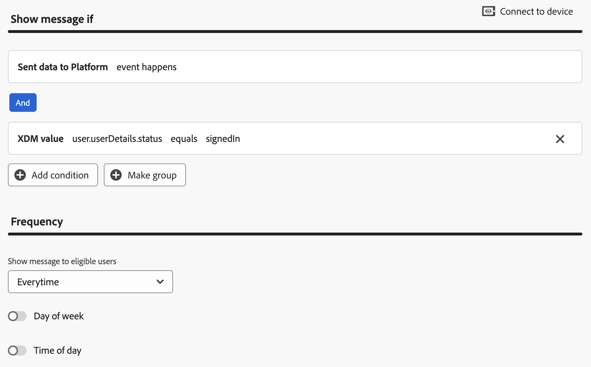

<Variant platform="android" function="send-event" repeat="12"/>

**Triggering a campaign using a simple key and value pair:**

The basic example described above will have a rule trigger created on the AJO UI which looks like:

```text
(Sent data to Platform event happens) AND (XDM value status = signedIn)
```

We can then trigger the campaign using a map containing the specified key value pair:

```kotlin
// Create an Experience Event
val xdmData = mapOf("status" to "signedIn")
val signinEvent = ExperienceEvent.Builder()
     							.setXdmSchema(xdmData)
                	.build()

// Send the event to the experience platform
Edge.sendEvent(signinEvent, null)
```

**Triggering a campaign using a key and value pair nested in a map**

If we have a more complex map named `userDetails` nested within another map named `user`:

```json
"user": {
   "userDetails": {
      "status": "signedIn",
      "firstName": "John",
      "lastName": "Doe"
   },
   "identifiers" : {
   		"ECID": "28649146398838158895030626237041592948",
   		"someOtherId": "e374aed66f6a3fda58aacb2d5e2cae5ce8d6ad1bbea2fedfd2640ac0d5be8d2e"
   }
},
```
We can setup a rule trigger on the AJO UI which uses a dot notation to access the nested map's key value pairs:



We can then trigger the campaign using xdm data containing nested maps:

```kotlin
// Create an Experience Event
val userDetails = mapOf("status" to "signedIn", "firstName" to "John", "lastName" to "Doe")
val identifiers = mapOf("ECID" to "28649146398838158895030626237041592948", "someOtherId" to "e374aed66f6a3fda58aacb2d5e2cae5ce8d6ad1bbea2fedfd2640ac0d5be8d2e")
val userData = mapOf("userDetails" to userDetails, "identifiers" to identifiers)
val xdmData = mapOf("user" to userData)
val signinEvent = ExperienceEvent.Builder()
			.setXdmSchema(xdmData)
			.build()

// Send the event to the experience platform
Edge.sendEvent(signinEvent, null)
```

<Variant platform="ios" function="send-event" repeat="12"/>

**Triggering a campaign using a simple key and value pair:**

The basic example described above will have a rule trigger created on the AJO UI which looks like:

```text
(Sent data to Platform event happens) AND (XDM value status = signedIn)
```

We can then trigger the campaign using a dictionary containing the specified key value pair:

```swift
// Create an Experience Event
let xdmData = ["status" : "signedIn"]
let signinEvent = ExperienceEvent(xdm: xdmData)

// Send the event to the experience platform
AEPEdge.Edge.sendEvent(experienceEvent: signinEvent)
```

**Triggering a campaign using a key and value pair nested in a dictionary**

If we have a more complex dictionary named `userDetails` nested within another dictionary named `user`:

```json
"user": {
   "userDetails": {
      "status": "signedIn",
      "firstName": "John",
      "lastName": "Doe"
   },
   "identifiers" : {
   		"ECID": "28649146398838158895030626237041592948",
   		"someOtherId": "e374aed66f6a3fda58aacb2d5e2cae5ce8d6ad1bbea2fedfd2640ac0d5be8d2e"
   }
},
```

We can setup a rule trigger on the AJO UI which uses a dot notation to access the nested dictionary's key value pairs:


We can then trigger the campaign using xdm data containing nested dictionaries:

```swift
// Create an Experience Event
let userDetails = ["status" : "signedIn", "firstName": "John", "lastName": "Doe"]
let identifiers = ["ECID" : "28649146398838158895030626237041592948", "someOtherId" : "e374aed66f6a3fda58aacb2d5e2cae5ce8d6ad1bbea2fedfd2640ac0d5be8d2e"]
let userData = ["userDetails" : userDetails, "identifiers" : identifiers]
let xdmData = ["user" : userData]
let signinEvent = ExperienceEvent(xdm: xdmData)

// Send the event to the experience platform
AEPEdge.Edge.sendEvent(experienceEvent: signinEvent)
```
