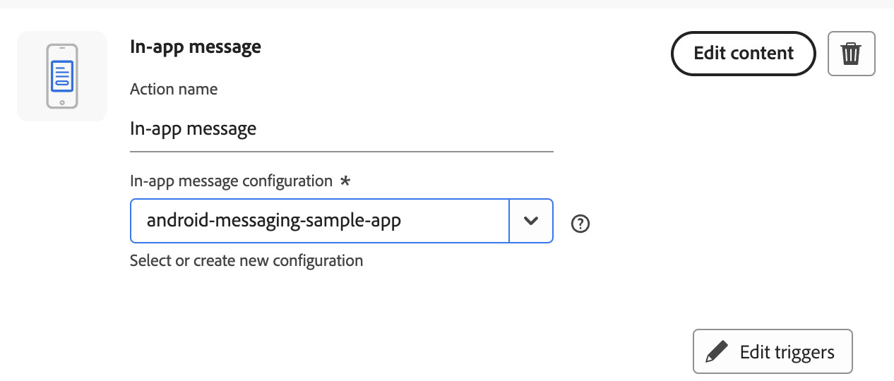
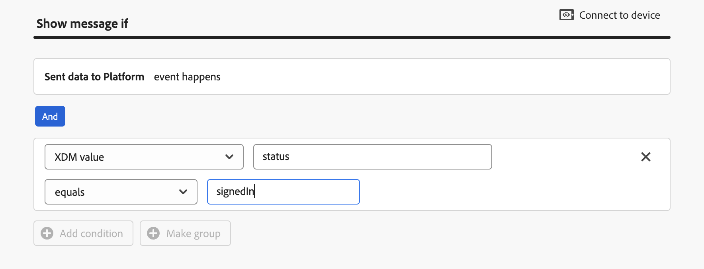
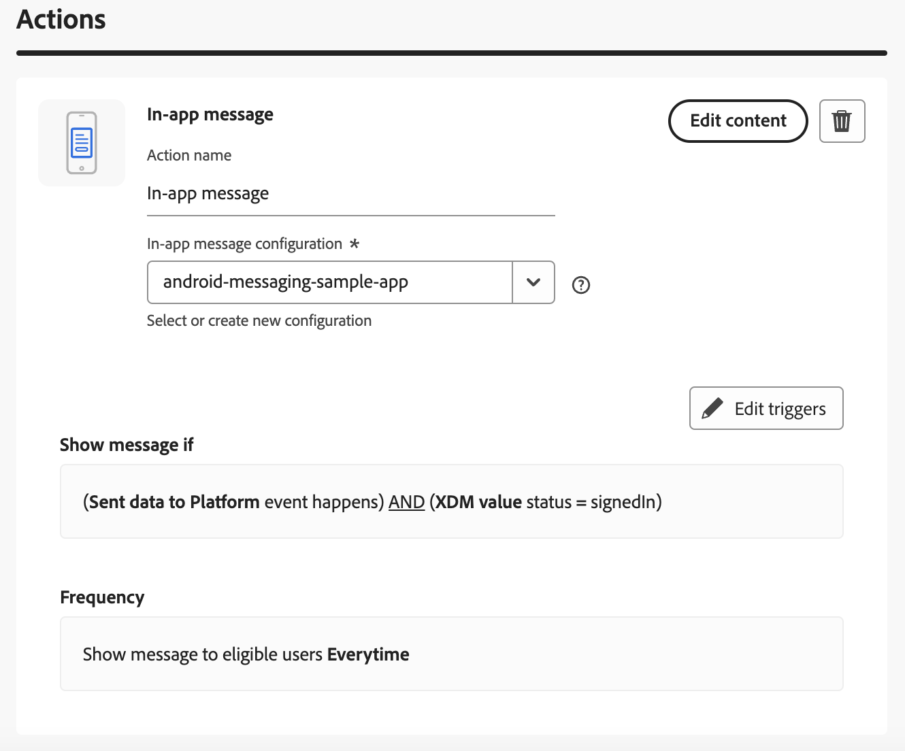

# Trigger Adobe Journey Optimizer campaigns using the send data to platform event

This guide explains how to set up, then trigger Adobe Journey Optimizer campaigns by using the `send data to platform event` trigger available in the Adobe Journey Optimizer UI.

## Prerequisites

* Intermediate knowledge of AJO in-app message or content card campaign creation. Documentation regarding these two campaign types is available at:
  * https://experienceleague.adobe.com/en/docs/journey-optimizer/using/channels/in-app/create-in-app
  * https://experienceleague.adobe.com/en/docs/journey-optimizer/using/channels/content-card/create-content-card

## AJO Campaign setup

1. Create a scheduled campaign containing an in-app message action.
   
2. In-app campaigns (as well as content cards) support rule based triggers. For this example, we will create a campaign containing an in-app message action which will be triggered using the *"Send data to platform event"*. Click *"Edit Triggers"* and setup a *"Send data to Platform"* event trigger with a condition of *"XDM value"*. The created condition will be satisfied by a defined key value pair. The key value pair must be present within an Experience event request sent by your app. For this example, we will use a key of "status" and a value of "signedIn" to show our in-app message when a user has signed in to our app.
   
3. The completed in-app campaign with the *"Send data to platform event"* trigger setup will look like:
   
4. Review and activate the campaign after the in-app action content authoring is complete.

## Trigger the campaign using the send data to platform event

To trigger an Adobe Journey Optimizer campaign, you need to send an Experience event to Experience Platform. This event should contain the data that matches your campaign's trigger conditions.

### Android

**Triggering a campaign using a simple key and value pair:**

The basic example described above will have a rule trigger created on the AJO UI which looks like:

```text
(Sent data to Platform event happens) AND (XDM value status = signedIn)
```

We can then trigger the campaign using a map containing the specified key value pair:

```kotlin
// Create an Experience Event
val xdmData = mapOf("status" to "signedIn")
val signinEvent = ExperienceEvent.Builder()
     							.setXdmSchema(xdmData)
                	.build()

// Send the event to the experience platform
Edge.sendEvent(signinEvent, null)
```

**Triggering a campaign using a key and value pair nested in a map**

If we have a more complex map named `userDetails` nested within another map named `user`:

```json
"user": {
   "userDetails": {
      "status": "signedIn",
      "firstName": "John",
      "lastName": "Doe"
   },
   "identifiers" : {
   		"ECID": "28649146398838158895030626237041592948",
   		"someOtherId": "e374aed66f6a3fda58aacb2d5e2cae5ce8d6ad1bbea2fedfd2640ac0d5be8d2e"
   }
},
```

We can setup a rule trigger on the AJO UI which uses a dot notation to access the nested map's key value pairs:


We can then trigger the campaign using XDM data containing nested maps:

```kotlin
// Create an Experience Event
val userDetails = mapOf("status" to "signedIn", "firstName" to "John", "lastName" to "Doe")
val identifiers = mapOf("ECID" to "28649146398838158895030626237041592948", "someOtherId" to "e374aed66f6a3fda58aacb2d5e2cae5ce8d6ad1bbea2fedfd2640ac0d5be8d2e")
val userData = mapOf("userDetails" to userDetails, "identifiers" to identifiers)
val xdmData = mapOf("user" to userData)
val signinEvent = ExperienceEvent.Builder()
			.setXdmSchema(xdmData)
			.build()

// Send the event to the experience platform
Edge.sendEvent(signinEvent, null)
```

### iOS

**Triggering a campaign using a simple key and value pair:**

The basic example described above will have a rule trigger created on the AJO UI which looks like:

```text
(Sent data to Platform event happens) AND (XDM value status = signedIn)
```

We can then trigger the campaign using a dictionary containing the specified key value pair:

```swift
// Create an Experience Event
let xdmData = ["status" : "signedIn"]
let signinEvent = ExperienceEvent(xdm: xdmData)

// Send the event to the experience platform
AEPEdge.Edge.sendEvent(experienceEvent: signinEvent)
```

**Triggering a campaign using a key and value pair nested in a dictionary**

If we have a more complex dictionary named `userDetails` nested within another dictionary named `user`:

```json
"user": {
   "userDetails": {
      "status": "signedIn",
      "firstName": "John",
      "lastName": "Doe"
   },
   "identifiers" : {
   		"ECID": "28649146398838158895030626237041592948",
   		"someOtherId": "e374aed66f6a3fda58aacb2d5e2cae5ce8d6ad1bbea2fedfd2640ac0d5be8d2e"
   }
},
```

We can setup a rule trigger on the AJO UI which uses a dot notation to access the nested dictionary's key value pairs:


We can then trigger the campaign using XDM data containing nested dictionaries:

```swift
// Create an Experience Event
let userDetails = ["status" : "signedIn", "firstName": "John", "lastName": "Doe"]
let identifiers = ["ECID" : "28649146398838158895030626237041592948", "someOtherId" : "e374aed66f6a3fda58aacb2d5e2cae5ce8d6ad1bbea2fedfd2640ac0d5be8d2e"]
let userData = ["userDetails" : userDetails, "identifiers" : identifiers]
let xdmData = ["user" : userData]
let signinEvent = ExperienceEvent(xdm: xdmData)

// Send the event to the experience platform
AEPEdge.Edge.sendEvent(experienceEvent: signinEvent)
```

## Triggers using values within arrays in event data

You can use a key-value pair within an array in the event data by specifying its full path along with its index in the array. Please see the [Event data key flattening](../../../../home/base/mobile-core/rules-engine/technical-details.md#event-data-key-flattening) section for more information.

For example, you can trigger an in-app message when an event sent to Experience Platform has the key-value pair `"sku": "1234"` in the `productlistitems` array in its event data.

```json
"xdm": {
     "productlistitems": [
          {
              "sku": "1234"
          },
          {
              "sku": "4567"
          }
       ]
},
```

In this case, the condition can be specified as:

```text
(Sent data to Platform event happens) AND (XDM value productlistitems.0.sku = 1234)
```
