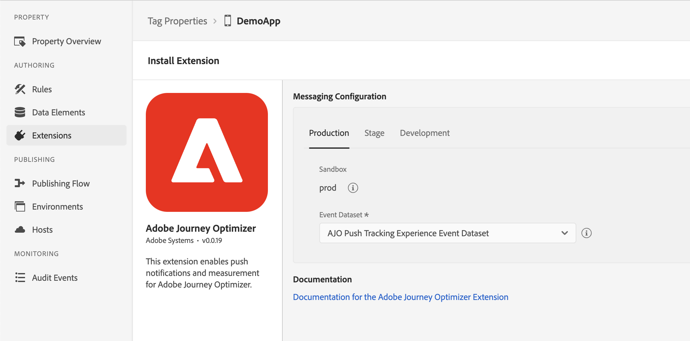

import Tabs from './tabs/index.md'
import InitializeSDK from '/src/pages/resources/initialize.md'

# Adobe Journey Optimizer

The [Adobe Journey Optimizer](https://business.adobe.com/products/journey-optimizer/adobe-journey-optimizer.html) extension for Adobe Experience Platform Mobile SDKs powers push notifications and in-app messages for your mobile apps. This extension also helps you to collect user push tokens and manages interaction measurement with Adobe Experience Platform services.

The following documentation details how to use the extension and required configurations to get started with Adobe Journey Optimizer for Adobe Experience Platform services, app stores, and your apps.

## Before starting

1. Read the tutorial on [getting started with push configuration](https://experienceleague.adobe.com/docs/journey-optimizer/using/get-started/configuration/push-config/push-gs.html) to learn how to configure push channels in Adobe Journey Optimizer.
2. [Update your app's Datastream](#update-datastream-with-profile-dataset) in [Adobe Experience Platform Data Collection](https://experience.adobe.com/#/data-collection/)
3. Integrate with following extensions:
   * [Mobile Core](../../home/base/mobile-core/index.md)
   * [Adobe Experience Platform Edge Network](../../edge/edge-network/index.md)
   * [Identity for Edge Network](../../edge/identity-for-edge-network/index.md)

### Update Datastream with a Profile dataset

Navigate to a previously configured Datastream by following the instructions in the [configure datastreams tutorial](../../home/getting-started/configure-datastreams.md) in [Adobe Experience Platform Data Collection](https://experience.adobe.com/#/data-collection/) and select **Add Service**. In the service dropdown select **Adobe Experience Platform**.

* In the **Event Dataset** dropdown, select a dataset previously created in the [Adobe Experience Platform](https://experience.adobe.com/#/platform) UI.
* In the **Profile Dataset** dropdown, select the **AJO Push Profile Dataset**.
* Ensure the **Personalized Destinations** box is checked.
* Ensure the **Adobe Journey Optimizer** box is checked.
* Select **Save** after making these selections.

## Set up a mobile property in Adobe Data Collection

To learn how to create the mobile property, please read the tutorial on [creating a mobile property](../../home/getting-started/create-a-mobile-property.md)

Now that a mobile property is created, we can setup the Adobe Journey Optimizer extension.

## Setup Adobe Journey Optimizer extension

### Configure extension in the Data Collection UI

Go to the [Experience Platform Data Collection UI](https://experience.adobe.com/#/data-collection/), select mobile property and navigate to **Extensions** from the left navigation panel:

1. Navigate to the **Catalog** tab, locate the **Adobe Journey Optimizer** extension, and select **Install**
2. Select the pre-created **AJO Push Tracking Experience Event Dataset** from the **Event Dataset** dropdown.
3. Select **Save**.
4. [Follow the publishing process](../../home/getting-started/create-a-mobile-property.md#publish-the-configuration) to update SDK configuration.

<InlineAlert variant="info" slots="text"/>

The datasets selected should use a schema that uses the "Push Notification Tracking" XDM field group. The pre-created CJM Push Tracking Dataset contains this XDM field group in its schema definition. For more information, please read the tutorial on [setting up schemas and datasets](../../home/getting-started/set-up-schemas-and-datasets.md).

## Add the Adobe Journey Optimizer extension to your app

### Include Messaging extension as an app dependency

Add MobileCore, Edge and Messaging extensions as dependencies to your project.

<TabsBlock orientation="horizontal" slots="heading, content" repeat="3"/>

Kotlin (Android)

<Tabs query="platform=android-kotlin&task=add"/>

Groovy (Android)

<Tabs query="platform=android-groovy&task=add"/>

CocoaPods (iOS)

<Tabs query="platform=ios-pods&task=add"/>

### Initialize Adobe Experience Platform SDK with Messaging Extension

Next, initialize the SDK by registering all the solution extensions that have been added as dependencies to your project with Mobile Core. For detailed instructions, refer to the [initialization](/src/pages/home/getting-started/get-the-sdk/#2-add-initialization-code) section of the getting started page.

Using the `MobileCore.initialize` API to initialize the Adobe Experience Platform Mobile SDK simplifies the process by automatically registering solution extensions and enabling lifecycle tracking.

<InitializeSDK query="componentClass=TabsBlock"/>

## Configuration keys

You can update the SDK configuration, including the Messaging configuration values, programmatically by using the following information.

| Key | Required | Description | Data Type | Operating System |
| :--- | :--- | :--- | :--- | :--- |
| messaging.eventDataset | Yes | Experience Event Dataset ID which can be found from Experience Platform | String | Android/iOS |
| messaging.useSandbox | No | A variable that lets the `apnsSandbox` environment be used for receiving push notifications. More details can be found in the [messaging documentation](https://github.com/adobe/aepsdk-messaging-ios/blob/main/Documentation/sources/getting-started.md#using-an-apns-sandbox-push-environment) | Boolean | iOS |

## Next Steps

* [Push notification implementation guide](./push-notification/index.md)
* [In-App message implementation guide](./in-app-message/index.md)
* [Code-based experiences implementation guide](./code-based/index.md)
