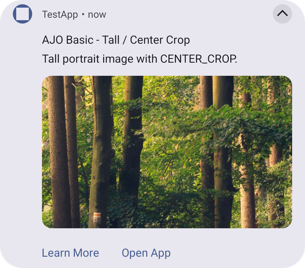
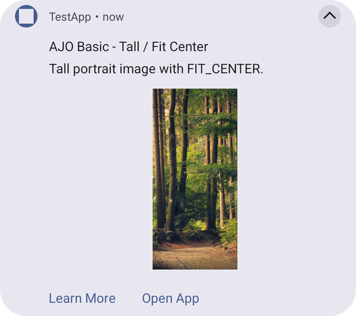

# Basic template

A title, a body, and an expanded hero image. The same body text is shown in both the collapsed and expanded states.

## How it looks

The expanded notification shows the hero image below the body text. The image scale type controls how the image fills its frame. The following example shows the same portrait image with each scale type:

| `center_crop` (default) | `fit_center` |
| :---------------------: | :----------: |
|  |  |

* `center_crop` fills the frame and crops the edges of the image that don't fit.
* `fit_center` shows the whole image, scaled down to fit the frame.

### Image guidelines

* Use a landscape image so it fills the frame without heavy cropping. Small images look blurry when they are scaled up to fill the frame.
* Animated GIFs show only their first frame.
* If the image can't be downloaded, the notification is shown with its text only.

## Configuration

This template is rendered by the [UI Builder plugin](../../../../../home/base/mobile-core/plugins/built-in-plugins/ui-builder-plugin.md). To add the plugin to your app, see [Add the UI Builder plugin to your app](../../../../../home/base/mobile-core/plugins/built-in-plugins/ui-builder-plugin.md#add-the-ui-builder-plugin-to-your-app). When the plugin is not added, the push is displayed as a standard notification. See [Push templates troubleshooting](troubleshooting.md).

## Properties

In addition to the top level keys documented on [Push notification payload keys](../../push-payload.md) (`adb_title`, `adb_body`, `adb_icon`, `adb_sound`, `adb_channel_id`, `adb_n_count`, `adb_n_priority`, `adb_n_visibility`, `adb_a_type`, `adb_uri`, `adb_act`), this template reads:

| **Field** | **Required** | **Key** | **Type** | **Description** |
| :-------- | :----------- | :------ | :------- | :--------------- |
| Template Type | Yes | `adb_template_type` | string | Identifies the template to render. The basic template uses a value of `"ajo_basic"`. |
| Payload Version | No | `adb_version` | string | Version of the payload assigned by the authoring UI. Defaults to `"1"` when absent. |
| Image | No | `adb_image` | string | URL of the hero image shown when the notification is expanded. |
| Image Scale Type | No | `adb_template_properties.adb_image_scale_type` | enum | How the hero image scales inside its frame. One of `center_crop` (default) or `fit_center`. |

## Example

```json
{
   "message":{
      "android":{
         "data":{
            "adb_template_type": "ajo_basic",
            "adb_version": "1",
            "adb_title": "AJO Basic - Center Crop",
            "adb_body": "This image is scaled using CENTER_CROP.",
            "adb_image": "https://example.com/hero.png",
            "adb_icon": "ic_launcher_background",
            "adb_sound": "bells",
            "adb_channel_id": "ajo_basic_channel",
            "adb_n_count": "1",
            "adb_n_priority": "PRIORITY_HIGH",
            "adb_n_visibility": "PUBLIC",
            "adb_a_type": "WEBURL",
            "adb_uri": "https://www.adobe.com",
            "adb_act": "[{\"label\":\"Learn More\",\"uri\":\"https://www.adobe.com\",\"type\":\"WEBURL\"}]",
            "adb_template_properties": "{\"adb_image_scale_type\":\"center_crop\"}"
         }
      }
   }
}
```

<InlineAlert variant="info" slots="text"/>

`adb_template_properties` is a JSON-encoded string, like `adb_act` above, because FCM data messages only allow string values. The object shown inside it (`{"adb_image_scale_type": "center_crop"}`) is the decoded shape.

See also: [Big text template](big-text.md), [Push templates troubleshooting](troubleshooting.md).
