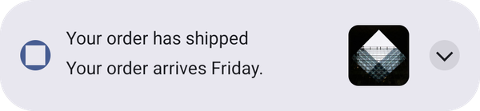
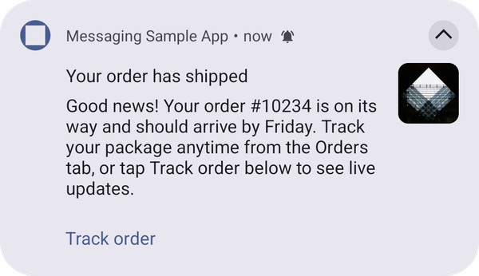

# Big text template

A title, a short collapsed body, a longer expanded body, and an optional large side icon.

Body text is split across two keys: `adb_body` holds the full text shown when the notification is expanded, and `adb_template_properties.adb_collapsed_text` holds the short text shown when it is collapsed. When `adb_collapsed_text` is absent, the collapsed state falls back to `adb_body`.

## How it looks

The following example shows the same big text notification, with a large icon, in the collapsed and expanded states:

| Collapsed | Expanded |
| :-------: | :------: |
|  |  |

When there is no large icon, or the icon can't be downloaded, the text uses the full width of the notification.

## Configuration

This template is rendered by the [UI Builder plugin](../../../../../home/base/mobile-core/plugins/built-in-plugins/ui-builder-plugin.md). To add the plugin to your app, see [Add the UI Builder plugin to your app](../../../../../home/base/mobile-core/plugins/built-in-plugins/ui-builder-plugin.md#add-the-ui-builder-plugin-to-your-app). When the plugin is not added, the push is displayed as a standard notification. See [Push templates troubleshooting](troubleshooting.md).

## Properties

In addition to the top level keys documented on [Push notification payload keys](../../push-payload.md) (`adb_title`, `adb_body`, `adb_icon`, `adb_sound`, `adb_channel_id`, `adb_n_count`, `adb_n_priority`, `adb_n_visibility`, `adb_a_type`, `adb_uri`, `adb_act`), this template reads:

| **Field** | **Required** | **Key** | **Type** | **Description** |
| :-------- | :----------- | :------ | :------- | :--------------- |
| Template Type | Yes | `adb_template_type` | string | Identifies the template to render. The big text template uses a value of `"ajo_bigtext"`. |
| Payload Version | No | `adb_version` | string | Version of the payload assigned by the authoring UI. Defaults to `"1"` when absent. |
| Collapsed Text | No | `adb_template_properties.adb_collapsed_text` | string | Short text shown when the notification is collapsed. Falls back to `adb_body` when absent. |
| Large Icon | No | `adb_template_properties.adb_large_icon` | string | URL of the large side icon, shown in both the collapsed and expanded state. Always rendered center-cropped; there is no scale type option. Lives inside `adb_template_properties`, not as a flat, top level `adb_large_icon` key. |

### Large icon recommendations

<InlineAlert variant="info" slots="text"/>

The aspect ratio recommendation helps the large icon display reliably across multiple devices. **This recommendation acts only as a guideline**; you should still test a notification prior to sending it.

* Recommended aspect ratio: 1:1 (square). The large icon is always rendered center-cropped, so a square source image fills the icon area without unexpected cropping.

## Example

```json
{
   "message":{
      "android":{
         "data":{
            "adb_template_type": "ajo_bigtext",
            "adb_version": "1",
            "adb_title": "Your order has shipped",
            "adb_body": "Good news! Your order #10234 is on its way and should arrive by Friday. Track your package anytime from the Orders tab, or tap Track order below to see live updates.",
            "adb_icon": "ic_launcher_background",
            "adb_sound": "bells",
            "adb_channel_id": "ajo_bigtext_channel",
            "adb_n_count": "1",
            "adb_n_priority": "PRIORITY_HIGH",
            "adb_n_visibility": "PUBLIC",
            "adb_a_type": "WEBURL",
            "adb_uri": "https://www.adobe.com",
            "adb_act": "[{\"label\":\"Track order\",\"uri\":\"https://www.adobe.com\",\"type\":\"WEBURL\"}]",
            "adb_template_properties": "{\"adb_collapsed_text\":\"Your order arrives Friday.\",\"adb_large_icon\":\"https://example.com/box.png\"}"
         }
      }
   }
}
```

<InlineAlert variant="info" slots="text"/>

`adb_template_properties` is a JSON-encoded string, like `adb_act` above, because FCM data messages only allow string values. The object shown inside it is the decoded shape.

See also: [Basic template](basic.md), [Push templates troubleshooting](troubleshooting.md).
