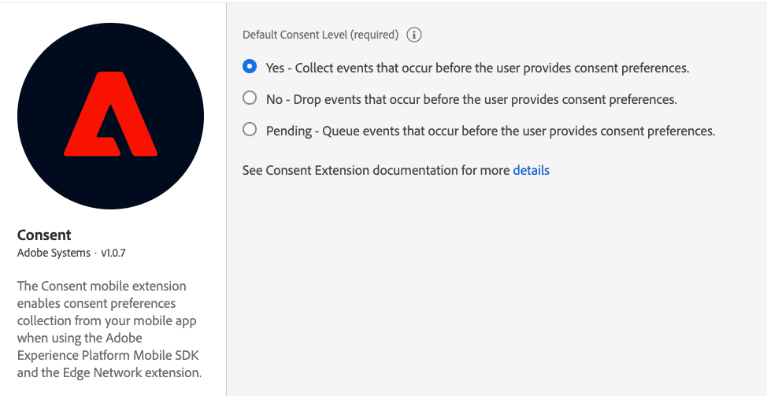

import Tabs from './tabs/index.md'

# Consent for Edge Network

The Adobe Experience Platform Consent mobile extension enables consent preferences collection from your mobile app when using the [Adobe Experience Platform Mobile SDK](../../home/base/mobile-core/index.md) and the [Edge Network extension](../edge-network/index.md).

## Configure the Adobe Experience Platform Consent extension in Data Collection UI

1. In Data Collection UI, in your mobile property, select the **Extensions** tab.
2. On the **Catalog** tab, locate or search for the **Consent** extension, and select **Install**.
3. Set your desired default consent level.
4. Select **Save**.
5. Follow the [publishing process](../../home/getting-started/create-a-mobile-property.md#publish-the-configuration) to update SDK configuration.

<InlineAlert variant="info" slots="text"/>

In order to ingest and use the data collected by this extension, follow the guide on [ingesting data using the Consents and Preferences data type](https://experienceleague.adobe.com/docs/experience-platform/xdm/data-types/consents.html#ingest).

<InlineAlert variant="info" slots="text"/>

The Consent extension uses Adobe Standard 2.0 when communicating with the Edge Network.

<InlineAlert variant="warning" slots="text"/>

The use of this extension is currently limited to the setting (and enforcement) of client-side, macro consent flags. While SDK APIs allow for granular and global consent preference collection, flags are not consistently enforced with upstream applications and therefore will not accommodate use cases that rely on global/granular consent preferences.

## Add the AEP Consent extension to your app

### Download and import the Consent extension

<TabsBlock orientation="horizontal" slots="heading, content" repeat="2"/>

Android

<Tabs query="platform=android&task=download"/>

iOS

<Tabs query="platform=ios&task=download"/>

### Add SDK Initialization code 

You'll need to initialize the SDK by registering the solution extensions as the dependencies in your project with Mobile Core. Refer to the initialization implementation [here](https://developer.adobe.com/client-sdks/home/getting-started/get-the-sdk/#2-add-initialization-code).

## Configuration keys

To update the SDK configuration programmatically, use the following information to change the Edge Consent configuration values.

| Key | Required | Description | Data Type |
| :--- | :--- | :--- | :--- |
| consent.default | No | Consents in XDM format. For more details, see [Privacy/Personalization/Marketing Preferences (Consents) Schema](https://github.com/adobe/xdm/blob/master/docs/reference/mixins/profile/profile-consents.schema.md). | Map |
