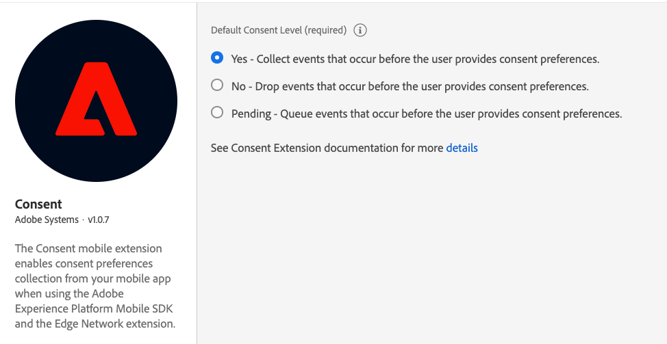

# Consent for Edge Network

The Adobe Experience Platform Consent mobile extension enables consent preferences collection from your mobile app when using the [Adobe Experience Platform Mobile SDK](../../home/base/mobile-core/index.md) and the [Edge Network extension](../edge-network/index.md).

## Configure the Adobe Experience Platform Consent extension in Data Collection UI

1. In Data Collection UI, in your mobile property, select the **Extensions** tab.
2. On the **Catalog** tab, locate or search for the **Consent** extension, and select **Install**.
3. Set your desired default consent level.
4. Select **Save**.
5. Follow the [publishing process](../../home/getting-started/create-a-mobile-property.md#publish-the-configuration) to update SDK configuration.



<InlineAlert variant="info" slots="text"/>

In order to ingest and use the data collected by this extension, follow the guide on [ingesting data using the Consents and Preferences data type](https://experienceleague.adobe.com/docs/experience-platform/xdm/data-types/consents.html#ingest).

<InlineAlert variant="info" slots="text"/>

The Consent extension uses Adobe Standard 2.0 when communicating with the Edge Network.

<InlineAlert variant="warning" slots="text"/>

The use of this extension is currently limited to the setting (and enforcement) of client-side, macro consent flags. While SDK APIs allow for granular and global consent preference collection, flags are not consistently enforced with upstream applications and therefore will not accommodate use cases that rely on global/granular consent preferences.

## Add the Consent extension to your app

### Include Consent extension as an app dependency

Add MobileCore, Edge and EdgeConsent extensions as dependencies to your project.

#### Android Kotlin

Add the required dependencies to your project by including them in the app's Gradle file.

```kotlin
implementation(platform("com.adobe.marketing.mobile:sdk-bom:3.+"))
implementation("com.adobe.marketing.mobile:core")
implementation("com.adobe.marketing.mobile:edge")
implementation("com.adobe.marketing.mobile:edgeidentity")
implementation("com.adobe.marketing.mobile:edgeconsent")
```

<InlineAlert variant="warning" slots="text"/>

Using dynamic dependency versions is **not** recommended for production apps. Please read the [managing Gradle dependencies guide](../../resources/manage-gradle-dependencies.md) for more information.

#### Android Groovy

Add the required dependencies to your project by including them in the app's Gradle file.

```java
implementation platform('com.adobe.marketing.mobile:sdk-bom:3.+')
implementation 'com.adobe.marketing.mobile:core'
implementation 'com.adobe.marketing.mobile:edge'
implementation 'com.adobe.marketing.mobile:edgeidentity'
implementation 'com.adobe.marketing.mobile:edgeconsent'
```

<InlineAlert variant="warning" slots="text"/>

Using dynamic dependency versions is **not** recommended for production apps. Please read the [managing Gradle dependencies guide](../../resources/manage-gradle-dependencies.md) for more information.

#### iOS CocoaPods

Add the required dependencies to your project using CocoaPods. Add following pods in your `Podfile`:

```swift
use_frameworks!
target 'YourTargetApp' do
    pod 'AEPCore', '~> 5.0'
    pod 'AEPEdge', '~> 5.0'
    pod 'AEPEdgeIdentity', '~> 5.0'
    pod 'AEPEdgeConsent', '~> 5.0'
end
```

### Initialize Adobe Experience Platform SDK with Consent Extension

Next, initialize the SDK by registering all the solution extensions that have been added as dependencies to your project with Mobile Core. For detailed instructions, refer to the [initialization](../../home/getting-started/get-the-sdk.md#2-add-initialization-code) section of the getting started page.

Using the `MobileCore.initialize` API to initialize the Adobe Experience Platform Mobile SDK simplifies the process by automatically registering solution extensions and enabling lifecycle tracking.

#### Android Kotlin

<InlineAlert variant="warning" slots="text"/>

This API is available starting from **Android BOM version 3.8.0**.

```kotlin
import com.adobe.marketing.mobile.LoggingMode
import com.adobe.marketing.mobile.MobileCore
...
import android.app.Application
...

class MainApp : Application() {
  override fun onCreate() {
    super.onCreate()
    MobileCore.setLogLevel(LoggingMode.DEBUG)
    MobileCore.initialize(this, "ENVIRONMENT_ID")
  }
}
```

#### Android Java

<InlineAlert variant="warning" slots="text"/>

This API is available starting from **Android BOM version 3.8.0**.

```java
import com.adobe.marketing.mobile.LoggingMode;
import com.adobe.marketing.mobile.MobileCore;
...
import android.app.Application;
...
public class MainApp extends Application {
  @Override
  public void onCreate(){
    super.onCreate();
    MobileCore.setLogLevel(LoggingMode.DEBUG);
    MobileCore.initialize(this, "ENVIRONMENT_ID");
  }
}
```

#### iOS Swift

<InlineAlert variant="warning" slots="text"/>

This API is available starting from **iOS version 5.4.0**.

```swift
// AppDelegate.swift
import AEPCore
import AEPServices
...

final class AppDelegate: NSObject, UIApplicationDelegate {
  func application(_: UIApplication, didFinishLaunchingWithOptions _: [UIApplication.LaunchOptionsKey: Any]? = nil) -> Bool {
    MobileCore.setLogLevel(.debug)
    MobileCore.initialize(appId: "ENVIRONMENT_ID")
    ...
  }
}
```

#### iOS Objective-C

<InlineAlert variant="warning" slots="text"/>

This API is available starting from **iOS version 5.4.0**.

```objectivec
// AppDelegate.m
#import "AppDelegate.h"
@import AEPCore;
@import AEPServices;
...
@implementation AppDelegate
- (BOOL)application:(UIApplication *)application didFinishLaunchingWithOptions:(NSDictionary *)launchOptions {
  [AEPMobileCore setLogLevel: AEPLogLevelDebug];  
  [AEPMobileCore initializeWithAppId:@"ENVIRONMENT_ID" completion:^{
      NSLog(@"AEP Mobile SDK is initialized");
  }];
  ...
  return YES;
}
@end
```

## Configuration keys

To update the SDK configuration programmatically, use the following information to change the Edge Consent configuration values.

| Key | Required | Description | Data Type |
| :--- | :--- | :--- | :--- |
| consent.default | No | Consents in XDM format. For more details, see [Privacy/Personalization/Marketing Preferences (Consents) Schema](https://github.com/adobe/xdm/blob/master/docs/reference/mixins/profile/profile-consents.schema.md). | Map |
