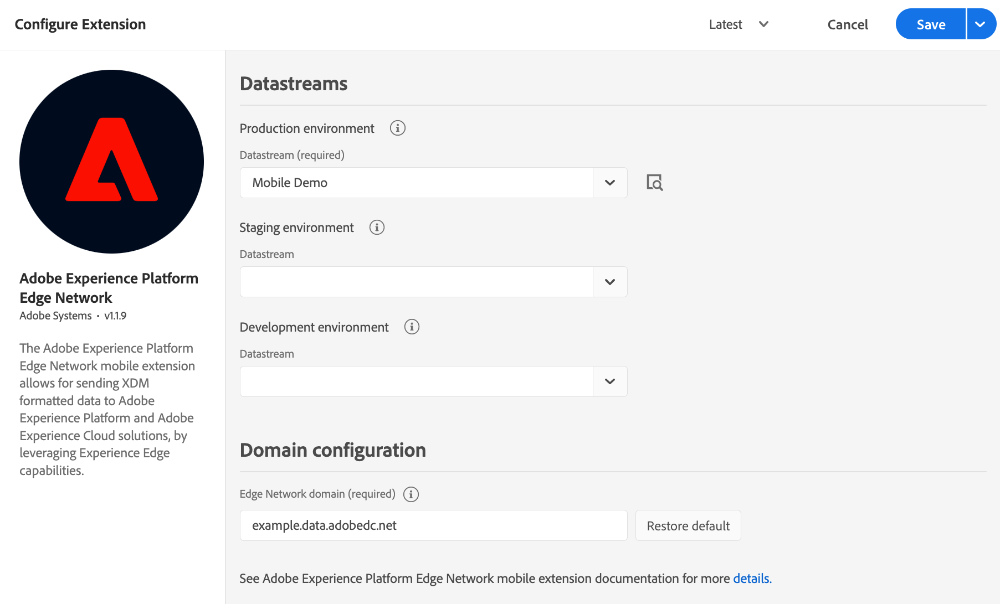

import Tabs from './tabs/index.md'
import InitializeSDK from '/src/pages/resources/initialize.md'

# Adobe Experience Platform Edge Network

## Before starting

### Install Identity for Edge Network

The Adobe Experience Platform Edge Network extension requires the Identity for Edge Network extension in order to operate. As a first step install and configure the [Identity for Edge Network](../identity-for-edge-network/index.md) extension, then continue with the steps below.

## Configure the Edge Network extension in Data Collection UI

1. In the Data Collection UI, in your mobile property, select the **Extensions** tab.
2. On the **Catalog** tab, locate or search for the **Adobe Experience Platform Edge Network** extension, and select **Install**.
3. Select the **Datastream** you would like to use per environment. Read more about [datastreams](#datastreams) below.
4. Set up the **Domain configuration** by either using the automatically populated domain, or a first party domain mapped to an Adobe-provisioned Edge network domain. For more information, see [domain configuration](#domain-configuration) below.
4. Select **Save**.
5. Follow the [publishing process](../../home/getting-started/create-a-mobile-property.md#publish-the-configuration) to update SDK configuration.

### Datastreams

If no datastream was previously created, see [Configure datastreams](../../home/getting-started/configure-datastreams.md) before moving to the next step.

You may configure only the required datastream for the production environment, and by default the staging and development environments will use the same datastream. Alternatively, if you want to use different datastreams per each environment, select the desired ones from the corresponding drop-down lists.

<InlineAlert variant="info" slots="text"/>

If your organization uses multiple sandboxes, select the **Sandbox** first, then select the **Datastream** for each environment.

The datastream used by the client-side implementation is one of the followings:

* the `Production environment` configuration when the tag library is published to production (in the Published column in the publishing flow).
* the `Staging environment` configuration when the tag library is published to staging (in the Submitted column in the publishing flow).
* the `Development environment` configuration when the tag library is in development.

### Domain configuration

The value under the **Edge Network domain** field is used for requests to Adobe Experience Platform Edge Network and it usually follows the format `<company>.data.adobedc.net`, where `<company>` is the unique namespace associated to your Adobe organization.

If you have a first-party domain mapped to the Adobe-provisioned Edge Network domain, you can enter it here. For more details about how to configure or maintain a first-party domain, see [Adobe-Managed Certificate Program](https://experienceleague.adobe.com/docs/core-services/interface/administration/ec-cookies/cookies-first-party.html#adobe-managed-certificate-program).

**Note:** The domain name is expected to be just the domain without any protocol or trailing slashes. If no domain is provided, by default the `edge.adobedc.net` domain is used.

## Add the Edge Network extension to your app

### Include Edge Network extension as an app dependency

Add MobileCore, Edge and EdgeIdentity extensions as dependencies to your project.

<TabsBlock orientation="horizontal" slots="heading, content" repeat="3"/>

Kotlin (Android)

<Tabs query="platform=android-kotlin&task=add"/>

Groovy (Android)

<Tabs query="platform=android-groovy&task=add"/>

CocoaPods (iOS)

<Tabs query="platform=ios-pods&task=add"/>

### Initialize Adobe Experience Platform SDK with Edge Network Extension

Next, initialize the SDK by registering all the solution extensions that have been added as dependencies to your project with Mobile Core. For detailed instructions, refer to the [initialization](/src/pages/home/getting-started/get-the-sdk/#2-add-initialization-code) section of the getting started page.

Using the `MobileCore.initialize` API to initialize the Adobe Experience Platform Mobile SDK simplifies the process by automatically registering solution extensions and enabling lifecycle tracking.

<InitializeSDK query="componentClass=TabsBlock"/>

## Next steps

Install other extensions based on your use-case:

1. If your application requires user consent preferences collection and enforcement, install and configure the [Consent for Edge Network](../consent-for-edge-network/index.md) extension.
2. Lifecycle extension now supports application lifecycle metrics collection for Edge Network. If you would like to start collecting this type of data, follow the installation instruction for [Lifecycle for Edge Network](../lifecycle-for-edge-network/index.md).
3. If your application uses push notifications, see also the [Adobe Journey Optimizer](../adobe-journey-optimizer/index.md) extension.

## Configuration keys

To update the SDK configuration programmatically, use the following information to change the Edge configuration values.

| Key | Required | Description | Data Type |
| :--- | :--- | :--- | :--- |
| edge.configId | Yes | See [datastreams](#datastreams). | String |
| edge.domain   | No  | A custom first-party domain mapped to the Adobe provisioned Edge Network domain. | String |
