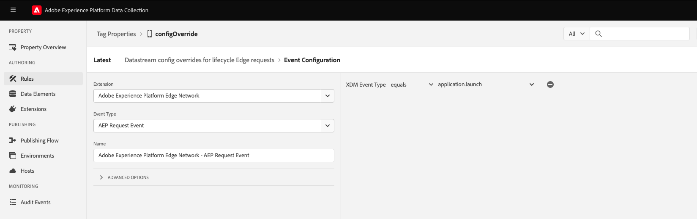
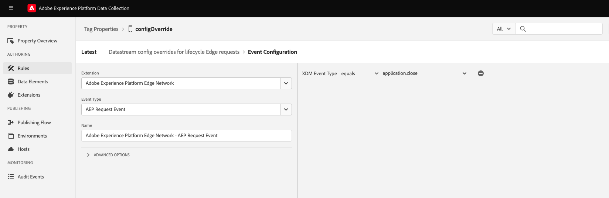
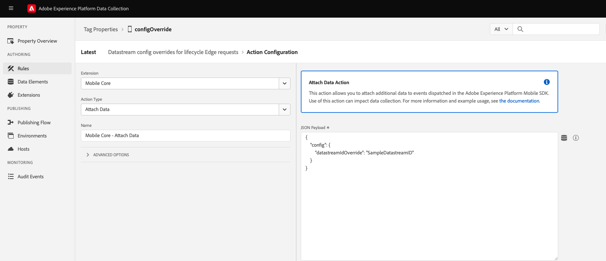
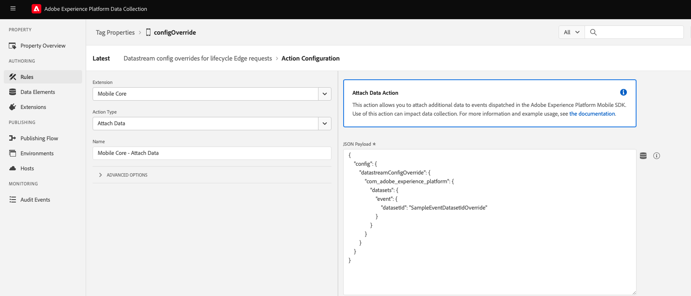
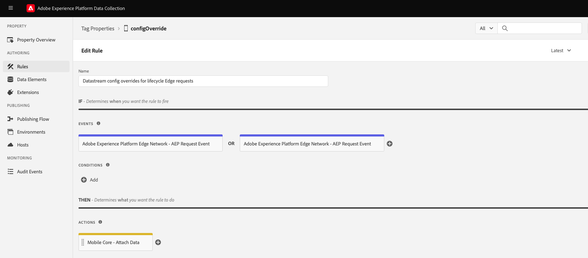

# Datastream configuration override for Edge events using Rules

By default, all **Edge Experience events** are sent to the datastream specified in the **Adobe Experience Platform Edge Network** extension configuration settings. This tutorial offers examples on how to customize this configuration on a per-event basis

## Prerequisites

* [Edge](../../index.md) extension version >= **2.4.0** (Android) and >= **4.3.0** (iOS).
* [Configure datastreams](../../../home/getting-started/configure-datastreams.md)
* [Define overrides in your datastream configuration](https://experienceleague.adobe.com/docs/experience-platform/datastreams/configure.html?lang=en)

## Add datastream configuration overrides for Lifecycle Edge events using rules

Add a **datastream ID override** or a **datastream config overrides** for `Lifecycle Edge` events of type **application.launch** and **application.close** by following the next steps.

### Add a new rule for your mobile property

Give your rule an easily recognizable name in your list of rules.
In this example, the rule is named "Attach datastream config overrides Data to Lifecycle Edge events".

### Configure Lifecycle Edge Events

Now, add two Lifecycle Edge events: one of type **application.launch** and other of type **application.close**.

#### Configure Lifecycle Edge event of type application.launch

1. Under the **Events** section, select **Add**.
2. From the **Extension** dropdown list, select **Adobe Experience Platform Edge Network**.
3. From the **Event Type** dropdown list, select **AEP Request Event**.
4. On the right pane, click the plus button **Add XDM Event Type** and set the condition to **equals** with value **application.launch**.
5. Select **Keep Changes**.



#### Configure Lifecycle Edge event of type application.close

1. Under the **Events** section, select **Add**.
2. From the **Extension** dropdown list, select **Adobe Experience Platform Edge Network**.
3. From the **Event Type** dropdown list, select **AEP Request Event**.
4. On the right pane, click the plus button **Add XDM Event Type** and set the condition to **equals** with value **application.close**.
5. Select **Keep Changes**.



Save the event configuration and return to the Rule Editor UI.

### Configure Attach Data Action

Based on the use case, you can **either** attach payload for the **datastream ID override** or for the **datastream config overrides**:

#### Configure the action to attach datastream ID override payload

1. Under the **Actions** section, select **Add**.
2. From the **Extension** dropdown list, select **Mobile Core**.
3. From the **Action Type** dropdown list, select **Attach Data**.
4. On the right pane, in the **JSON Payload** field, type the config overrides data that will be added to this event.

    **Sample Payload for datastream ID override:**

    ```json
    {
        "config": {
            "datastreamIdOverride": "SampleDatastreamID"
        }
    }
    ```

    

5. Select **Keep Changes**.
6. Return to the Rule Editor UI.

#### Configure the action to attach datastream configuration override payload

<InlineAlert variant="info" slots="text"/>

In order to use this feature, configuration overrides in this case event dataset override must be preset in the datastream configuration. Learn more about this configuration in the [configuring datastream overrides guide](https://experienceleague.adobe.com/docs/experience-platform/datastreams/overrides.html?lang=en#event-dataset-overrides).

1. Under the **Actions** section, select **Add**.
2. From the **Extension** dropdown list, select **Mobile Core**.
3. From the **Action Type** dropdown list, select **Attach Data**.
4. On the right pane, in the **JSON Payload** field, type the config overrides data that will be added to this event.

    **Sample Payload for datastream config overrides:**

    ```json
    {
        "config": {
            "datastreamConfigOverride": {
                "com_adobe_experience_platform": {
                    "datasets": {
                        "event": {
                            "datasetId": "SampleEventDatasetIdOverride"
                        }
                    }
                }
            }
        }
    }
    ```

   

5. Select **Keep Changes**.
6. Return to the Rule Editor UI.

### Save the rule and publish the updated library

The final rule should appear as follows:


**Save** this Rule, **publish** the new Tags library with all the changes, and your rule will be set and ready. Now, Lifecycle Edge events of type **application.launch** and **application.close** will be sent with the overridden datastream ID or datastream config overrides payload.

## Sending overrides to Edge Network

After configuring the datastream overrides, you can now send these overrides to the Edge Network through Mobile SDK. Sending the overrides using the `sendEvent` API is the final step of activating the datastream configuration overrides.

### Datastream ID override

The following examples demonstrate what a datastream ID override could look like in a Mobile SDK integration:

<CodeBlock slots="heading, code" repeat="2" languages="iOS (Swift), Android (Kotlin)" />

iOS (Swift)

```swift
// Create Experience event from dictionary
var xdmData: [String: Any] = [
  "eventType": "SampleXDMEvent",
  "sample": "data",
]
let experienceEvent = ExperienceEvent(xdm: xdmData, datastreamIdOverride: "SampleDatastreamId")

Edge.sendEvent(experienceEvent: experienceEvent) { (handles: [EdgeEventHandle]) in
  // Handle the Edge Network response
}
```

Android (Kotlin)

```kotlin
// Create experience event from Map
val xdmData = mutableMapOf < String, Any > ()
xdmData["eventType"] = "SampleXDMEvent"
xdmData["sample"] = "data"

val experienceEvent = ExperienceEvent.Builder()
    .setXdmSchema(xdmData)
    .setDatastreamIdOverride("SampleDatastreamId")
    .build()

Edge.sendEvent(experienceEvent) {
    // Handle the Edge Network response
}
```

### Datastream configuration override

The following examples demonstrate what a datastream configuration override could look like in a Mobile SDK integration:

<CodeBlock slots="heading, code" repeat="2" languages="iOS (Swift), Android (Kotlin)" />

iOS (Swift)

```swift
// Create Experience event from dictionary
var xdmData: [String: Any] = [
  "eventType": "SampleXDMEvent",
  "sample": "data",
]

let configOverrides: [String: Any] = [
  "com_adobe_experience_platform": [
    "datasets": [
      "event": [
        "datasetId": "SampleEventDatasetIdOverride"
      ]
    ]
  ],
  "com_adobe_analytics": [
  "reportSuites": [
        "MyFirstOverrideReportSuite",
          "MySecondOverrideReportSuite",
          "MyThirdOverrideReportSuite"
      ]
  ],
  "com_adobe_identity": [
    "idSyncContainerId": "1234567"
  ],
  "com_adobe_target": [
    "propertyToken": "63a46bbc-26cb-7cc3-def0-9ae1b51b6c62"
 ],
]

let experienceEvent = ExperienceEvent(xdm: xdmData, datastreamConfigOverride: configOverrides)

Edge.sendEvent(experienceEvent: experienceEvent) { (handles: [EdgeEventHandle]) in
  // Handle the Edge Network response
}
```

Android (Kotlin)

```kotlin
// Create experience event from Map
val xdmData = mutableMapOf < String, Any > ()
xdmData["eventType"] = "SampleXDMEvent"
xdmData["sample"] = "data"

val configOverrides = mapOf(
    "com_adobe_experience_platform"
    to mapOf(
        "datasets"
        to mapOf(
            "event"
            to mapOf("datasetId"
                to "SampleEventDatasetIdOverride")
        )
    ),
    "com_adobe_analytics"
    to mapOf(
        "reportSuites"
        to listOf(
            "MyFirstOverrideReportSuite",
            "MySecondOverrideReportSuite",
            "MyThirdOverrideReportSuite"
        )
    ),
    "com_adobe_identity"
    to mapOf(
        "idSyncContainerId"
        to "1234567"
    ),
    "com_adobe_target"
    to mapOf(
        "propertyToken"
        to "63a46bbc-26cb-7cc3-def0-9ae1b51b6c62"
    )
)

val experienceEvent = ExperienceEvent.Builder()
    .setXdmSchema(xdmData)
    .setDatastreamConfigOverride(configOverrides)
    .build()

Edge.sendEvent(experienceEvent) {
    // Handle the Edge Network response
}
```

### Payload example

The following example shows a sample payload after overriding the datastream configurations.

```json
{
  "meta": {
    "configOverrides": {
      "com_adobe_experience_platform": {
        "datasets": {
          "event": {
            "datasetId": "SampleProfileDatasetIdOverride"
          }
        }
      },
      "com_adobe_analytics": {
        "reportSuites": [
        "MyFirstOverrideReportSuite",
        "MySecondOverrideReportSuite",
        "MyThirdOverrideReportSuite"
        ]
      },
      "com_adobe_identity": {
        "idSyncContainerId": "1234567"
      },
      "com_adobe_target": {
        "propertyToken": "63a46bbc-26cb-7cc3-def0-9ae1b51b6c62"
      }
    },
    "state": {  }
  },
  "events": [  ]
}
```
