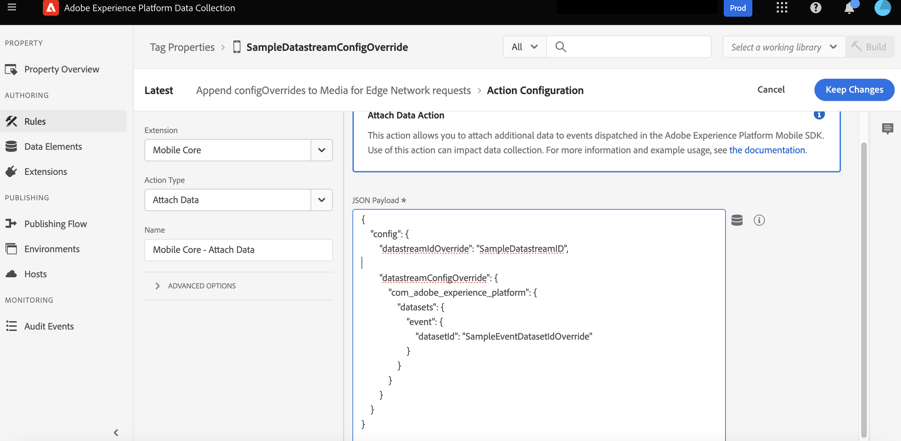

# Overriding Datastream ID and Configuration for Edge Network Requests Using Tags Rules

By default, all Edge requests are sent to the datastream configuration specified in the Adobe Experience Platform Edge Network extension configuration settings. This tutorial will offer examples demonstrating how to customize this configuration on a per-event basis

<InlineAlert variant="info" slots="text"/>

Starting with `Edge` extension version **2.4.0** (Android) and **4.3.0** (iOS), the `sendEvent` API supports optional Datastream overrides. For detailed information, please refer to the [sendEvent API reference](./api-reference.md#sendEvent).

## Datastream configuration overrides in Edge based extensions using Rules

Let's consider a situation where you are working with **Lifecycle For Edge Network** and you want to override the datastream ID and datastream configuration for Lifecycle events routed through the Edge Network. Follow these steps to achieve that:

1. Navigate to the **DataCollection UI** and go to **Tags** select your mobile property.

2. Add a new rule for your mobile property:

    a. Provide a descriptive name for your Rule.

    b. Under the **If** section in the **Events** category, add 2 Events.
    b. In the Events section under If, add two events.

    c. Configure the first event as Lifecycle start event. Set the `Extension` to **"Adobe Experience Platform Edge Network"** and the `Event Type` to **"AEP Request Event"**. Click the plus button `Add XDM Event Type` and set the condition to **equals** with value **"application.launch"**.

    

    

    d. For the second event, configure Lifecycle pause event in a similar manner. Set the `Extension` to **"Adobe Experience Platform Edge Network"** and the `Event Type` to **"AEP Request Event"**. Click the plus button to `Add XDM Event Type` and set the condition to **equals** with value **"application.close"**.

    

    d. Save the event configuration and return to the Rule Editor UI.

    e. In the **Then** section under **Actions** add a new Action.

    f. In the Action configuration view, set the **Extension** to "Mobile Core" and the **Action Type** to "Attach Data."

    g. Now, add the JSON payload for your `datastream ID override` and `datastream config override` in the following format:

    **Payload Format for datastream ID override:**

    ```json
    {
        "config" : {
            "datastreamIdOverride" : "<Your_Datastream_ID>"
        }
    }
    ```

    **Sample Payload for datastream ID override:**

    ```json
    {
        "config": {
            "datastreamIdOverride": "SampleDatastreamID"
        }
    }
    ```

    **Payload Format for datastream config overrides:**

    ```json
    {
        "config" : {
            "datastreamConfigOverride" : {
                "<Your_Config_Key>" : "<Your_Config_Value>"
            }
        }
    }
    ```

    **Sample Payload for datastream config overrides:**

    ```json
    {
        "config": {
            "datastreamConfigOverride": {
                "com_adobe_experience_platform": {
                    "datasets": {
                        "event": {
                            "datasetId": "SampleEventDatasetIdOverride"
                        }
                    }
                }
            }
        }
    }
    ```

    

    h. **Save** the Action configuration and return to the Rule Editor UI. Your rule should look like this:

    

    i. **Save** this Rule, **publish** the new Tags library with all the changes, and your rule will be set and ready. Now, all Media Edge Requests will be sent with the overridden datastream ID and Datastream Config Overrides.
