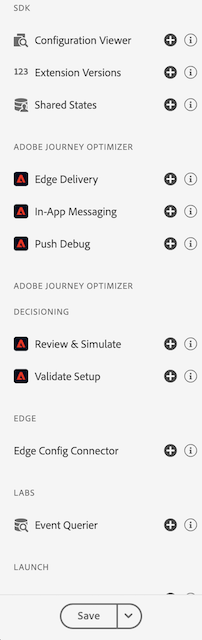
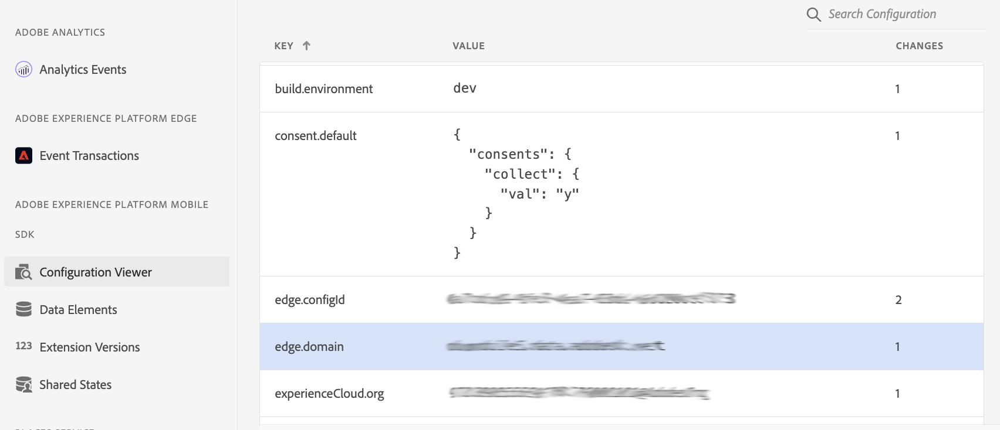
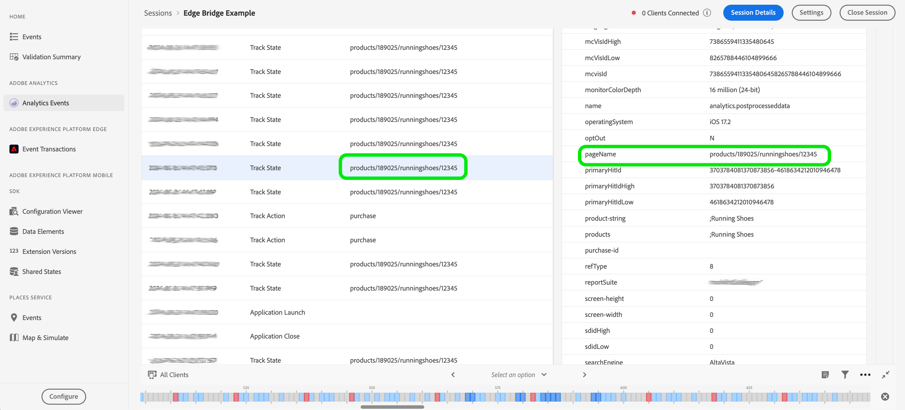
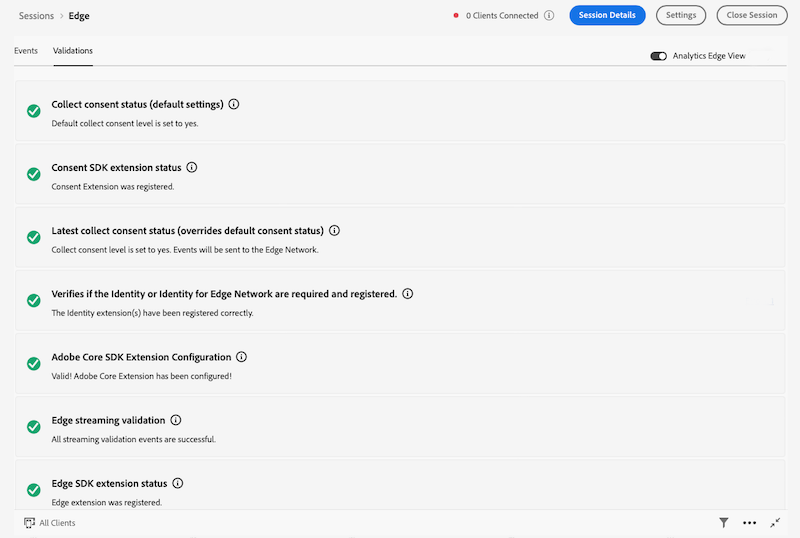

# Validating the Adobe Experience Platform Edge Network to Analytics workflow with Assurance

This guide outlines the steps for using Adobe Experience Platform Assurance to validate the data flow from Edge Network to Analytics.

## Getting started with Assurance

Assurance is an advanced tool for inspecting and validating mobile app data. To get started, follow these steps:

1. Follow the instructions for [user access to Assurance](https://experienceleague.adobe.com/docs/experience-platform/assurance/user-access.html).
2. [Install and register the Assurance extension](../../home/base/assurance/index.md) in your mobile app.
3. Refer to the same document for [connecting to an Assurance session](../../home/base/assurance/index.md#connect-to-an-assurance-session).

## Assurance plugin views

In the Assurance interface, users can customize the plugin views they frequently use by enabling them in the left navigation menu. This allows for a personalized experience, making the most relevant tools easily accessible during sessions.

To add a view in the Assurance UI, follow these steps:

1. In the left navigation menu, select **Configure** at the bottom left corner of the window.

2. Add the desired view from the available options.
3. Select **Save** to apply the changes.

## Review the Configuration Viewer

Add the **Configuration Viewer** to the left navigation menu in Assurance. This view displays the **Tag property** settings configured in Data Collection UI for the app. For an Edge Network session, verify that the **edge.configId** is pointing to the correct datastream ID and that the **edge.domain** value is set correctly, along with other expected configuration settings.

### Inspect the Extension Versions view

Add the **Extension Versions** view to the left navigation menu in Assurance. This view allows you to check which Mobile SDK extensions are in use and their respective version numbers. Verify that all extensions are up-to-date or at the desired versions. 

If an extension is missing or has an incorrect version, review your Mobile SDK registration implementation in the client app.

Depending on the method you are using to send Analytics data through Edge Network, verify the presence of the following extensions:

1. **If using `Edge.sendEvent`:**

   * Required: Core Extension, Edge Extension, Edge Identity Extension
   * Optional: Consent Extension, Lifecycle Extension

2. **If using `MobileCore.trackAction` or `MobileCore.trackState`:**

   * Required: Core Extension, Edge Bridge Extension, Edge Extension, Edge Identity Extension
   * Optional: Consent Extension, Lifecycle Extension

For more details on which extensions to use, refer to the [Adobe Analytics documentation](https://developer.adobe.com/client-sdks/solution/adobe-analytics/migrate-to-edge-network/).

## Validate events with the Analytics Events view

The [**Analytics Events**](https://experienceleague.adobe.com/en/docs/experience-platform/assurance/view/adobe-analytics-edge) view provides an in-depth look at SDK events, helping users debug and validate their events. It includes a detailed panel that shows how each event was processed, from the client SDK to the Analytics service.

//TODO: Add screenshot when the new Analytics Event view is released.

Review the example below to learn how to debug an event using this view.

1. **Locate the event**: Identify the event within the list of SDK events.
2. **Open the details panel**: Select the event to open the detailed information panel.
3. **Check post-processed data**: Review the final event in the event chain, labeled "POST-PROCESSED DATA." Presence of the assigned data confirms that the data was correctly passed to Analytics.

4. **Review the chain of events**: If the "POST-PROCESSED DATA" event is missing or the expected data is not present, analyze the chain of events to understand the processing flow. Debug issues by tracing the events from the client SDK to the Analytics platform.

In this Edge Bridge example, inspection of the Edge Bridge Request event reveals that the `contextdata` does not match the format expected in the latest Edge Bridge Extension version. This mismatch may be the primary cause of data not appearing in the post-processed data event.

For details on the correct Edge Bridge event format, refer to the [Edge Bridge data format documentation](https://github.com/adobe/aepsdk-edgebridge-ios/blob/main/Documentation/data-format.md#examples).

Use the **Copy Data** button in each detailed event view to copy data in JSON format for further review. For instance, in the **Analytics Hit** event, this feature provides a view of **kvdata** in JSON format.

5. **Verify using the Analytics validation view**: Select the **Validations** tab to identify any errors.

### Additional debugging steps

If the previous steps do not resolve the issue, review the [datastream setup](https://github.com/adobe/aepsdk-edge-ios/blob/main/Documentation/Tutorials/edge-send-event-tutorial.md#2-create-a-datastream) in the Data Collection UI.