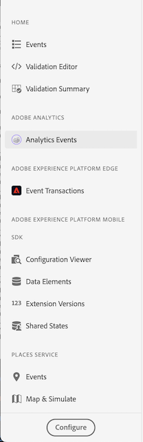
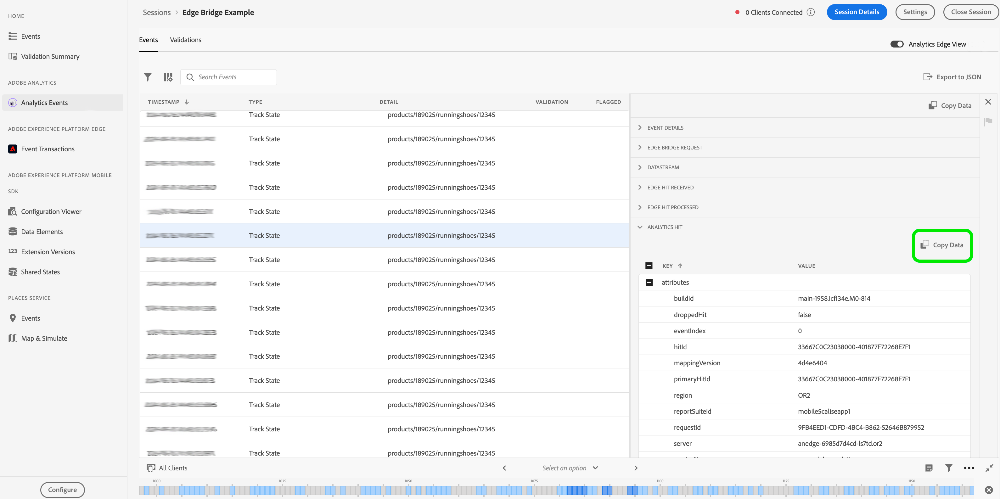

# Troubleshooting Analytics Data with Adobe Experience Platform Edge Network and Assurance

Ensuring that analytics data is correctly sent and received is important for working with the Adobe Experience Platform Edge Network extension. This document will guide you through common process of using Adobe Assurance to troubleshoot and verify your analytics data.

## Get started with Assurance

If you haven't installed Assurance yet, an advanced tool for inspecting and validating your mobile app data, follow these steps:

1. Begin by following the instructions for [using Assurance](https://experienceleague.adobe.com/docs/experience-platform/assurance/user-access.html).
2. [Install and register the Assurance extension](../../home/base/assurance/index.md) in your mobile app.
3. Follow the same document for [connecting to an Assurance session](../../home/base/assurance/index.md#connect-to-an-assurance-session).

## Assurance plugin views

In the Assurance interface, users can customize the plugin views they frequently use by enabling them in the left navigation menu. This allows for a tailored experience, ensuring that the most relevant tools are readily accessible during sessions.

To add a view in the Assurance UI, follow these steps:

1. From the left navigation menu, select **Configure** at the bottom left of the window.
2. Add the desired view.
3. Select **Save** to apply the changes.

## Review the Configuration Viewer

Add the **Configuration Viewer** to the left navigate menu in the Assurance. This view displays the **Tag property** settings configured in the Data Collection UI for the app. For an Edge Network session, ensure that the **edge.configId** is pointing to the correct datastream ID and that the **edge.domain** value is properly set, along with other expected configuration settings.

## Inspect the Extension Versions View

Add the **Extension Versions** View to the left navigation menu in Assurance. This view allows you to verify which Mobile SDK extensions are being used and their respective version numbers. Ensure that all extensions are up-to-date or at the desired versions.
If you see a missing extension or the wrong version of an extension, you need to check your Mobile SDK registration implementation in the client app.

Depending on the method you are using to send analytics data through the Edge Network, please verify the following extensions:

1. If using Edge.sendEvent:

* Check for: Edge Extension, Edge Identity Extension, Mobile Core Extension
* Optional: Consent Extension, Lifecycle Extension

2. If using MobileCore.trackAction or MobileCore.trackState:

* Check for: Edge Bridge Extension, Edge Extension, Edge Identity Extension, Mobile Extension
* Optional: Consent Extension, Lifecycle Extension

Refer to this [documentation](https://developer.adobe.com/client-sdks/solution/adobe-analytics/migrate-to-edge-network/) to learn more about which extension should be used.

## Validate events with the Analytics Event view

The [**Analytics Events**](https://experienceleague.adobe.com/en/docs/experience-platform/assurance/view/adobe-analytics-edge) View offers an in-depth look at SDK events, assisting users in debugging and validating their events. It features a detailed panel that explains how each event was processed, from the client SDK to the Analytics Service.

//TO DO Add screenshot when the new Analytics Event is released.

Let’s walk through an example of how you can use this view to debug an event.

1. **Locate the Event**: Find the event in question within the list of SDK events.
2. **Open the Details Panel**: Click on the event to open the detailed panel.
3. **Check Post-Processed Data**: Look at the last event in the chain of events, labeled “POST-PROCESSED DATA.” If the assigned data is present there, it confirms that the data has been correctly passed to Analytics.

4. **Review the chain of events**: If the “POST-PROCESSED DATA” event is missing or the expected data isn’t there, examine the chain of the events to understand how the events were processed. Debug the issue by following the events from the client SDK to the Analytics platform.

In this Edge Bridge Example, when checking the Edge Bridge Request event, the contextdata does not match the proper format as specified in the latest Edge Bridge Extension version. We suspect this mismatch could be the main reason causing the data not show to the Post-processed data event.

For learning the proper Edge Bridge Event format , please refer to the [Edge Bridge data format documentation](https://github.com/adobe/aepsdk-edgebridge-ios/blob/main/Documentation/data-format.md#examples).

Moreover, you can use the **Copy Data** button available in each detailed event view to copy the data in JSON format for further review. For example, with the **Analytics Hit** event, it is easier to view its **kvdata** in this format.

5. **Verify using the Analytics validation view**: Click the **Validations** tab to discover for any errors.

## Additional Debugging Steps

If the above debugging steps do not resolve the issue, consider checking the [datastream setup](https://github.com/adobe/aepsdk-edge-ios/blob/main/Documentation/Tutorials/edge-send-event-tutorial.md#2-create-a-datastream) in the Data Collection UI.
