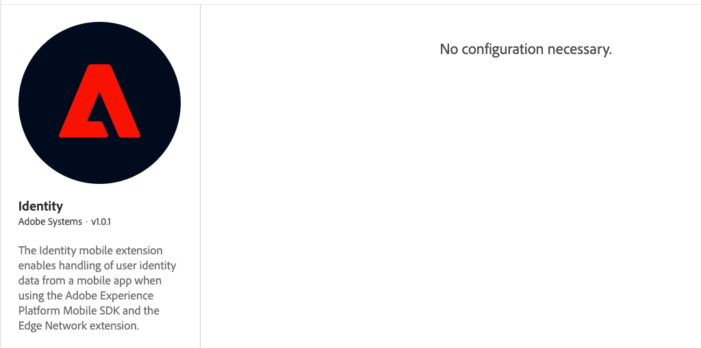

# Identity for Edge Network

The Identity for Edge Network mobile extension enables identity management, including the Experience Cloud ID (ECID), from your mobile app when using the Adobe Experience Platform Mobile SDK and the [Edge Network extension](../edge-network/index.md).

Use the Identity for Edge Network extension when including the Edge Network extension into an application. The Identity for Edge Network extension is not used with Adobe Solution extensions, which must use the [Identity for Experience Cloud ID Service extension](../../home/base/mobile-core/identity/index.md).

## Configure the Identity extension in the Data Collection UI

1. In Data Collection UI, in your mobile property, select the **Extensions** tab.
2. On the **Catalog** tab, locate or search for the **Identity** extension, and select **Install**.
3. There are no configuration settings for **Identity**.
4. Select **Save**.
5. Follow the publishing process to update SDK configuration.



## Add the Identity For Edge Network extension to your app

<InlineAlert variant="info" slots="text"/>

The following instructions are for configuring an application using Adobe Experience Platform Edge mobile extensions. If an application will include both Edge Network and Adobe Solution extensions, both the Identity for Edge Network and Identity for Experience Cloud ID Service extensions are required. Find more details in the [frequently asked questions](faq.md).

<InlineAlert variant="info" slots="text"/>

When using the [`setAdvertisingIdentifier`](api-reference.md#setadvertisingidentifier) API, see the setup guide for [Consent for Edge Network](../consent-for-edge-network/index.md) for instructions on setting up the extension and profile schema for proper usage.

### Include Identity extension as an app dependency

Add MobileCore, Edge, EdgeIdentity extensions as dependencies to your project.

#### Android Kotlin

Add the required dependencies to your project by including them in the app's Gradle file.

```kotlin
implementation(platform("com.adobe.marketing.mobile:sdk-bom:3.+"))
implementation("com.adobe.marketing.mobile:core")
implementation("com.adobe.marketing.mobile:edge")
implementation("com.adobe.marketing.mobile:edgeidentity")
```

<InlineAlert variant="warning" slots="text"/>

Using dynamic dependency versions is **not** recommended for production apps. Please read the [managing Gradle dependencies guide](../../resources/manage-gradle-dependencies.md) for more information.

#### Android Groovy

Add the required dependencies to your project by including them in the app's Gradle file.

```java
implementation platform('com.adobe.marketing.mobile:sdk-bom:3.+')
implementation 'com.adobe.marketing.mobile:core'
implementation 'com.adobe.marketing.mobile:edge'
implementation 'com.adobe.marketing.mobile:edgeidentity'
```

<InlineAlert variant="warning" slots="text"/>

Using dynamic dependency versions is **not** recommended for production apps. Please read the [managing Gradle dependencies guide](../../resources/manage-gradle-dependencies.md) for more information.

#### iOS CocoaPods

Add the required dependencies to your project using CocoaPods. Add following pods in your `Podfile`:

```swift
use_frameworks!
target 'YourTargetApp' do
    pod 'AEPCore', '~> 5.0'
    pod 'AEPEdge', '~> 5.0'
    pod 'AEPEdgeIdentity', '~> 5.0'
    pod 'AEPEdgeConsent', '~> 5.0' // Recommended when using the setAdvertisingIdentifier API
end
```

### Initialize Adobe Experience Platform SDK with Identity for Edge Network Extension

Next, initialize the SDK by registering all the solution extensions that have been added as dependencies to your project with Mobile Core. For detailed instructions, refer to the [initialization](../../home/getting-started/get-the-sdk.md#2-add-initialization-code) section of the getting started page.

Using the `MobileCore.initialize` API to initialize the Adobe Experience Platform Mobile SDK simplifies the process by automatically registering solution extensions and enabling lifecycle tracking.

#### Android Kotlin

<InlineAlert variant="warning" slots="text"/>

This API is available starting from **Android BOM version 3.8.0**.

```kotlin
import com.adobe.marketing.mobile.LoggingMode
import com.adobe.marketing.mobile.MobileCore
...
import android.app.Application
...

class MainApp : Application() {
  override fun onCreate() {
    super.onCreate()
    MobileCore.setLogLevel(LoggingMode.DEBUG)
    MobileCore.initialize(this, "ENVIRONMENT_ID")
  }
}
```

#### Android Java

<InlineAlert variant="warning" slots="text"/>

This API is available starting from **Android BOM version 3.8.0**.

```java
import com.adobe.marketing.mobile.LoggingMode;
import com.adobe.marketing.mobile.MobileCore;
...
import android.app.Application;
...
public class MainApp extends Application {
  @Override
  public void onCreate(){
    super.onCreate();
    MobileCore.setLogLevel(LoggingMode.DEBUG);
    MobileCore.initialize(this, "ENVIRONMENT_ID");
  }
}
```

#### iOS Swift

<InlineAlert variant="warning" slots="text"/>

This API is available starting from **iOS version 5.4.0**.

```swift
// AppDelegate.swift
import AEPCore
import AEPServices
...

final class AppDelegate: NSObject, UIApplicationDelegate {
  func application(_: UIApplication, didFinishLaunchingWithOptions _: [UIApplication.LaunchOptionsKey: Any]? = nil) -> Bool {
    MobileCore.setLogLevel(.debug)
    MobileCore.initialize(appId: "ENVIRONMENT_ID")
    ...
  }
}
```

#### iOS Objective-C

<InlineAlert variant="warning" slots="text"/>

This API is available starting from **iOS version 5.4.0**.

```objectivec
// AppDelegate.m
#import "AppDelegate.h"
@import AEPCore;
@import AEPServices;
...
@implementation AppDelegate
- (BOOL)application:(UIApplication *)application didFinishLaunchingWithOptions:(NSDictionary *)launchOptions {
  [AEPMobileCore setLogLevel: AEPLogLevelDebug];  
  [AEPMobileCore initializeWithAppId:@"ENVIRONMENT_ID" completion:^{
      NSLog(@"AEP Mobile SDK is initialized");
  }];
  ...
  return YES;
}
@end
```

## Advertising identifier

The Identity for Edge Network extension compares the previously stored advertising identifier value with the new value received from the [`setAdvertisingIdentifier`](api-reference.md#setadvertisingidentifier) API and handles the following scenarios:

Ad tracking enabled - when the new value sent to the API is:

* A valid UUID string (example: `"a127a99e-50be-4d87-bf6f-6ab9541c105b"`)

Process:

1. Updates the client side XDM `IdentityMap` with the new value for IDFA/GAID, which is included in subsequent [XDM Experience events](../edge-network/xdm-experience-events.md). For more details, see the [standard Identity namespaces](https://experienceleague.adobe.com/docs/experience-platform/identity/namespaces.html#standard).
2. Sends a [consent update event](https://experienceleague.adobe.com/docs/experience-platform/xdm/data-types/consents.html) with ad ID consent preferences set to `yes` (only when a valid ad ID is absent from the `IdentityMap` and the Edge Consent extension is registered and properly configured).

Ad tracking disabled - Given a valid ad ID already exists in the `IdentityMap`, and the new value sent to the API is:

* `null`/`nil`
* Empty string (`""`)
* All-zeros string (`"00000000-0000-0000-0000-000000000000"`)  

Process:

1. Removes the ad ID from the client side XDM `IdentityMap`, which is removed from subsequent [XDM Experience events](../edge-network/xdm-experience-events.md).
2. Sends a [consent update event](https://experienceleague.adobe.com/docs/experience-platform/xdm/data-types/consents.html) with ad ID consent preferences set to `no` (only when the Edge Consent extension is registered and properly configured).

No operations are executed when no changes are detected between the previously stored and new ad ID value.
