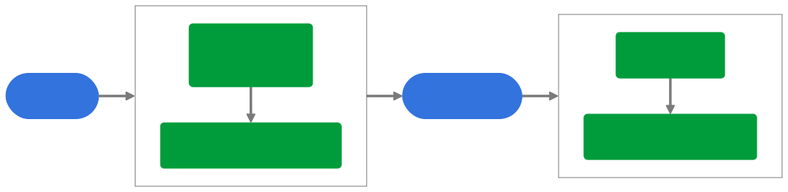
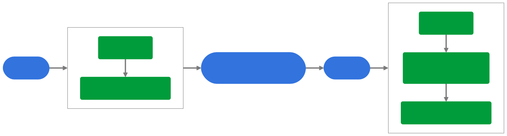
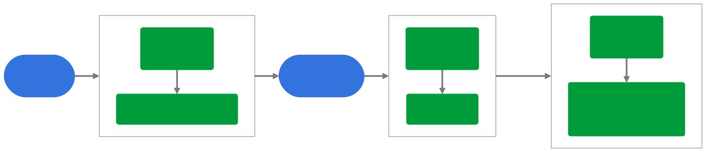
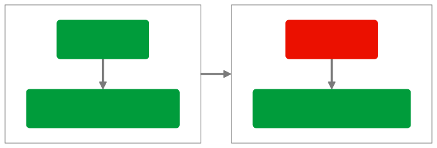
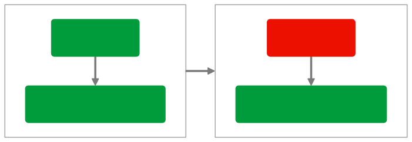
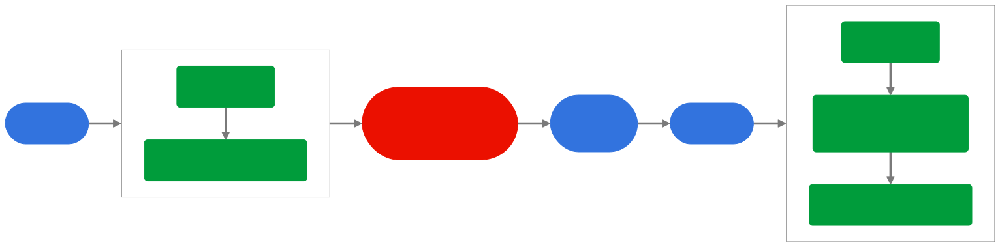
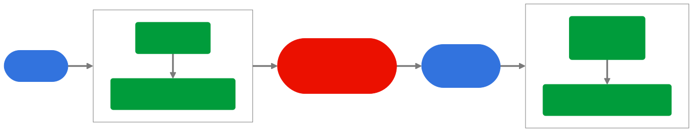
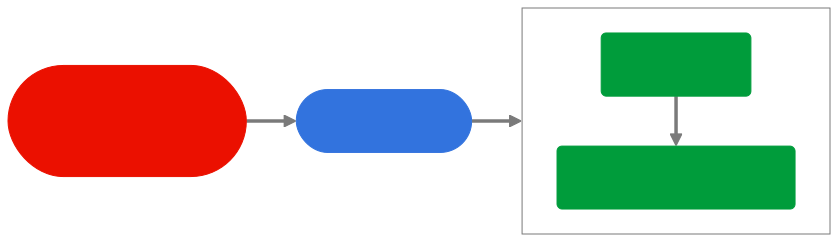

# Lifecycle for Edge Network behavior reference

The Lifecycle for Edge Network extension introduces a new way of collecting Lifecycle data and tracking sessions. Unlike the previous Lifecycle extension, which used a configurable timeout window for session tracking, this extension emits Application Launch and Close events, treating each pair as an independent session. As a result of not relying on a session timeout window to identify new sessions, the potential Lifecycle states are simplified.

## General behavior

The Lifecycle for Edge Network extension relies solely on the Lifecycle events dispatched by the [`lifecycleStart`](../../home/base/mobile-core/lifecycle/api-reference.md#lifecyclestart) and [`lifecyclePause`](../../home/base/mobile-core/lifecycle/api-reference.md#lifecyclepause) calls to determine the start and end of new sessions and to calculate lifecycle data.

A Lifecycle session is the time between a `lifecycleStart` call and a `lifecyclePause` call. A new session is detected when `lifecycleStart` is called after app first launch or after a `lifecyclePause`.

All events that are not Lifecycle start or Lifecycle pause do not affect Lifecycle state or data. Starting MobileCore using `registerExtensions` does not automatically start a Lifecycle session nor does it affect Lifecycle data.

### Event reference

Events dispatched by the Lifecycle extension to support Adobe Experience Platform Edge Network workflows include:

* [Lifecycle Application Launch (Foreground)](../../home/base/mobile-core/lifecycle/event-reference.md#lifecycle-application-foreground)
* [Lifecycle Application Close (Background)](../../home/base/mobile-core/lifecycle/event-reference.md#lifecycle-application-background)

For full event details, please read the [Lifecycle event reference](../../home/base/mobile-core/lifecycle/event-reference.md).

### Data payloads

The Lifecycle for Edge Network event payloads are defined by the Platform Mobile Lifecycle Details XDM field group, and include information about the application, device, and environment when the event occurred. Please refer to [Lifecycle for Edge Network data](metrics.md) for the data included with these events.

## Expected Lifecycle scenarios

The following Lifecycle workflows show examples of the expected ordering of Lifecycle events.

### App launch and close

This scenario shows the standard Lifecycle workflow, with expected Lifecycle API calls.

### On app crash or force close

This scenario shows the standard Lifecycle workflow when the application crashes or is force closed, preventing `lifecyclePause` from being called.

### Rapid successive lifecyclePause and lifecycleStart calls

This scenario shows the handling of rapid successive calls to `lifecyclePause` followed by `lifecycleStart`. This is designed to accommodate use cases such as in Android, where Lifecycle APIs are linked to the Android Activity lifecycle callback methods. When users transition between activities within the same app, this logic prevents these transitions from being tracked as individual sessions.

## Troubleshooting unexpected Lifecycle scenarios

The following Lifecycle workflows show examples of the unexpected ordering of Lifecycle events that can impact Lifecycle data and can indicate an incorrect implementation of the Lifecycle APIs. To address the following scenarios, refer to the [implementation guide for Lifecycle](../../home/base/mobile-core/lifecycle/index.md).

### Consecutive Lifecycle API calls

Consecutive `lifecycleStart` and consecutive `lifecyclePause` API calls will not update their respective timestamps stored in persistence, and Lifecycle data is not changed.

#### Consecutive `lifecycleStart` API calls

#### Consecutive `lifecyclePause` API calls

### Missing pause, app terminated

This scenario looks the same as a standard crash, but the underlying reason is an incorrect implementation where `lifecyclePause` is not called before the app is terminated.

### Missing pause, app still in memory

This scenario shows an example of [consecutive `lifecycleStart` API calls](#consecutive-lifecyclestart-api-calls). The app close is not detected because `lifecyclePause` is not called. As the app is not removed from memory, the current session continues.

In this scenario, the `lifecycleStart` call (5a) is not detected as a new session nor a crash. It will have the consequence of a [consecutive `lifecycleStart` API call](#consecutive-lifecyclestart-api-calls).

### Missing start

This scenario shows an example of a missing `lifecycleStart` call (1). The new session is not detected because `lifecycleStart` is not called.

In this scenario, the `lifecyclePause` call (3a) will dispatch an Application Close event only if the Lifecycle extension state is not already set to Pause (that is, `lifecyclePause` has not been called before the current call). Otherwise, it is effectively a [consecutive `lifecyclePause` API call](#consecutive-lifecyclepause-api-calls).
