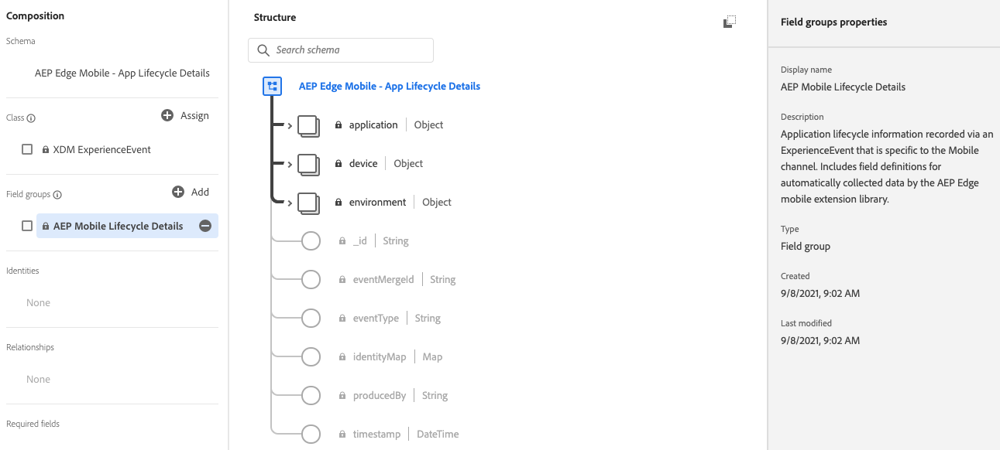
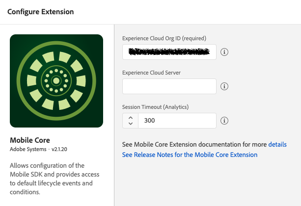
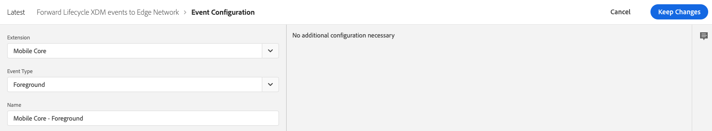
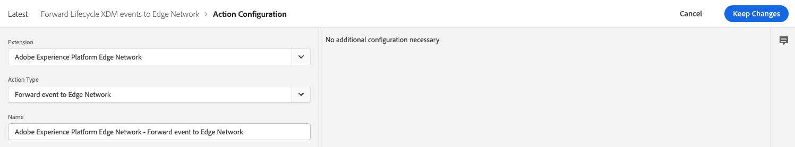
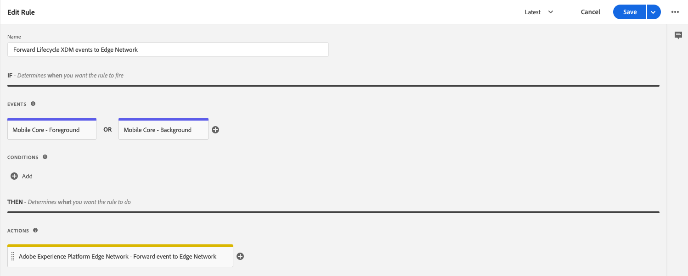

# Lifecycle for Edge Network

The Adobe Experience Platform Mobile SDK Lifecycle extension enables application lifecycle data collection from your mobile app when using the Adobe Experience Platform Mobile SDK and the [Edge Network extension](../edge-network/index.md). Use the following steps to set up an application to forward Lifecycle extension data to the Adobe Experience Platform.

## Migrating from Analytics to Lifecycle for Edge Network

If you are an existing Mobile Analytics customer and are migrating to the Edge Network, or would like more information on how Lifecycle for Edge Network works, please read the [Lifecycle for Edge Network migration reference](./migration-reference.md). Here you will find important information about the differences of how Lifecycle works when using Edge Network versus Analytics.

<InlineAlert variant="warning" slots="text"/>

After migrating to Lifecycle for Edge Network from Analytics, the number of events (hits) sent to Adobe Experience Platform may increase and could impact billable events. It is important to understand the changes to Lifecycle for Edge Network by reading the [migration reference](./migration-reference.md).

## Configure and install Lifecycle for Edge Network

### Add AEP Mobile Lifecycle Details field group to your XDM Schema in Adobe Experience Platform

Include the "AEP Mobile Lifecycle Details" field group to the schema defined in your Edge configuration datastream. This field group defines all the data auto-collected by the Lifecycle for Edge Network extension.

<InlineAlert variant="info" slots="text"/>

If your workflow does not require the creation of an XDM schema, such as when only using the Adobe Analytics service, then this step is optional.

1. In Adobe Experience Platform, log in to your organization.
2. Under **Schemas** section, select the **Browse** tab and search for the schema used in the application's Edge configuration.
3. In the **Field groups** section, select **Add**.
4. Search for **AEP Mobile Lifecycle Details**. Select it, then select **Add field groups**.
5. Select **Save**.

### Configure the Adobe Experience Platform Lifecycle extension in Data Collection UI

<InlineAlert variant="info" slots="text"/>

The Lifecycle for Edge Network extension is part of the Mobile Core extension. There is no separate card for the Lifecycle for Edge Network extension in the Extensions Catalog.

<InlineAlert variant="warning" slots="text"/>

The configuration setting "Session Timeout" in the Mobile Core extension configuration is used when collecting Lifecycle session data for Analytics and is not used for the Lifecycle for Edge Network extension.

1. In the Data Collection UI, from your mobile property, select the **Extensions** tab.
2. On the **Catalog** tab, locate or search for the **Mobile Core** extension, and select **Install**.
3. There are no configuration settings for **Lifecycle for Edge Network**.
4. Select **Save**.
5. Follow the publishing process to update SDK configuration.

In addition, use the following steps to [Configure the Edge Network extension](../edge-network/index.md#configure-edge-network-extension).

### Configure a Rule to forward Lifecycle data to Platform

The Lifecycle for Edge Network extension dispatches application launch (foreground) and application close (background) events to the Mobile SDK. Create a rule to forward these events to the Adobe Experience Platform Edge Network.

#### Create a rule

1. On the **Rules** tab, select **Create New Rule**.
2. Give your rule an easily recognizable name in your list of rules.

   In this example, the rule is named "Forward Lifecycle XDM events to Edge Network".

<InlineAlert variant="info" slots="text"/>

If you do not have existing rules for this property, the **Create New Rule** button will be in the middle of the screen. If your property has rules, the button will be in the top right of the screen.

#### Select an event

1. Under the **Events** section, select **Add**.
2. From the **Extension** dropdown list, select **Mobile Core**.
3. From the **Event Type** dropdown list, select **Foreground**.
4. Select **Keep Changes**.
5. Under the **Events** section again, select the plus icon to add another Event.
6. From the **Extension** dropdown list, select **Mobile Core**.
7. From the **Event Type** dropdown list, select **Background**.
8. Select **Keep Changes**.

#### Define the action

1. Under the **Actions** section, select **Add**.
2. From the **Extension** dropdown list, select **Adobe Experience Platform Edge Network**.
3. From the **Action Type** dropdown list, select **Forward event to Edge Network**.
4. Select **Keep Changes**.

#### Save the rule and rebuild your property

After you complete your configuration, verify that your rule looks like the following:

1. Select **Save**.
2. Rebuild your mobile property and deploy it to the correct environment.

### Add the Lifecycle extension to your app

Installing Lifecycle for Edge Network is the same as installing Lifecycle for Analytics as there is only a single mobile SDK Lifecycle extension. The Lifecycle APIs for lifecycleStart and lifecyclePause are the same for both Lifecycle workflows. If your application already includes the Lifecycle extension then you are already setup for Lifecycle for Edge Network.

For implementation details, please reference the Lifecycle documentation to learn how to [add Lifecycle to your app](../../home/base/mobile-core/lifecycle/index.md#add-lifecycle-to-your-app) and [register Lifecycle with Mobile Core and add appropriate the Start/Pause calls](../../home/base/mobile-core/lifecycle/index.md#register-lifecycle-with-mobile-core-and-add-appropriate-start-pause-calls).

### Add Edge Network extension to your app

Use the following steps to [add the Edge Network extension to your app](../edge-network/index.md#add-the-edge-network-extension-to-your-app).
