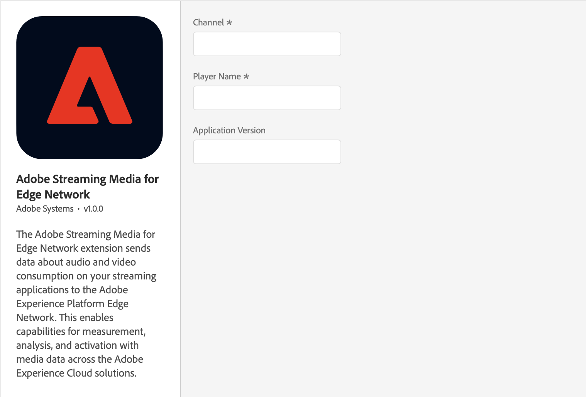

# Adobe Streaming Media for Edge Network

The Media for Edge Network extension enables tracking user's engagement and consumption of audio and video content on mobile devices.

## Before starting

### Configure and Setup Adobe Streaming Media for Edge Network

1. [Define a report suite](https://experienceleague.adobe.com/docs/media-analytics/using/implementation/implementation-edge.html#define-a-report-suite)
2. [Set up the schema in Adobe Experience Platform](https://experienceleague.adobe.com/docs/media-analytics/using/implementation/implementation-edge.html#set-up-the-schema-in-adobe-experience-platform)
3. [Create a dataset in Adobe Experience Platform](https://experienceleague.adobe.com/docs/media-analytics/using/implementation/implementation-edge.html#create-a-dataset-in-adobe-experience-platform)
4. [Configure a datastream in Adobe Experience Platform](https://experienceleague.adobe.com/docs/media-analytics/using/implementation/implementation-edge.html#configure-a-datastream-in-adobe-experience-platform)

Follow the full guide for setting up [Adobe Streaming Media for Edge Network with Experience Platform Edge](https://experienceleague.adobe.com/docs/media-analytics/using/implementation/edge-recommended/media-edge-sdk/implementation-edge.html) before configuring and implementing the SDK.

### Configure and Install Dependencies

Media for Edge Network requires Edge and Edge Identity extensions. Make sure to [configure the Edge extension in Data Collection UI](../edge-network/index.md#configure-the-edge-network-extension-in-data-collection-ui) and [configure the Edge Identity extension in Data Collection UI](../identity-for-edge-network/index.md#configure-the-identity-extension-in-the-data-collection-ui) before proceeding.

## Configure Media for Edge Network extension in the Data Collection Tags

1. In the [Data Collection Tags](https://experience.adobe.com/#/data-collection/tags), select the **Extensions** tab in your mobile property.
2. On the **Catalog** tab, locate the **Adobe Streaming Media for Edge Network** extension, and select **Install**.
3. Type the extension settings. For more information, see [Configure Media for Edge Network extension](#configure-the-media-for-edge-network-extension).
4. Select **Save**.
5. Follow the publishing process to update your SDK configuration.

## Configure the Media for Edge Network extension

<InlineAlert variant="info" slots="text"/>



To configure the Media for Edge Network extension, complete the following steps:

### Channel

Type the channel name property.

### Player name

Type the name of the media player in use (for example, _AVPlayer_, _Native Player_, or _Custom Player_).

### Application version

Type the version of the media player application/SDK.

## Add Media for Edge Network to your app

### Include Media for Edge Network extension as an app dependency

Add MobileCore, Edge, EdgeIdentity and EdgeMedia extensions as dependencies to your project.

<InlineAlert variant="info" slots="text"/>

This extension requires the [Edge Network extension](../edge-network/index.md) and [Identity for Edge Network extension](../identity-for-edge-network/index.md). You must add the `Adobe Experience Platform Edge Network` and `Identity` extensions to your mobile property in the `Data collection UI` and make sure they are correctly configured.

#### Android Kotlin

Add the required dependencies to your project by including them in the app's Gradle file.

```kotlin
implementation(platform("com.adobe.marketing.mobile:sdk-bom:3.+"))
implementation("com.adobe.marketing.mobile:core")
implementation("com.adobe.marketing.mobile:edge")
implementation("com.adobe.marketing.mobile:edgeidentity")
implementation("com.adobe.marketing.mobile:edgemedia")
```

<InlineAlert variant="warning" slots="text"/>

Using dynamic dependency versions is **not** recommended for production apps. Please read the [managing Gradle dependencies guide](../../resources/manage-gradle-dependencies.md) for more information.

#### Android Groovy

Add the required dependencies to your project by including them in the app's Gradle file.

```java
implementation platform('com.adobe.marketing.mobile:sdk-bom:3.+')
implementation 'com.adobe.marketing.mobile:core'
implementation 'com.adobe.marketing.mobile:edge'
implementation 'com.adobe.marketing.mobile:edgeidentity'
implementation 'com.adobe.marketing.mobile:edgemedia'
```

<InlineAlert variant="warning" slots="text"/>

Using dynamic dependency versions is **not** recommended for production apps. Please read the [managing Gradle dependencies guide](../../resources/manage-gradle-dependencies.md) for more information.

#### iOS CocoaPods

Add the required dependencies to your project using CocoaPods. Add following pods in your `Podfile`:

```swift
    pod 'AEPCore', '~> 5.0'
    pod 'AEPEdge', '~> 5.0'
    pod 'AEPEdgeIdentity', '~> 5.0'
    pod 'AEPEdgeMedia', '~> 5.0'
```

### Initialize Adobe Experience Platform SDK with Media for Edge Network Extension

Next, initialize the SDK by registering all the solution extensions that have been added as dependencies to your project with Mobile Core. For detailed instructions, refer to the [initialization](../../home/getting-started/get-the-sdk.md#2-add-initialization-code) section of the getting started page.

Using the `MobileCore.initialize` API to initialize the Adobe Experience Platform Mobile SDK simplifies the process by automatically registering solution extensions and enabling lifecycle tracking.

#### Android Kotlin

<InlineAlert variant="warning" slots="text"/>

This API is available starting from **Android BOM version 3.8.0**.

```kotlin
import com.adobe.marketing.mobile.LoggingMode
import com.adobe.marketing.mobile.MobileCore
...
import android.app.Application
...

class MainApp : Application() {
  override fun onCreate() {
    super.onCreate()
    MobileCore.setLogLevel(LoggingMode.DEBUG)
    MobileCore.initialize(this, "ENVIRONMENT_ID")
  }
}
```

#### Android Java

<InlineAlert variant="warning" slots="text"/>

This API is available starting from **Android BOM version 3.8.0**.

```java
import com.adobe.marketing.mobile.LoggingMode;
import com.adobe.marketing.mobile.MobileCore;
...
import android.app.Application;
...
public class MainApp extends Application {
  @Override
  public void onCreate(){
    super.onCreate();
    MobileCore.setLogLevel(LoggingMode.DEBUG);
    MobileCore.initialize(this, "ENVIRONMENT_ID");
  }
}
```

#### iOS Swift

<InlineAlert variant="warning" slots="text"/>

This API is available starting from **iOS version 5.4.0**.

```swift
// AppDelegate.swift
import AEPCore
import AEPServices
...

final class AppDelegate: NSObject, UIApplicationDelegate {
  func application(_: UIApplication, didFinishLaunchingWithOptions _: [UIApplication.LaunchOptionsKey: Any]? = nil) -> Bool {
    MobileCore.setLogLevel(.debug)
    MobileCore.initialize(appId: "ENVIRONMENT_ID")
    ...
  }
}
```

#### iOS Objective-C

<InlineAlert variant="warning" slots="text"/>

This API is available starting from **iOS version 5.4.0**.

```objectivec
// AppDelegate.m
#import "AppDelegate.h"
@import AEPCore;
@import AEPServices;
...
@implementation AppDelegate
- (BOOL)application:(UIApplication *)application didFinishLaunchingWithOptions:(NSDictionary *)launchOptions {
  [AEPMobileCore setLogLevel: AEPLogLevelDebug];  
  [AEPMobileCore initializeWithAppId:@"ENVIRONMENT_ID" completion:^{
      NSLog(@"AEP Mobile SDK is initialized");
  }];
  ...
  return YES;
}
@end
```

## Configuration keys

To update your SDK configuration programmatically, use the following information to change your Media configuration values. For more information, see [Configuration API reference](../../home/base/mobile-core/configuration/api-reference.md).

| Key | Required | Description | Data Type |
| :--- | :--- | :--- | :--- |
| `edgeMedia.channel` | Yes | The Channel name. For more information, see [Channel](#channel). | String |
| `edgeMedia.playerName` | Yes | The media player name, i.e., "AVPlayer", "HTML5 Player", "My Custom Player". For more information, see [Player Name](#player-name). | String |
| `edgeMedia.appVersion` | No | Version of the media player app/SDK. For more information, see [Application Version](#application-version). | String |
