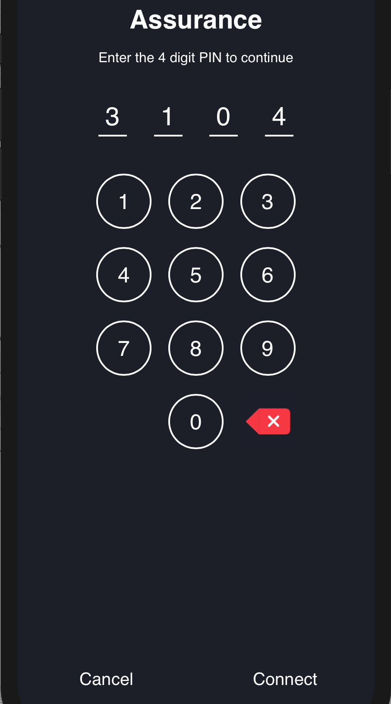
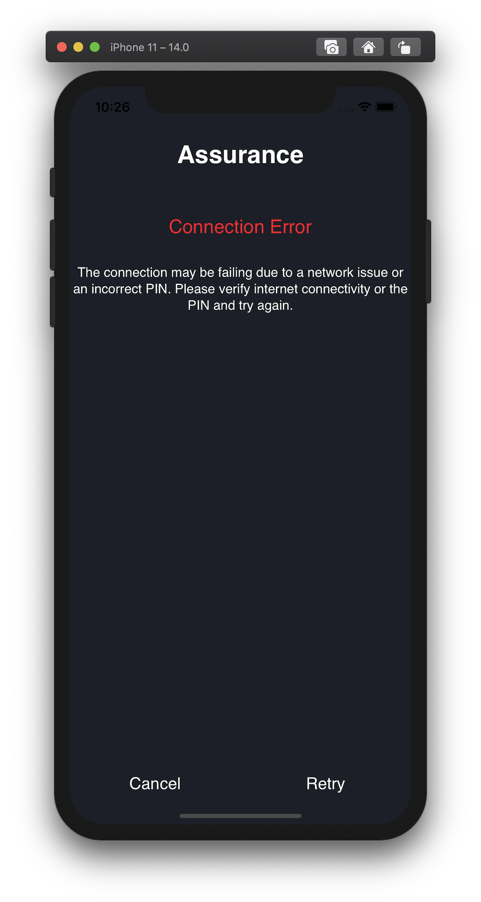
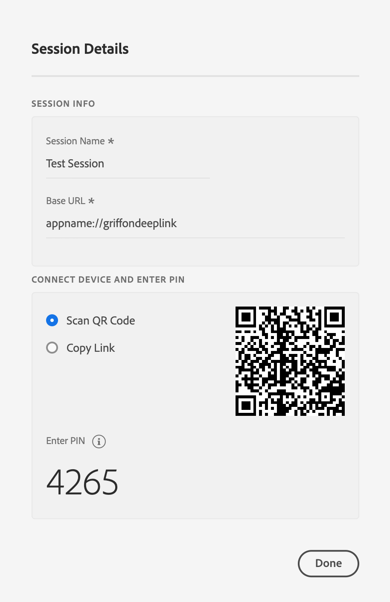
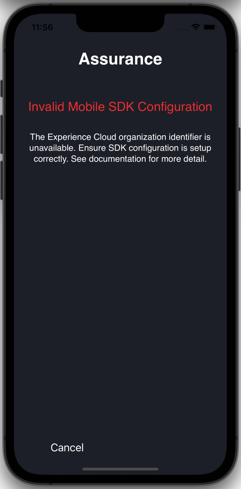
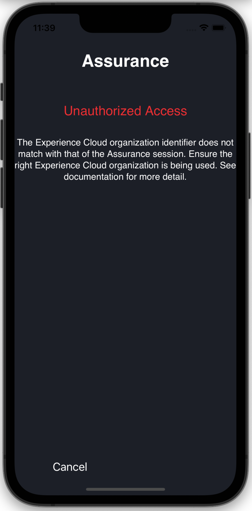

# Resolving common issues

## Unable to open app with QR code or generated link

If scanning the QR code or opening the deep link in Adobe Experience Platform Assurance does not open your app, deep linking may not be correctly configured in your mobile application.

Please follow OS developer documentation to learn more on setting up deep linking.

### Android

Follow the [Android documention](https://developer.android.com/training/app-links/deep-linking) on information about how to set up a deeplink.

### iOS

Follow the [Apple developer](https://developer.apple.com/documentation/uikit/inter-process_communication/allowing_apps_and_websites_to_link_to_your_content/defining_a_custom_url_scheme_for_your_app) documentation to set a custom URL scheme for your application.

## PIN screen does not appear

When the generated link or QR code from Adobe Experience Platform Assurance is opened on device, it should launch your app and show a PIN screen to establish a Assurance session (as shown below). If this screen does not appear, ensure the following:



### Register Assurance SDK extension with Mobile Core

Please refer to the [Assurance overview](../index.md#register-aepassurance-with-mobile-core) for more details.

### Copy link or open QR code from Adobe Experience Platform Assurance

The PIN screen may not show if the link or QR code is incorrect (or doesn't contain the query parameter `adb_validation_sessionid`). You may detect this error by seeing console logs with the following strings:

### Android

```text
AdobeExperienceSDK: Assurance - Not a valid Assurance deeplink, Ignoring start session API call. URL :  <deeplink URL>
```

### iOS

```text
AdobeExperienceSDK: Assurance - Not a valid Assurance deeplink, Ignoring start session API call. URL :  <deeplink URL>
```

This issue may be resolved by scanning the right QR code or correctly copying the link generated in Assurance.

## Connection error

After you enter the PIN, if you see the following Connection Error:



You may resolve it by double-checking the PIN is entered correctly from the session associated link or QR code:



Or ensuring internet connectivity on the device/simulator.

## Invalid Mobile SDK configuration

If you see an Invalid Mobile SDK Configuration error (see screenshot below), verify the following:

1. Mobile Core is [configured](../mobile-core/configuration/api-reference.md)
2. Configuration in the Data Collection UI is [published](../../getting-started/create-a-mobile-property.md#publish-the-configuration)
3. Ensure the device/simulator has internet connectivity



#### Sample logs

### Android

```text
W/AdobeExperienceSDK: Assurance - Assurance connection closed. Reason: Invalid Configuration, Description: The Experience Cloud organization identifier is unavailable from the SDK. Ensure SDK configuration is setup correctly. See documentation for more detail.
```

### iOS

```text
[AdobeExperienceSDK ERROR <AEPAssurance>]: Invalid Configuration, Description: The Experience Cloud organization identifier is unavailable from the SDK. Ensure SDK configuration is setup correctly. See documentation for more detail.
```

## Unauthorized access

This error may happen when you have access to multiple organizations in your Adobe Experience Cloud interface. To resolve, ensure the organization which houses the mobile property is the same one as that where you are using Adobe Experience Platform Assurance.



#### Sample logs

### Android

```text
W/AdobeExperienceSDK: Assurance - Assurance connection closed. Reason: Unauthorized Access, Description: The Experience Cloud organization identifier does not match with that of the Assurance session. Ensure the right Experience Cloud organization is being used. See documentation for more detail.
```

### iOS

```text
[AdobeExperienceSDK ERROR <AEPAssurance>]: Assurance connection closed. Reason: Unauthorized Access, Description: The Experience Cloud organization identifier does not match with that of the Assurance session. Ensure the right Experience Cloud organization is being used. See documentation for more detail.
```

## Timeout

This SDK log message is not an error and is displayed during the routine course of SDK initialization. This message is expected if the app was not launched with an Adobe Experience Platform Assurance deep link. You may ignore this message if Assurance works as expected.

#### Sample logs

### Android

```text
D/AdobeExperienceSDK: Assurance - Timeout - Assurance did not receive deeplink to start Assurance session within 5 seconds. Shutting down Assurance extension
```

### iOS

```text
[AdobeExperienceSDK DEBUG <AEPAssurance>]: Timeout - Assurance extension did not receive session url. Shutting down from processing any further events.
```

## Failed to show fullscreen takeover

This log message is not an error and will appear with routine usage on Android devices & simulators. You may ignore this log if Assurance works as expected.

#### Sample log

```text
W/AdobeExperienceSDK: Assurance - Failed to show fullscreen takeover, could not get fullScreenTakeover object.
```
