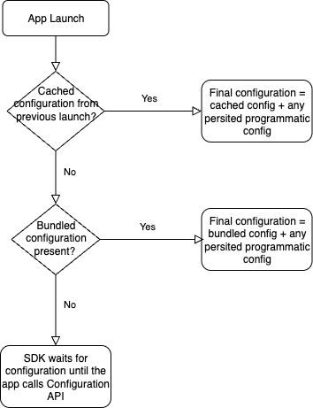
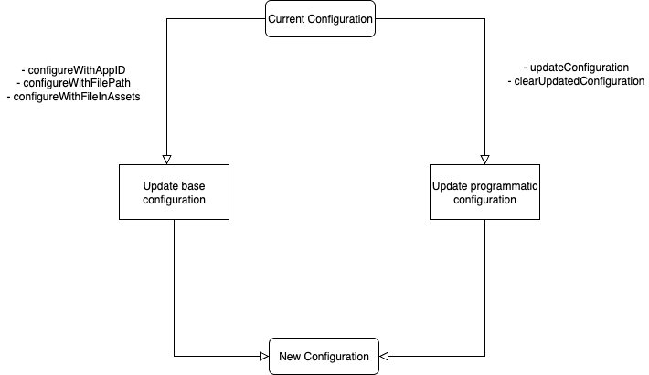

import Tabs from './tabs/index.md'

# Configuration

The Configuration extension is built into the Mobile Core extension. It provides several different APIs for you to setup the configuration either remotely in the Data Collection UI or locally.

## How Configuration Works 

The Configuration extension manages two types of configuration values: **base configuration** and **programmatic configuration**. The final configuration is created by merging the programmatic configuration over the base configuration and then resolving [environment-aware properties](#environment-aware-configuration-properties). The Configuration extension then publishes the final configuration for use by all other extensions.

### Base Configuration:

The base configuration is loaded when the app launches, either from the [cache](./api-reference.md#configurewithappid) or a [bundled configuraton](#using-a-bundled-file-configuration-for-first-launch-scenarios), if available. It can also be updated at any time using the following APIs:
- [configureWithAppID](./api-reference.md#configurewithappid)
- [configureWithFilePath](./api-reference.md#configurewithfileinpath)
- [configureWithFileInAssets](./api-reference.md#configurewithfileinassets)

### Programmatic Configuration:

Programmatic configuration consists of overrides applied on top of the base configuration. This is persisted separately and managed through the following APIs:
- [updateConfiguration](./api-reference.md#updateconfiguration)
- [clearUpdatedConfiguration](./api-reference.md#clearupdatedconfiguration)

This is how the Configuration extension handles the following scenarios.

### App Launch:

1) On app launch, the extension loads the base configuration as follows:
  - First, the extension checks for and loads a cached configuration if available. This is typically cached from previous app launches. Refer [configureWithAppID](./api-reference.md#configurewithappid).
  - If no cached configuration is found, it looks for a [bundled configuration](#using-a-bundled-file-configuration-for-first-launch-scenarios).

2) If no base configuration is found, it will not publish a configuration and will wait for configuration APIs to be called by the app. This will cause the SDK to hold event processing.

3) If a base configuration is loaded, it will publish the final configuration by merging it with any persisted programmatic configuration and resolving environment-aware properties.



### Configuration APIs:

The extension updates either the base configuration or the programmatic configuration, depending on the corresponding API call. Once the update is processed, it publishes the final configuration by merging programmatic configuration over base configuration and resolving environment-aware properties.



## Using a bundled file configuration for first launch scenarios

When configuring the SDK using the [Configure with App ID](./api-reference.md#configurewithappid) approach, the SDK downloads the Adobe hosted configuration and caches it for future launches. On subsequent app launches, the SDK uses this cached configuration during initialization and will only re-download it if any changes are detected.

However, on the initial launch after app installation, the SDK does not have a cached configuration available. In this case, SDK processing is deferred until the configuration is successfully retrieved from the remote server. This introduces a timing gap during which essential SDK features depend on a network connection to fetch the configuration data.

Applications which need to get data from the SDK early in the application lifecycle should use a bundled file configuration. This will allow the SDK to properly process events before a remote configuration is downloaded, using the bundled configuration. Without a bundled configuration, events triggered early after app launch will wait for the remote configuration to download and may not function as expected.

To use a bundled configuration, follow the steps below:

1. Download your JSON configuration file from the following URL: https://assets.adobedtm.com/PASTE-ENVIRONMENT-ID.json, replacing PASTE-ENVIRONMENT-ID with your mobile property environment ID.
2. Rename the JSON file to “ADBMobileConfig.json”.
3. iOS: Place the file anywhere that it is accessible in your app bundle.
   Android: Place the file in the assets folder.

<InlineAlert variant="info" slots="text"/>

Please note that the configuration that is downloaded by using the [Configure with App ID](./api-reference.md#configuration-api-reference) approach, will overwrite the bundled configuration once it is downloaded, allowing you to always keep a more up-to-date configuration remotely, without needing an app update.

## Environment-aware configuration properties

Some extension developers might use different configuration values based on their environment, and the generated configuration might have several entries for the same property. For example, the Adobe Campaign Standard extension has different endpoints for development, staging, and production servers. Here is an example of a raw configuration that supports multiple build environments:

```javascript
{
  "myExtension.server": "mydomain.com",
  "__dev__myExtension.server": "mydomain.dev.com",
  "__stage__myExtension.server": "mydomain.stage.com"
}
```

<InlineAlert variant="success" slots="text"/>

Each time a remote configuration is generated in the Data Collection UI, a `build.environment` value is set. This value is based on the environment that you are publishing. When the remote configuration is downloaded, the Configuration extension considers the value in `build.environment` and provides **only** the non-prefixed version for the current environment in the shared state.

Here is a modification of the previous example, which now includes `build.environment`:

```javascript
{
  "build.environment": "dev",
  "myExtension.server": "mydomain.com",
  "__dev__myExtension.server": "mydomain.dev.com",
  "__stage__myExtension.server": "mydomain.stage.com"
}
```

Here is the resulting shared state from the Configuration extension:

```javascript
{
  "build.environment": "dev",
  "myExtension.server": "mydomain.dev.com"  
}
```

## Sample configuration

Here's a sample JSON file for the SDK:

```javascript
{
    "experienceCloud.org": "3CE342C75100435B0A490D4C@AdobeOrg",  
    "target.clientCode": "yourclientcode",  
    "target.timeout": 5,  
    "audience.server": "omniture.demdex.net",  
    "audience.timeout": 5,  
    "analytics.rsids": "mobilersidsample",  
    "analytics.server": "obumobile1.sc.omtrdc.net",  
    "analytics.aamForwardingEnabled": false,  
    "analytics.offlineEnabled": true,  
    "analytics.batchLimit": 0,  
    "analytics.backdatePreviousSessionInfo": false,
    "global.privacy": "optedin",  
    "lifecycle.sessionTimeout": 300,  
    "rules.url": "https://link.to.rules/test.zip"
}
```
