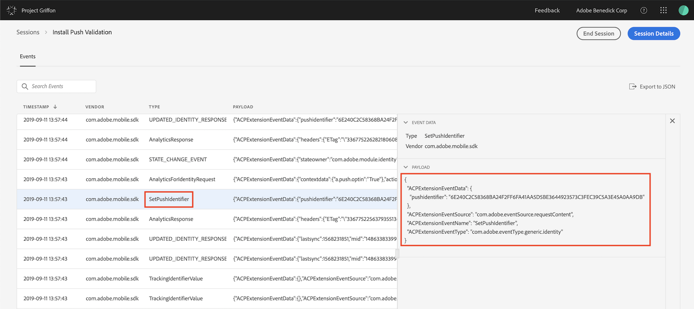
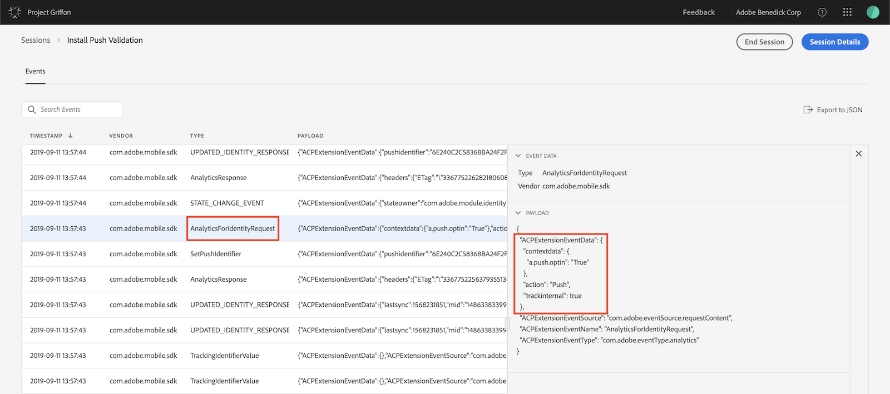
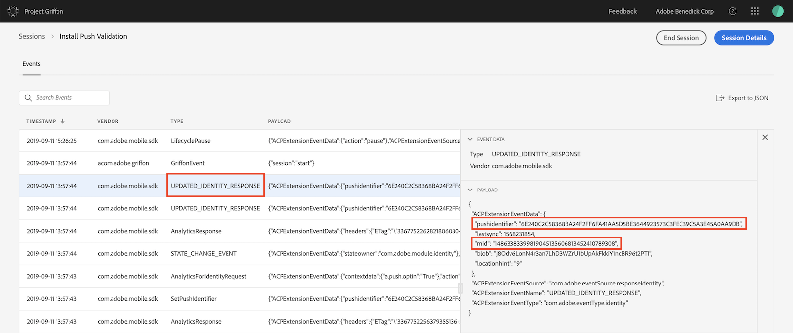

# Troubleshooting push identifier sync

<InlineAlert variant="info" slots="text"/>

This troubleshooting guide requires Adobe Experience Platform Assurance. For more information about access and how to set up Assurance, see the [documentation](https://experienceleague.adobe.com/docs/experience-platform/assurance/home.html).

When implementing push messaging via the Adobe Experience Platform Mobile SDK, you can validate the client-side implementation by verifying that you completed the following steps:

1. Pass the device's push token to the SDK.
2. Verify push token sync with the Experience Cloud Identity service.
3. Ensure user opt-in for push in Adobe Analytics.
4. Confirm user ID is correctly set (and is the same as Steps 2 and 3, above).

## Pass the push identifier to the SDK

The `setPushIdentifier` API sets the device token for push notifications in the SDK. This results in a few network calls made to the requisite Adobe servers to associate the user with the push token.

<InlineAlert variant="info" slots="text"/>

If SDK privacy status isoptedout, the push identifier will not be set.

### setPushIdentifier

#### Android Java

<CodeBlock slots="heading, code" repeat="2" />

### Syntax

```java
public static void setPushIdentifier(final String pushIdentifier);
```

### Example

```java
// retrieve the token from either GCM or FCM, and pass it to the SDK
```

#### iOS Swift

<CodeBlock slots="heading, code" repeat="2" />

### Syntax

```swift
Void setPushIdentifier(deviceToken: Data?)
```

### Example

```swift
// pass the deviceToken that the APNS has assigned to the device.
```

#### iOS Objective-C

<CodeBlock slots="heading, code" repeat="2" />

### Syntax

```objectivec
+ (void) setPushIdentifier: (nullable NSData*) deviceToken;
```

### Example

```objectivec
// pass the deviceToken that the APNS has assigned to the device
```

## Verify push token sync with the Experience Cloud Identity service

Launch your app with the device connected to an [Adobe Experience Platform Assurance session](https://experienceleague.adobe.com/docs/experience-platform/assurance/home.html).

In the list of events, verify that you have an event with type `SetPushIdentifier`. In the details panel on the right, verify the value of the push token for this device. The value in `pushIdentifier` is the same value that is sent to the Adobe servers.



## Ensure user opt-in for push in Adobe Analytics

Launch your app with the device connected to an [Adobe Experience Platform Assurance session](https://experienceleague.adobe.com/docs/experience-platform/assurance/home.html).

In the resulting list of events, verify that you have an event with type `AnalyticsForIdentityRequest`. In the details panel on the right, you can see that there is a value that was sent to Analytics that opts this user in to receive push notifications.



## Confirm that the user ID is correctly set

Launch your app with the device connected to an [Adobe Experience Platform Assurance session](https://experienceleague.adobe.com/docs/experience-platform/assurance/home.html).

In the list of events, verify that you have an event with type `UPDATED_IDENTITY_RESPONSE`. In the details panel on the right, confirm that the following values are correct:

* The value for `pushidentifier` should match the value that was sent in step 2 above.
* The value for mid should match the value for mid that is sent to Analytics. If you are using a [custom visitor identifier](../../../../../solution/adobe-analytics/api-reference.md#setidentifier), this payload should also contain a vid variable with a value that matches the value that was used to identify this user.



After completing these steps, your app is correctly configured and is ready to send push messages via the SDK and Adobe.
