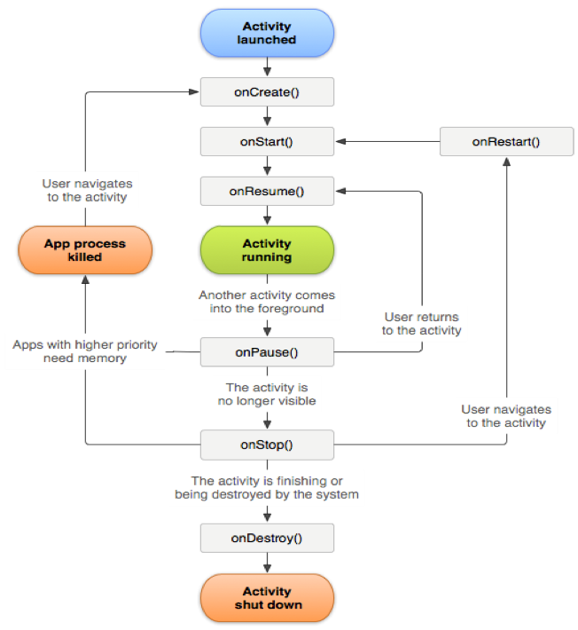

# Lifecycle extension in Android

## Implementing Lifecycle data collection in Android

For implementation details, please reference the [implementation guide for Lifecycle](/src/pages/home/base/mobile-core/lifecycle/index.md).

## Tracking app crashes in Android

This information helps you understand how crashes are tracked and the best practices to handle false crashes.

### How does crash reporting work?

When Lifecycle data collection is implemented in an application, pausing Lifecycle data collection sets a variable which is persisted in the application. When the application is launched again and Lifecycle data collection is started, if the flag is **not** set then a crash event is reported.

The variable is controlled by calls to [lifecyclePause](/src/pages/home/base/mobile-core/lifecycle/api-reference.md#lifecyclepause) (which sets the flag) and [lifecycleStart](/src/pages/home/base/mobile-core/lifecycle/api-reference.md#lifecyclestart) (which clears the flag).

<InlineAlert variant="info" slots="text"/>

To ensure accurate session and crash reporting, we recommend calling `MobileCore.lifecycleStart()` in the **onResume()** method of each activity, and `MobileCore.lifecyclePause()` in the **onPause()** method of each activity.  You should not call Lifecycle start and pause APIs from fragments.

To understand why this is essential, here is an illustration of the Android activity lifecycle:

For more information about the Android activity lifecycle, see [Activities](https://developer.android.com/guide/components/activities/).

This Android lifecycle illustration was created and shared by the [Android Open Source Project](https://source.android.com/) and used according to terms in the [Creative Commons 2.5 Attribution License](https://creativecommons.org/licenses/by/2.5/).

### What can cause a false crash to be reported?

* If you are debugging by using an IDE such as Android Studio, and launching the app again from the IDE while the app is in the foreground causes a crash.
  * You can avoid this crash by backgrounding the app before launching again from the IDE.
* If the previous foreground Activity of your app is moved to the background and does not call `MobileCore.lifecyclePause()`in `onPause`, and your app is manually closed or killed by the operating system, the next launch results in a crash.

### How should Fragments be handled?

Fragments have application lifecycle events that are similar to Activities. However, a Fragment cannot be active without being attached to an Activity. It is therefore recommended to implement the Lifecycle APIs from Activities.

## Further reading

The following guides further illustrate the expected Lifecycle scenarios along with example unexpected scenarios and how to correct them.

* [Lifecycle behavior reference](/src/pages/home/base/mobile-core/lifecycle/behavior-reference.md) when sending Lifecycle events to Analytics.
* [Lifecycle behavior reference](/src/pages/edge/lifecycle-for-edge-network/behavior-reference.md) when sending Lifecycle events to Edge Network.