# Lifecycle behavior reference

The Lifecycle extension relies solely on the Lifecycle events dispatched by the [`lifecycleStart`](api-reference.md#lifecyclestart) and [`lifecyclePause`](api-reference.md#lifecyclepause) calls to determine the start of new sessions and to calculate lifecycle data.

## General behavior

A Lifecycle session is the time between a `lifecycleStart` call and a `lifecyclePause` call. A new session is detected when `lifecycleStart` is called after a `lifecyclePause` and the [Lifecycle session timeout](configuration-keys.md#lifecyclesessiontimeout) has elapsed.

All events that are not Lifecycle start or Lifecycle pause do not affect Lifecycle state or data. The starting of MobileCore via `registerExtensions` does not automatically start a Lifecycle session nor does it affect Lifecycle data.

## Correct call patterns

The following flows are examples of correct implementations.

**On app first launch after installation**

1. *App launched*
2. `lifecycleStart` <- Start of new session
3. `lifecyclePause`
4. `lifecycleStart`
5. `lifecyclePause`
6. *App backgrounded*

**On subsequent app launches**

1. *App launched*
2. `lifecycleStart`
3. `lifecyclePause`
4. *App backgrounded*
5. *Session timeout window passes*
6. *App launched*
7. `lifecycleStart` <- Start of new session
8. ...

**On app crash or force close**

1. *App launched*
2. `lifecycleStart`
3. App crashed/force closed - consequences:
   1. Causes missing pause call
   2. App removed from device memory
4. *Session timeout window passes*
5. *App launched*
6. `lifecycleStart` <- Crash detected

## Incorrect call patterns

The following flows are examples of incorrect implementations that can lead to unexpected lifecycle data.

### Consecutive `lifecycleStart` API calls

1. Consecutive `lifecycleStart` calls are ignored.
2. A consecutive `lifecycleStart` call will trigger a new shared state event. However, the Lifecycle data is not updated from the initial `lifecycleStart` call, and the session start timestamp is also unchanged.

### Consecutive `lifecyclePause` API calls

Consecutive `lifecyclePause` calls will update the persisted pause timestamp. On the next `lifecycleStart` API call, the last pause timestamp is used to determine if the previous session has timed out and a new session is started.

### Scenario troubleshooting

**Missing pause, app terminated**  
This scenario looks the same as a standard crash, but the underlying reason is an app implementation that causes a missing `lifecyclePause` call.

1. ...
2. `lifecycleStart`
3. *App backgrounded* (missing pause)
4. *App removed from device memory* (user or device initated)
5. `lifecycleStart` <- Crash

**Missing pause, app still in memory**  
This scenario shows an example of [consecutive `lifecycleStart` API calls](#consecutive-lifecyclestart-api-calls).

1. ...
2. `lifecycleStart`
3. *App backgrounded* (missing pause) + optionally: *Session timeout window passes*
4. `lifecycleStart`

In this scenario, the `lifecycleStart` call (4) is not detected as a new session nor a crash. It will have the consequences of a [consecutive `lifecycleStart` API call](#consecutive-lifecyclestart-api-calls).

**Missing start**  
This scenario shows an example of [consecutive `lifecyclePause` API calls](#consecutive-lifecyclepause-api-calls).

1. ...
2. `lifecyclePause`
3. *App backgrounded*
4. Optionally: *Session timeout window passes*
5. *App launched*
6. `lifecyclePause` (missing start)

In this scenario, the last `lifecyclePause` call (6) is effectively a [consecutive `lifecyclePause` API call](#consecutive-lifecyclepause-api-calls), with the consequences of:

1. Actual app background time - the time between `lifecyclePause` calls (2) and (6) - to be included in Lifecycle data calculations.
2. Potentially affecting detection of a new session start.
