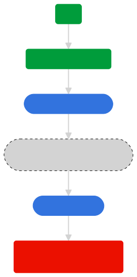

# Lifecycle behavior reference

The Lifecycle extension relies solely on the Lifecycle events dispatched by the [`lifecycleStart`](api-reference.md#lifecyclestart) and [`lifecyclePause`](api-reference.md#lifecyclepause) calls to determine the start of new sessions and to calculate lifecycle data.

## General behavior

A Lifecycle session is the time between a `lifecycleStart` call and a `lifecyclePause` call. A new session is detected when `lifecycleStart` is called after a `lifecyclePause` and the [Lifecycle session timeout](configuration-keys.md#lifecyclesessiontimeout) has elapsed.

All events that are not Lifecycle start or Lifecycle pause do not affect Lifecycle state or data. Starting MobileCore using `registerExtensions` does not automatically start a Lifecycle session nor does it affect Lifecycle data.

### Consecutive `lifecycleStart` API calls

Consecutive `lifecycleStart` calls will not update the session start timestamp from the initial `lifecycleStart` call, and Lifecycle data is not changed.

<InlineAlert variant="info" slots="text"/>

In this case, a Lifecycle shared state is dispatched with its data reflecting the start timestamp from the initial `lifecycleStart` call. This can be verified in both application logs or Assurance.

### Consecutive `lifecyclePause` API calls

Consecutive `lifecyclePause` calls will update the persisted pause timestamp. On the next `lifecycleStart` API call, the last pause timestamp is used to determine if the previous session has timed out and a new session is started.

## Expected Lifecycle scenarios

The following Lifecycle workflows show examples of the expected ordering of Lifecycle events.

**App first launch after installation**

**Subsequent app launches, continue session with app close**

**Subsequent app launches, continue session without app close**

**Subsequent app launches, new session**

**On app crash or force close**

## Troubleshooting unexpected Lifecycle scenarios

The following Lifecycle workflows show examples of the unexpected ordering of Lifecycle events that can impact Lifecycle data and can indicate an incorrect implementation of the Lifecycle APIs. To address the following scenarios, refer to the [implementation guide for Lifecycle](index.md).

**Missing pause, app terminated**  

This scenario looks the same as a standard crash, but the underlying reason is an incorrect implementation where `lifecyclePause` is not called before the app is terminated.

**Missing pause, app still in memory**  

This scenario shows an example of [consecutive `lifecycleStart` API calls](#consecutive-lifecyclestart-api-calls). The app close is not detected because `lifecyclePause` is not called. As the app is not removed from memory, the current session continues.

In this scenario, the `lifecycleStart` call (5) is not detected as a new session nor a crash. It will have the consequences of a [consecutive `lifecycleStart` API call](#consecutive-lifecyclestart-api-calls).

**Missing start**  

This scenario shows an example of [consecutive `lifecyclePause` API calls](#consecutive-lifecyclepause-api-calls). The new session is not detected because `lifecycleStart` is not called.

In this scenario, the last `lifecyclePause` call (7) is effectively a [consecutive `lifecyclePause` API call](#consecutive-lifecyclepause-api-calls), with the consequences of:

1. Actual app background time - the time between `lifecyclePause` calls (3) and (7) - to be included in Lifecycle data calculations.
2. Potentially affecting detection of a new session start.
