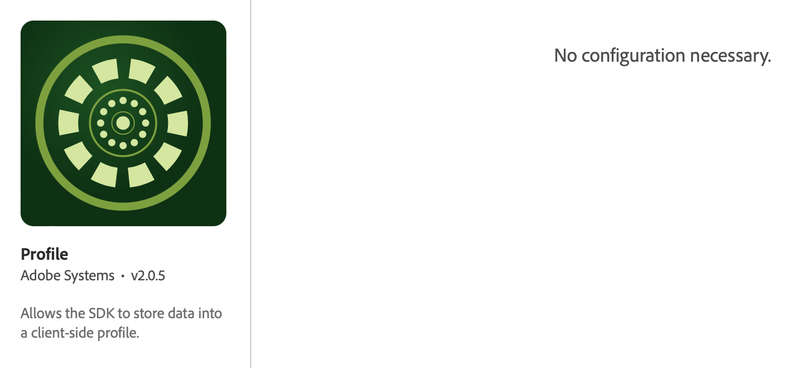

import Tabs from './tabs/index.md'

# Profile

You can use the Profile extension to store attributes about your user on the client. This information can be used later to target and personalize messages during online or offline scenarios, without having to connect to a server for optimal performance. The Profile extension manages the Client-Side Operation Profile (CSOP) and provides a way to react to APIs, updates user profile attributes, and shares the user profile attributes with the rest of the system as a generated event.

The Profile data is used by other extensions to perform profile-related actions. An example is the Rules Engine extension that consumes the profile data and runs rules based on the profile data.

<InlineAlert variant="info" slots="text"/>

The Profile extension does not require any configuration.

To get started with the Profile extension:

1. Configure the Profile Extension in the Data Collection UI.
2. Add the Profile extension to your app.
3. Implement Profile APIs to:
   * Update user attributes.
   * Remove user attributes.

## Install the Profile extension in the Data Collection UI

1. In the Data Collection UI, in your mobile property, select the **Extensions** tab.
2. On the **Catalog** tab, locate or search for the **Profile** extension, and select **Install**.
3. There are no configuration settings for **Profile**.
4. Select **Save**.
5. Follow the publishing process to update SDK configuration.

## Add the Profile extension to your app

### Include Profile extension as an app dependency

Add Profile extensions as dependencies to your project.

<TabsBlock orientation="horizontal" slots="heading, content" repeat="3"/>

Kotlin (Android)

<Tabs query="platform=android-kotlin&task=add"/>

Groovy (Android)

<Tabs query="platform=android-groovy&task=add"/>

CocoaPods (iOS)

<Tabs query="platform=ios-pods&task=add"/>

### Initialize Adobe Experience Platform SDK with Profile Extension

Next, initialize the SDK by registering all the solution extensions that have been added as dependencies to your project with Mobile Core. For detailed instructions, refer to the [initialization](/src/pages/home/getting-started/get-the-sdk/#2-add-initialization-code) section of the getting started page.

Using the `MobileCore.initialize` API to initialize the Adobe Experience Platform Mobile SDK simplifies the process by automatically registering solution extensions and enabling lifecycle tracking.

<InitializeSDK query="componentClass=TabsBlock"/>
