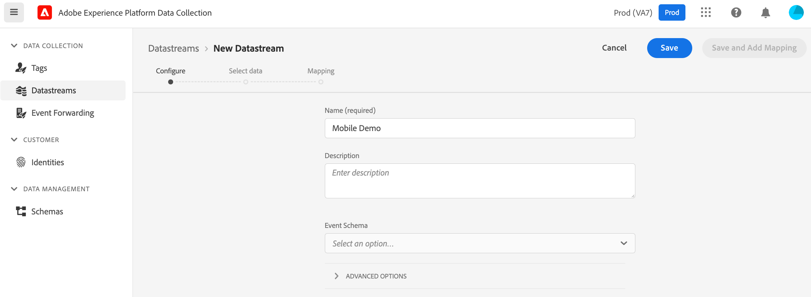
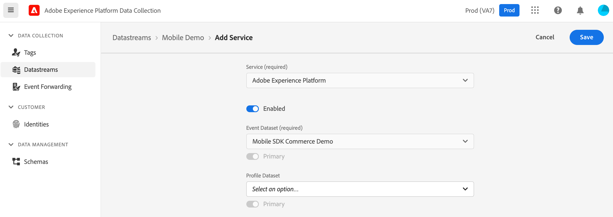

# Configure datastreams

After you've created a schema and its associated dataset, you may now configure datastreams (also referred to as Edge configurations or Edge Network configurations).

<InlineAlert variant="warning" slots="text"/>

To create a datastream, your organization must be provisioned for this feature in the Data Collection UI. Please contact your Adobe Customer Success Manager (CSM) to be added to the allow list.

<InlineAlert variant="info" slots="text"/>

The Datastreams tool is available to customers on the _allow list_ regardless whether they use the Data Collection UI for web tag management or to manage mobile app configuration. <br/><br/>Users require **Develop** permissions for the Data Collection UI. See the [user permissions](https://experienceleague.adobe.com/docs/experience-platform/tags/admin/user-permissions.html) article for more details.

## What is a datastream?

A datastream is a configured instance of the Edge Network that contains settings for your Adobe solutions and services. This configuration ensures that incoming data to the Edge Network is routed to Adobe Experience Platform and Adobe Experience Cloud solutions & services appropriately.

The following steps illustrate how to create a sample datastream for a mobile implementation:

1. In the browser, navigate to the [Data Collection UI](https://experience.adobe.com/#/data-collection) and login with your credentials.
2. If your organization is enabled for multiple sandboxes, first select the sandbox from the top right corner. For more details about sandboxes, please read the [sandboxes overview](https://experienceleague.adobe.com/docs/experience-platform/sandbox/home.html).
2. From the left panel, select **Datastreams**.
3. Select **New Datastream** (located on top right).
4. Set a name for the datastream and select **Save**.



5. In the next screen, select **Add Service**.

6. From the Service drop-down, select **Adobe Experience Platform** and:

   * Make sure the service toggle is **Enabled**.

   * Choose the appropriate **Event Dataset** as previously created, then select **Save**.



Your datastream is ready to be used now. If different settings are required per environment, create new datastreams with the respective configuration settings.

## Sending overrides to the Edge Network

After configuring the datastream overrides, you can now send these overrides to the Edge Network through Mobile SDK. Sending the overrides using the `sendEvent` API is the final step of activating the datastream configuration overrides.

### Datastream ID override

The following examples demonstrate what a datastream ID override could look like in a Mobile SDK integration:

<CodeBlock slots="heading, code" repeat="2" languages="iOS (Swift), Android (Kotlin)" />

iOS (Swift)

```swift
// Create Experience event from dictionary
var xdmData: [String: Any] = [
  "eventType": "SampleXDMEvent",
  "sample": "data",
]
let experienceEvent = ExperienceEvent(xdm: xdmData, datastreamIdOverride: "SampleDatastreamId")

Edge.sendEvent(experienceEvent: experienceEvent) { (handles: [EdgeEventHandle]) in
  // Handle the Edge Network response
}
```

Android (Kotlin)

```kotlin
// Create experience event from Map
val xdmData = mutableMapOf < String, Any > ()
xdmData["eventType"] = "SampleXDMEvent"
xdmData["sample"] = "data"

val experienceEvent = ExperienceEvent.Builder()
    .setXdmSchema(xdmData)
    .setDatastreamIdOverride("SampleDatastreamId")
    .build()

Edge.sendEvent(experienceEvent) {
    // Handle the Edge Network response
}
```

### Datastream configuration override

The following examples demonstrate what a datastream configuration override could look like in a Mobile SDK integration:

<CodeBlock slots="heading, code" repeat="2" languages="iOS (Swift), Android (Kotlin)" />

iOS (Swift)

```swift
// Create Experience event from dictionary
var xdmData: [String: Any] = [
  "eventType": "SampleXDMEvent",
  "sample": "data",
]

let configOverrides: [String: Any] = [
  "com_adobe_experience_platform": [
    "datasets": [
      "event": [
        "datasetId": "SampleEventDatasetIdOverride"
      ]
    ]
  ],
  "com_adobe_analytics": [
  "reportSuites": [
        "MyFirstOverrideReportSuite",
          "MySecondOverrideReportSuite",
          "MyThirdOverrideReportSuite"
      ]
  ],
  "com_adobe_identity": [
    "idSyncContainerId": "1234567"
  ],
  "com_adobe_target": [
    "propertyToken": "63a46bbc-26cb-7cc3-def0-9ae1b51b6c62"
 ],
]

let experienceEvent = ExperienceEvent(xdm: xdmData, datastreamConfigOverride: configOverrides)

Edge.sendEvent(experienceEvent: experienceEvent) { (handles: [EdgeEventHandle]) in
  // Handle the Edge Network response
}
```

Android (Kotlin)

```kotlin
// Create experience event from Map
val xdmData = mutableMapOf < String, Any > ()
xdmData["eventType"] = "SampleXDMEvent"
xdmData["sample"] = "data"

val configOverrides = mapOf(
    "com_adobe_experience_platform"
    to mapOf(
        "datasets"
        to mapOf(
            "event"
            to mapOf("datasetId"
                to "SampleEventDatasetIdOverride")
        )
    ),
    "com_adobe_analytics"
    to mapOf(
        "reportSuites"
        to listOf(
            "MyFirstOverrideReportSuite",
            "MySecondOverrideReportSuite",
            "MyThirdOverrideReportSuite"
        )
    ),
    "com_adobe_identity"
    to mapOf(
        "idSyncContainerId"
        to "1234567"
    ),
    "com_adobe_target"
    to mapOf(
        "propertyToken"
        to "63a46bbc-26cb-7cc3-def0-9ae1b51b6c62"
    )
)

val experienceEvent = ExperienceEvent.Builder()
    .setXdmSchema(xdmData)
    .setDatastreamConfigOverride(configOverrides)
    .build()

Edge.sendEvent(experienceEvent) {
    // Handle the Edge Network response
}
```

### Payload example

The following example shows a sample payload after overriding the datastream configurations.

```json
{
  "meta": {
    "configOverrides": {
      "com_adobe_experience_platform": {
        "datasets": {
          "event": {
            "datasetId": "SampleProfileDatasetIdOverride"
          }
        }
      },
      "com_adobe_analytics": {
        "reportSuites": [
        "MyFirstOverrideReportSuite",
        "MySecondOverrideReportSuite",
        "MyThirdOverrideReportSuite"
        ]
      },
      "com_adobe_identity": {
        "idSyncContainerId": "1234567"
      },
      "com_adobe_target": {
        "propertyToken": "63a46bbc-26cb-7cc3-def0-9ae1b51b6c62"
      }
    },
    "state": {  }
  },
  "events": [  ]
}
```
