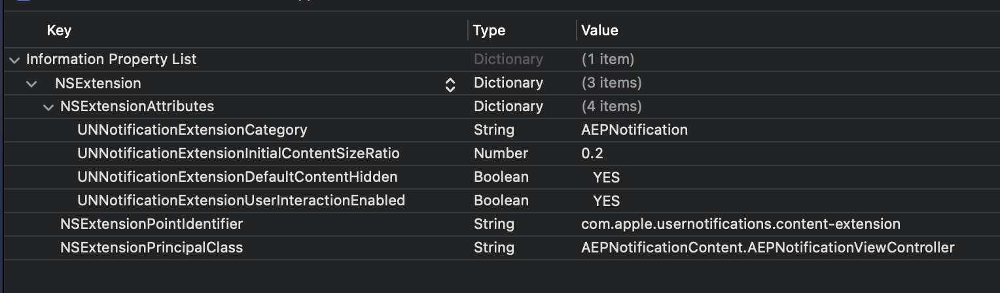

# Configure the Notification Content extension

With the `AEPNotificationContent` package now available after following the [installation steps](./index.md), the app and notification content extension must be configured to use it.

## App configuration

1. Ensure the `AppDelegate` implements `UNUserNotificationCenterDelegate`.

    ```swift
    @main
    class AppDelegate: UIResponder, UIApplicationDelegate, UNUserNotificationCenterDelegate {
        ...
    }
    ```

1. In your `AppDelegate`, after the user has granted your app permission to display notifications, create any custom notification actions needed by your app and register a category with identifier `AEPNotification`.

    ```swift
    let center = UNUserNotificationCenter.current()

    // ask user for permission to display notifications
    center.requestAuthorization(options: [.badge, .sound, .alert]) { [weak self] granted, _ in
        
        // return early if the user does not consent 
        guard granted else { return }
        
        center.delegate = self
        
        // create a category with desired actions and `AEPNotification` as the identifier
        let myCategory = UNNotificationCategory(identifier: "AEPNotification",
                                                actions: [],
                                                intentIdentifiers: [],
                                                options: [.customDismissAction])

        // register the category
        UNUserNotificationCenter.current().setNotificationCategories([myCategory])
        
        // if not done elsewhere, register the app to receive remote notifications
        DispatchQueue.main.async {
            application.registerForRemoteNotifications()
        }
    }
    ```

## Notification Content extension configuration

Update the `Info.plist` for your Notification Content extension with the following values:

| Key | Type | Value |
| --- | --- | --- |
| `NSExtension.NSExtensionPrincipalClass` | `String` | `AEPNotificationContent.AEPNotificationViewController` |
| `NSExtension.NSExtensionAttributes.UNNotificationExtensionUserInteractionEnabled` | `Boolean` | `YES` |
| `NSExtension.NSExtensionAttributes.UNNotificationExtensionDefaultContentHidden` | `Boolean` | `YES` |
| `NSExtension.NSExtensionAttributes.UNNotificationExtensionCategory` | `String` | `AEPNotification` |
| `NSExtension.NSExtensionAttributes.UNNotificationExtensionInitialContentSizeRatio` | `Number` | `0.2` |



## Next steps

Use a sample payload to generate a notification in your app by completing the steps in [Validate AEPNotificationContent integration](./validate-integration.md).
