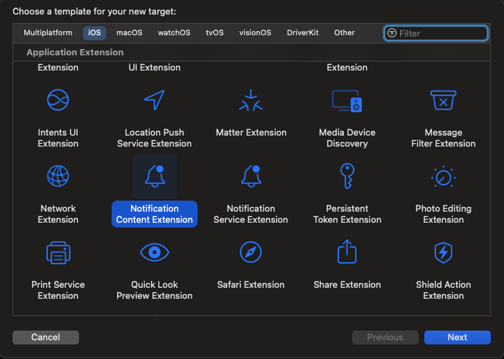

# Create a Notification Content extension

In order to use the AEPNotificationContent push templates, your app needs to have a Notification Content app extension

To add a Notification Content app extension to your iOS app, open it in Xcode and perform the following:

1. From the menu, select `File`, followed by `New` and `Target`

1. Choose the `Notification Content Extension` template under the `Application Extension` section of the `iOS` tab:  

    

1. Click `Next`

1. Name your Notification Content app extension

1. Click `Finish`

For more information about Notification Content app extensions, visit the [Apple documentation](https://developer.apple.com/documentation/usernotificationsui/customizing-the-appearance-of-notifications).
