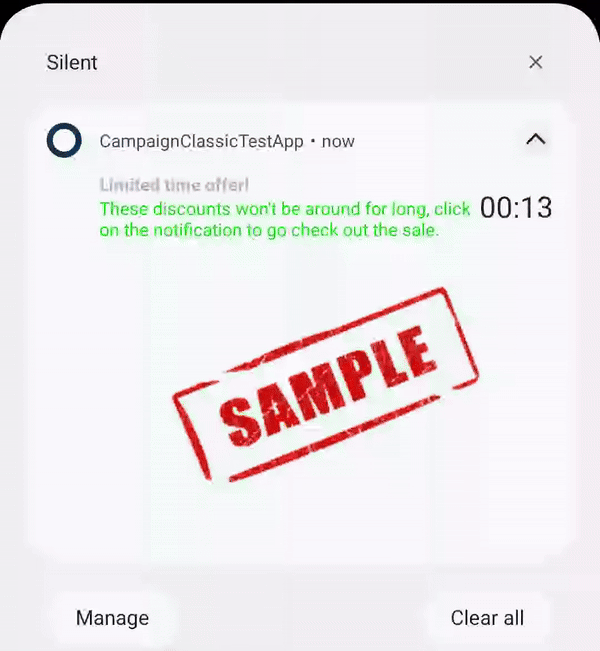
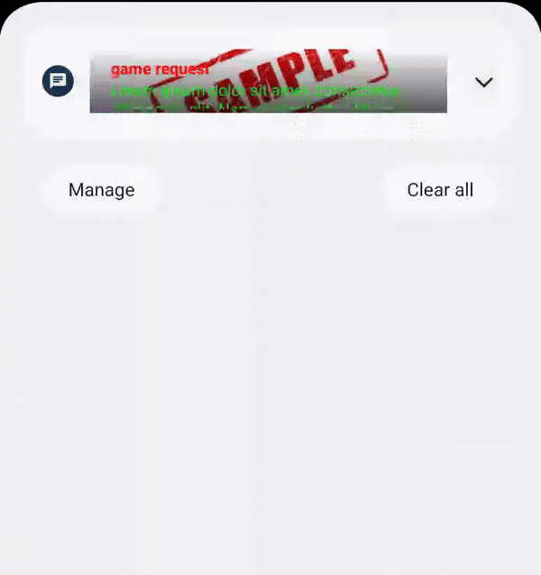
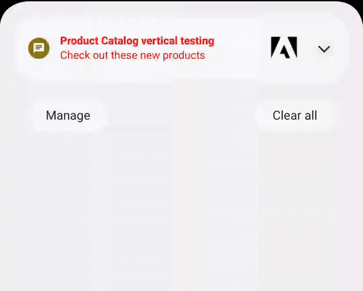
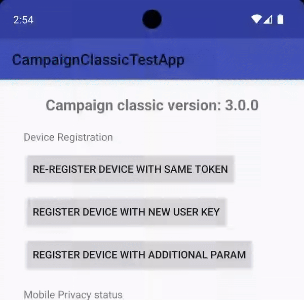

# Adobe Experience Platform - push templates

This document outlines the push templates that are supported by default.

<InlineAlert variant="info" slots="text"/>

This functionality is supported starting Campaign v8. Default push template functionality is available for use with the **Adobe Campaign Classic** extension. 

This is supported by **Android SDK version 3.1.0+** and **iOS SDK version 5.0.0+**.

| Template Name | Compatibility | Description | Sample |
| :------------ | :------------ | :---------- | :----- |
| [Basic](./basic) | **Android** **> Product**  *Adobe Campaign v8*  **> SDK Extension**  *CampaignClassic 3.1.0+*   **iOS**  **> Product** *Adobe Campaign v8*  **> SDK Extension**  *AEPNotificationContent 5.0.0+* | A basic push notification template.  Allows setting a title, message body, and optional image, action buttons, and click-through URL.   For **Android only**, it also supports a "remind me later" functionality which will schedule the notification to be re-delivered at a later time. |   |
| [Carousel](./carousel) | **Android** **> Product**  *Adobe Campaign v8*  **> SDK Extension**   *CampaignClassic 3.1.0+*   **iOS**  **> Product** *Adobe Campaign v8*  **> SDK Extension**  *AEPNotificationContent 5.0.0+* | Shows a series of three to five (3-5) images that scroll on and off the side of the notification.   Available in `manual` mode (user must click a button to scroll carousel items) and `auto` mode (carousel items scroll every five seconds). |   |
| [Timer](./timer) | **Android** **> Product**  *Adobe Campaign v8*  **> SDK Extension**   *CampaignClassic 3.1.0+*  **iOS**  **> Product** *Adobe Campaign v8*  **> SDK Extension**  *AEPNotificationContent 5.0.0+* | Notification containing title, body, and image.  Configure a countdown timer which upon expiry can cause a new title, body, and image to be shown. |   |
| [Input Box](./input-box) | **Android** **> Product**  *Adobe Campaign v8*  **> SDK Extension**   *CampaignClassic 3.1.0+*   | Notification containing title, body, and image. The notification contains a user input field which can receive a user text input that is sent back to the app via `Intent`. After the input is received, the notification can be updated with a feedback image and/or feedback message. |  |
| [Zero Bezel](./zero-bezel) | **Android** **> Product**  *Adobe Campaign v8*  **> SDK Extension**   *CampaignClassic 3.1.0+*   | Notification containing title, body, and an edge-to-edge background image which fills the notification area. |  |
| [Product Catalog](./catalog) | **Android** **> Product**  *Adobe Campaign v8*  **> SDK Extension**   *CampaignClassic 3.1.0+*   | Notification containing a main product image which can be changed by pressing one of the three product thumbnails present on the notification. The notification also contains a call-to-action (CTA) button to redirect the app user to a specified uri.  Product catalog notifications have recommended image aspect ratios depending on the layout style used. See this [table](./../index#Image specifications) for detailed information. |  |
| [Rating](./rating) | **Android** **> Product**  *Adobe Campaign v8*  **> SDK Extension**   *CampaignClassic 3.1.0+*   | Notification containing title, body, and image.  The notification contains three to five (3-5) customizable rating icons to be used for rating confirmation, each containing a click-through URI and type. The call-to-action for each rating can be unique for each rating icon. |  |
| [Multi icon](./multi-icon) | **Android** **> Product**  *Adobe Campaign v8*  **> SDK Extension**   *CampaignClassic 3.1.0+*   | Notification containing three to five (3-5) customizable icons. Each icon can be pressed to be redirected to a specified URI. The notification is persistent and will remain in the notification tray when it is interacted with. |  |
