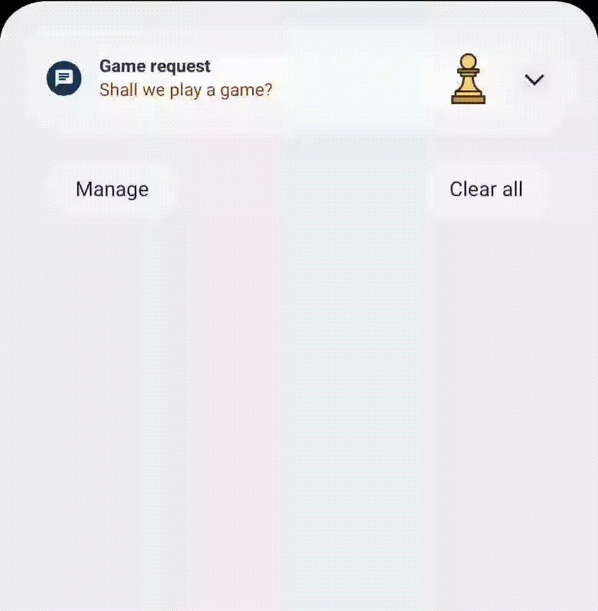
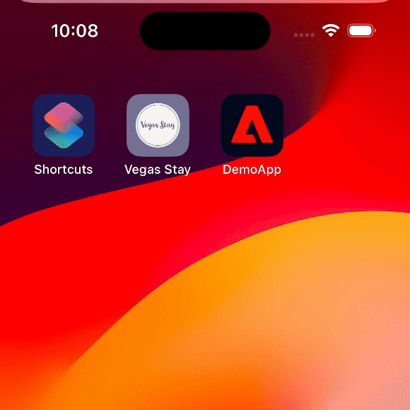

<Variant platform="fcm" template="basic" repeat="18" />

## Configuration

If using "remind later" functionality in a basic notification, you **must** declare use of the `USE_EXACT_ALARM` permission in your `AndroidManifest.xml`:

```xml
<manifest xmlns:android="http://schemas.android.com/apk/res/android"
    package="com.mycompany.myapp">
    ...
    <uses-permission android:name="android.permission.USE_EXACT_ALARM" />
    ...
</manifest>
```

## Properties

The properties below define the payload sent to FCM:

| **Field** | **Required** | **Key** | **Type** | **Description** |
| :-------- | :----------- | :------ | :------- | :-------------- |
| Payload Version | ✅ | `adb_version` | string | Version of the payload assigned by the ACC authoring UI. |
| Template Type | ✅ | `adb_template_type` | string | Informs the reader which properties may exist in the template object.<br />Basic template uses a value of "basic". |
| Title | ✅ | `adb_title` | string | Text shown in the notification's title. |
| Color - Title | ⛔️ | `adb_clr_title` | string | Text color for `adb_title`.<br />Represented as six character hex, e.g. `00FF00`. |
| Body | ✅ | `adb_body` | string | Text shown in message body when notification is collapsed. |
| Expanded Body | ⛔️ | `adb_body_ex` | string | Body of the message when the message is expanded. |
| Color - Body | ⛔️ | `adb_clr_body` | string | Text color for `adb_body`, `adb_body_ex`.<br />Represented as six character hex, e.g. `00FF00`. |
| Sound | ⛔️ | `adb_sound` | string | Sound played when notification is delivered.<br />Value should be the name of the sound file without its extension.<br />Sound file should be located in the `assets/raw` directory of your app. |
| Image | ⛔️ | `adb_image` | string | URI of an image to be shown when notification is expanded. |
| Link URI | ⛔️ | `adb_uri` | string | URI to be handled when user clicks the notification. |
| Link Type | ⛔️ | `adb_a_type` | string | Type of link represented in `adb_uri` - one of "WEBURL", "DEEPLINK", "DISMISS", or "OPENAPP".<br />Required if `adb_uri` is specified. |
| Button(s) | ⛔️ | `adb_act` | string | **The value is an encoded JSON string.**<br />One to three buttons to create for the notification. If using "remind later" functionality, only two buttons may be used in this field.<br />When decoded, the string contains an array of the following objects:<br /><ul><li>`label` (required) - Text shown on the button's label.</li><li>`uri` (required) - URI to be handled when user clicks the button.</li><li>`type` (required) - Type of link represented in `uri` - one of "WEBURL", "DEEPLINK", "DISMISS", or "OPENAPP".</li></ul> |
| Icon | ⛔️ | `adb_icon` | string | Name of a small icon to use in the notification. <br />**Note** - The value referenced by this key is not used if a valid `adb_small_icon` key value pair is present in the payload. |
| Small Icon | ⛔️ | `adb_small_icon` | string | Name of a small icon to use in the notification. The app's drawable resources are checked for an image file with the provided name. |
| Color - Small Icon | ⛔️ | `adb_clr_icon` | string | Color for the notification's small icon.<br />Represented as six character hex, e.g. `00FF00`. |
| Large Icon | ⛔️ | `adb_large_icon` | string | URI or name for a large icon to use in the notification. If the URI is valid, the remote image is downloaded and cached on the device to be used as the large icon. If a name is provided, the app's drawable resources are checked for an image file with the same name. If no valid URI or name is provided then no large icon is set on the notification. |
| Remind Later Text | ⛔️ | `adb_rem_txt` | string | If present, show a "remind later" button using the value provided as its label.<br />**Note** - both `remTxt` and `remTs` must be present in order to support "remind me later" functionality. |
| Remind Later Date | ⛔️ | `adb_rem_ts` | string | If present, schedule this notification to be re-delivered at this epoch timestamp (in seconds) provided.<br />**Note** - both `remTxt` and `remTs` must be present in order to support "remind me later" functionality. |
| Channel ID | ⛔️ | `adb_channel_id` | string | The [notification's channel id](https://developer.android.com/guide/topics/ui/notifiers/notifications#ManageChannels) (new in Android O). The app must create a channel with this channel ID before any notification with this channel ID is received. If you don't send this channel ID in the request, or if the channel ID provided has not yet been created by the app, FCM uses the channel ID specified in the app manifest.<br />If not provided in payload, SDK uses a "default" channel ID of value "General Notifications".<br />If < API 26 (Android O), this value is ignored. |
| Badge Count | ⛔️ | `adb_n_count` | string | Value to be used on app's badge. |
| Priority | ⛔️ | `adb_n_priority` | string | Designates the notification priority for Android - [importance](https://developer.android.com/reference/android/app/NotificationChannel#setImportance(int)) for API >= 26 (Android 8.0) or [priority](https://developer.android.com/reference/androidx/core/app/NotificationCompat.Builder#setPriority(int)) for API < 26. |
| Tag | ⛔️ | `adb_tag` | string | Identifier used to replace existing notifications in the notification drawer. If not specified, each request creates a new notification. If specified and a notification with the same tag is already being shown, the new notification replaces the existing one in the notification drawer. |
| Sticky | ⛔️ | `adb_sticky` | string | Boolean value represented as a string "true" or "false".<br />When set to false or unset, the notification is automatically dismissed when the user clicks it in the panel. When set to true, the notification persists even when the user clicks it. |
| Ticker | ⛔️ | `adb_ticker` | string | Sets the "ticker" text, which is sent to accessibility services. |
| Color - Background | ⛔️ | `adb_clr_bg` | string | Color for notification's background.<br />Represented as six character hex, e.g. `00FF00`. |

## Example



Below is a sample of what a payload might look like for a basic notification:

```json
{
  "message": {
    "token": "FCM_TOKEN",
    "android": {
      "collapse_key": "new message"
    },    
    "data": {
      "adb_version": "1",
      "adb_template_type": "basic",
      "adb_title": "game request",
      "adb_body": "shall we play a game?",
      "adb_sound": "bingBong",
      "adb_small_icon": "ic_knight",
      "adb_large_icon": "https://pictureofchess.com/logo.png",
      "adb_n_count": "1",
      "adb_n_priority": "PRIORITY_LOW",
      "adb_channel_id": "a3b80ef",
      "adb_image": "https://pictureofchess.com/board.png",
      "adb_uri": "https://chess.com/games",
      "adb_a_type": "WEBURL",
      "adb_act": "[{\"label\":\"accept\",\"uri\":\"https://chess.com/games/552\",\"type\":\"DEEPLINK\"{\"label\":\"decline\",\"uri\":\"\",\"type\":\"OPENAPP\"}]",
      "adb_tag": "24",
      "adb_sticky": "true",
      "adb_ticker": "Play a game?",
      "adb_body_ex": "Bob wants to play a game of chess with you. Click 'accept' to start!",
      "adb_clr_body": "00EE00",
      "adb_clr_title": "AABBCC",
      "adb_clr_icon": "123456",
      "adb_clr_bg": "000000",
      "adb_rem_txt": "Remind me",
      "adb_rem_ts": "1703462400"
    }
  }
}
```

## Usage recommendations

The tables below contain guidelines for your push notification content. **These recommendations help your text and images display reliably across multiple devices.** These values are guidelines only - you should still test a notification prior to sending it.

### Audio specifications

Custom sound files must be placed within the app's bundle in the `res/raw` directory. Supported formats are `mp3`, `wav`, or `ogg`.

### Image specifications

| **Aspect ratios** | **Image size range** | **Supported file types** |
| :-------- | -----------: | ------: |
| 1:1, 3:2, 5:4, 4:3, 2:1, 16:9 | < 1 MB | PNG, JPG, WebP |

### Text guidelines

| **Type** |**Recommended max # of characters** | **Supports multiple lines?** |
| :-------- | ------: | -------: |
| Title | ~35 (depends on screen size and device font setting) | No |
| Description | ~110 (depends on screen size and device font setting) | Yes |

<Variant platform="apns" template="basic" repeat="16" />

For full information on APNS payload keys, see [Apple's documentation](https://developer.apple.com/documentation/usernotifications/generating-a-remote-notification).

The properties below define the payload sent to APNS:

## APS properties

| **Field** | **Required** | **Key** | **Type** | **Description** |
| :-------- | :----------- | :------ | :------- | :-------------- |
| Title | ✅ | `aps.alert.title` | string | Text shown in the notification's title. |
| Subtitle | ⛔️ | `aps.alert.subtitle` | string | Text shown in subtitle of notification. |
| Body | ✅ | `aps.alert.body` | string | Text shown in message body when notification is collapsed. |
| Notification Category | ✅ | `aps.category` | string | The notification’s type. This string must correspond to the identifier of one of the `UNNotificationCategory` objects you register at launch time.<br /><br />Value will always be "AEPNotification" to use an Adobe push template. |
| Mutable content | ✅ | `aps.mutable-content` | number | The notification service app extension flag. If the value is 1, the system passes the notification to your notification service app extension before delivery. Use your extension to modify the notification’s content.<br /><br />Value must always equal 1 so that the app's notification content service is called prior to the notification being displayed to the user. |
| Sound | ⛔️ | `aps.sound` | string | The name of a sound file in your app’s main bundle or in the Library/Sounds folder of your app’s container directory. Specify the string “default” to play the system sound. Use this key for regular notifications. For critical alerts, use the sound dictionary instead. |
| Badge Count | ⛔️ | `aps.badge` | string | The number to display in a badge on your app’s icon. Specify 0 to remove the current badge, if any. |
| Notification Thread ID | ⛔️ | `aps.thread-id` | string | An app-specific identifier for grouping related notifications. This value corresponds to the `threadIdentifier` property in the `UNNotificationContent` object. |

## AEPNotificationContent properties

| **Field** | **Required** | **Key** | **Type** | **Description** |
| :-------- | :----------- | :------ | :------- | :-------------- |
| Payload Version | ✅ | `adb_version` | string | Version of the payload assigned by the Adobe authoring UI. |
| Template Type | ✅ | `adb_template_type` | string | Informs the reader which properties may exist in the template object.<br /><br />Basic template uses a value of "basic". |
| Expanded Title | ⛔️ | `adb_title_ex` | string | Title of the message when the notification is expanded.<br /><br />If an expanded title is not provided, the value in `aps.alert.title` will be used. |
| Expanded Body | ⛔️ | `adb_body_ex` | string | Body of the message when the notification is expanded.<br /><br />If an expanded body is not provided, the value in `aps.alert.body` will be used. |
| Image | ⛔️ | `adb_media` | string | URI of an image to be shown when notification is expanded. |
| Link URI | ⛔️ | `adb_uri` | string | URI to be handled when user clicks the notification body. For example, a deep link to your app or a URI to a webpage.<br /><br />If no value is provided, clicking on the notification will open the host application. |
| Color - Title | ⛔️ | `adb_clr_title` | string | Text color for `adb_title_ex`. Represented as six character hex, e.g. `00FF00`<br /><br />If no value is provided, the system [label color](https://developer.apple.com/documentation/uikit/uicolor/3173131-label) will be used. |
| Color - Body | ⛔️ | `adb_clr_body` | string | Text color for `adb_body_ex`. Represented as six character hex, e.g. `00FF00`<br /><br />If no value is provided, the system [secondaryLabel color](https://developer.apple.com/documentation/uikit/uicolor/3173136-secondarylabel) will be used. |
| Color - Background | ⛔️ | `adb_clr_bg` | string | Color for notification's background. Represented as six character hex, e.g. `00FF00`<br /><br />If no value is provided, the system [systemBackground color](https://developer.apple.com/documentation/uikit/uicolor/3173140-systembackground) will be used. |

## Example



Below is a sample of what a payload might look like for a notification using a basic template:

```json
{
    "aps" : {
        "alert" : {
            "title" : "Need a break? Picture this...",
            "body" : "Warm sand, turquoise waves, you + a cocktail. Book your beach escape now!"
        },
        "mutable-content" : 1,
        "category" : "AEPNotification"
    },
    "adb_template_type" : "basic",
    "adb_version" : "1.0",
    "adb_title_ex" : "Summer Beach Vibes Await ☀️",
    "adb_body_ex" : "Escape to paradise with our Summer Bliss Package! Secure your spot in paradise today—your dream vacation is just a booking away.",
    "adb_media" : "https://<URL_CONTAINING_IMAGE>",
    "adb_uri" : "myapp://book/beachPackage"
}
```

## Usage recommendations

The tables below contain guidelines for your push notification content. **These recommendations help your text and images display reliably across multiple devices.** These values are guidelines only - you should still test a notification prior to sending it.

### Image specifications

| **Aspect ratio** | **Image size range** | **Supported file types** |
| :-------- | -----------: | ------: |
| 2:1 (e.g. - 400x200 px) | 50 KB to 1 MB | PNG, JPG, WebP |

### Text guidelines

| **Type** |**Recommended max # of characters** | **Supports multiple lines?** |
| :-------- | ------: | -------: |
| Title | 70 | Yes (2 lines max) |
| Description | 600 | Yes |
