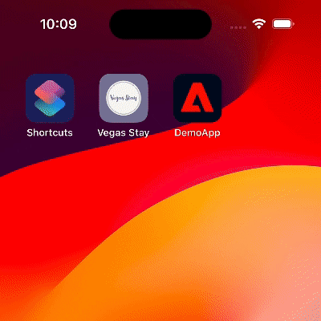

<Variant platform="fcm" template="carousel" repeat="20"/>

## Properties

The properties below define the payload sent to FCM:

| **Field** | **Required** | **Key** | **Type** | **Description** |
| :-------- | :----------- | :------ | :------- | :-------------- |
| Payload Version | ✅ | `adb_version` | string | Version of the payload assigned by the ACC authoring UI. |
| Template Type | ✅ | `adb_template_type` | string | Informs the reader which properties may exist in the template object.<br />Carousel template uses a value of "car". |
| Title | ✅ | `adb_title` | string | Text shown in the notification's title. |
| Color - Title | ⛔️ | `adb_clr_title` | string | Text color for `adb_title`.<br />Represented as six character hex, e.g. `00FF00`. |
| Body | ✅ | `adb_body` | string | Text shown in message body when notification is collapsed. |
| Expanded Body | ⛔️ | `adb_body_ex` | string | Body of the message when the message is expanded. |
| Color - Body | ⛔️ | `adb_clr_body` | string | Text color for `adb_body`, `adb_body_ex`.<br />Represented as six character hex, e.g. `00FF00`. |
| Sound | ⛔️ | `adb_sound` | string | Sound played when notification is delivered.<br />Value should be the name of the sound file without its extension.<br />Sound file should be located in the `assets/raw` directory of your app. |
| Link URI | ⛔️ | `adb_uri` | string | URI to be handled when user clicks the notification. |
| Link Type | ⛔️ | `adb_a_type` | string | Type of link represented in `adb_uri` - one of "WEBURL", "DEEPLINK", "DISMISS", or "OPENAPP".<br />Required if `adb_uri` is specified. |
| Carousel Items | ✅ | `adb_items` | string | **The value is an encoded JSON string.**<br />Three to five items in the carousel of the notification.<br />When decoded, the string contains an array of the following objects:<br /><ul><li>`img` (required) - URI to an image to be shown for the carousel item.</li><li>`txt` (optional) - Caption to show when the carousel item is visible.</li><li>`uri` (optional) - URI to be handled when the carousel item is touched by the user. If no `uri` is provided for the item, `adb_uri` will be handled instead.</li></ul> |
| Carousel Layout | ⛔️ | `adb_car_layout` | string | Determines whether the carousel should use the default layout or filmstrip variant.<br />Valid values are "default" or "filmstrip". |
| Carousel Mode | ⛔️ | `adb_car_mode` | string | Determines how the carousel will be operated.<br />Valid values are "auto" or "manual". |
| Icon | ⛔️ | `adb_icon` | string | Name of a small icon to use in the notification. <br />**Note** - The value referenced by this key is not used if a valid `adb_small_icon` key value pair is present in the payload. |
| Small Icon | ⛔️ | `adb_small_icon` | string | Name of a small icon to use in the notification. The app's drawable resources are checked for an image file with the provided name. |
| Color - Small Icon | ⛔️ | `adb_clr_icon` | string | Color for the notification's small icon.<br />Represented as six character hex, e.g. `00FF00`. |
| Large Icon | ⛔️ | `adb_large_icon` | string | URI or name for a large icon to use in the notification. If the URI is valid, the remote image is downloaded and cached on the device to be used as the large icon. If a name is provided, the app's drawable resources are checked for an image file with the same name. If no valid URI or name is provided then no large icon is set on the notification. |
| Channel ID | ⛔️ | `adb_channel_id` | string | The [notification's channel id](https://developer.android.com/guide/topics/ui/notifiers/notifications#ManageChannels) (new in Android O). The app must create a channel with this channel ID before any notification with this channel ID is received. If you don't send this channel ID in the request, or if the channel ID provided has not yet been created by the app, FCM uses the channel ID specified in the app manifest.<br />If not provided in payload, SDK uses a "default" channel ID of value "General Notifications".<br />If < API 26 (Android O), this value is ignored. |
| Badge Count | ⛔️ | `adb_n_count` | string | Value to be used on app's badge. |
| Priority | ⛔️ | `adb_n_priority` | string | Designates the notification priority for Android - [importance](https://developer.android.com/reference/android/app/NotificationChannel#setImportance(int)) for API >= 26 (Android 8.0) or [priority](https://developer.android.com/reference/androidx/core/app/NotificationCompat.Builder#setPriority(int)) for API < 26. |
| Tag | ⛔️ | `adb_tag` | string | Identifier used to replace existing notifications in the notification drawer. If not specified, each request creates a new notification. If specified and a notification with the same tag is already being shown, the new notification replaces the existing one in the notification drawer. |
| Sticky | ⛔️ | `adb_sticky` | string | Boolean value represented as a string "true" or "false".<br />When set to false or unset, the notification is automatically dismissed when the user clicks it in the panel. When set to true, the notification persists even when the user clicks it. |
| Ticker | ⛔️ | `adb_ticker` | string | Sets the "ticker" text, which is sent to accessibility services. |
| Color - Background | ⛔️ | `adb_clr_bg` | string | Color for notification's background.<br />Represented as six character hex, e.g. `00FF00`. |

## Example

Default Manual Carousel:


Filmstrip Manual Carousel:


Automatic Carousel:


Below is a sample of what a payload might look like for a carousel notification:

```json
{
  "message": {
    "token": "FCM_TOKEN",
    "android": {
      "collapse_key": "new message"
    },    
    "data": {
      "adb_version": "1",
      "adb_template_type": "car",
      "adb_title": "Check out the new line of shoes!",
      "adb_body": "Hot deals on new releases!",
      "adb_sound": "sneakerSqueaker",
      "adb_small_icon": "chat_bubble",
      "adb_large_icon": "https://sneakerland.com/logo.png",
      "adb_uri": "https://sneakerland.com/newReleases",
      "adb_a_type": "WEBURL",
      "adb_body_ex": "We have some new inventory we think you'll like.",
      "adb_clr_body": "00EE00",
      "adb_clr_title": "AABBCC",
      "adb_clr_icon": "123456",
      "adb_clr_bg": "000000",
      "adb_car_mode": "auto",
      "adb_car_layout": "default",
      "adb_items": "[{\"img\":\"https://sneakerland.com/products/shoe1/shoe1.png\",\"txt\":\"Shoe 1 by Cool Sneaker Brand\",\"uri\":\"https://sneakerland.com/products/shoe1\"},{\"img\":\"https://sneakerland.com/products/shoe2/shoe2.png\",\"txt\":\"Shoe 2 by Lame Sneaker Brand\",\"uri\":\"https://sneakerland.com/products/shoe2\"},{\"img\":\"https://sneakerland.com/products/shoe3/shoe3.png\",\"txt\":\"Shoe 3 by Average Sneaker Brand\",\"uri\":\"https://sneakerland.com/products/shoe3\"}]"
    }
  }
}
```

## Usage recommendations

The tables below contain guidelines for your push notification content. **These recommendations help your text and images display reliably across multiple devices.** These values are guidelines only - you should still test a notification prior to sending it.

### Audio specifications

Custom sound files must be placed within the app's bundle in the `res/raw` directory. Supported formats are `mp3`, `wav`, or `ogg`.

### Image specifications

| **Aspect ratios** | **Image size range** | **Supported file types** |
| :-------- | -----------: | ------: |
| Carousel - 1:1, 3:2, 5:4, 4:3, 2:1, 16:9<br />Filmstrip carousel - 1:1, 3:2, 5:4, 4:3 | < 1 MB | PNG, JPG, WebP |

### Text guidelines

| **Type** |**Recommended max # of characters** | **Supports multiple lines?** |
| :-------- | ------: | -------: |
| Title | ~35 (depends on screen size and device font setting) | No |
| Description | ~110 (depends on screen size and device font setting) | Yes |

<Variant platform="apns" template="carousel" repeat="16"/>

For full information on APNS payload keys, see [Apple's documentation](https://developer.apple.com/documentation/usernotifications/generating-a-remote-notification).

The properties below define the payload sent to APNS:

## APNS properties

| **Field** | **Required** | **Key** | **Type** | **Description** |
| :-------- | :----------- | :------ | :------- | :-------------- |
| Title | ✅ | `aps.alert.title` | string | Text shown in the notification's title. |
| Subtitle | ⛔️ | `aps.alert.subtitle` | string | Text shown in subtitle of notification. |
| Body | ✅ | `aps.alert.body` | string | Text shown in message body when notification is collapsed. |
| Notification Category | ✅ | `aps.category` | string | The notification’s type. This string must correspond to the identifier of one of the `UNNotificationCategory` objects you register at launch time.<br /><br />Value will always be "AEPNotification" to use an Adobe push template. |
| Mutable content | ✅ | `aps.mutable-content` | number | The notification service app extension flag. If the value is 1, the system passes the notification to your notification service app extension before delivery. Use your extension to modify the notification’s content.<br /><br />Value must always equal 1 so that the app's notification content service is called prior to the notification being displayed to the user. |
| Sound | ⛔️ | `aps.sound` | string | The name of a sound file in your app’s main bundle or in the Library/Sounds folder of your app’s container directory. Specify the string “default” to play the system sound. Use this key for regular notifications. For critical alerts, use the sound dictionary instead. |
| Badge Count | ⛔️ | `aps.badge` | string | The number to display in a badge on your app’s icon. Specify 0 to remove the current badge, if any. |
| Notification Thread ID | ⛔️ | `aps.thread-id` | string | An app-specific identifier for grouping related notifications. This value corresponds to the `threadIdentifier` property in the `UNNotificationContent` object. |

## AEPNotificationContent properties

| **Field** | **Required** | **Key** | **Type** | **Description** |
| :-------- | :----------- | :------ | :------- | :-------------- |
| Payload Version | ✅ | `adb_version` | string | Version of the payload assigned by the Adobe authoring UI. |
| Template Type | ✅ | `adb_template_type` | string | Informs the reader which properties may exist in the template object.<br /><br />Carousel template uses a value of "car". |
| Expanded Title | ⛔️ | `adb_title_ex` | string | Title of the message when the notification is expanded.<br /><br />If an expanded title is not provided, the value in `aps.alert.title` will be used. |
| Link URI | ⛔️ | `adb_uri` | string | URI to be handled when the user clicks on the unexpanded notification or on a carousel item that has not provided its own `uri`.<br /><br />If no value is provided, clicking on the notification will open the host application. |
| Operation mode | ⛔️ | `adb_car_mode` | string | Determines how the carousel will be operated.<br /><br />Valid values are "auto" or "manual".<br /><br />Default value is "auto". |
| Carousel items | ✅ | `adb_items` | array | Two to five items in the carousel defined by the following object:<ul><li>`img` (*required*) - URI to an image to be shown for the carousel item</li><li>`txt` (*optional*) - caption to show when the carousel item is visible</li><li>`uri` (*optional*) - URI to handle when the item is touched by the user.<br />If no `uri` is provided for the item, `adb_uri` will be handled instead.</li></ul> |
| Color - Title | ⛔️ | `adb_clr_title` | string | Text color for `adb_title_ex`. Represented as six character hex, e.g. `00FF00`<br /><br />If no value is provided, the system [label color](https://developer.apple.com/documentation/uikit/uicolor/3173131-label) will be used. |
| Color - Body | ⛔️ | `adb_clr_body` | string | Text color for `adb_body_ex`. Represented as six character hex, e.g. `00FF00`<br /><br />If no value is provided, the system [secondaryLabel color](https://developer.apple.com/documentation/uikit/uicolor/3173136-secondarylabel) will be used. |
| Color - Background | ⛔️ | `adb_clr_bg` | string | Color for notification's background. Represented as six character hex, e.g. `00FF00`<br /><br />If no value is provided, the system [systemBackground color](https://developer.apple.com/documentation/uikit/uicolor/3173140-systembackground) will be used. |

## Example



Below is a sample of what a payload might look like for a notification using a carousel template:

```json
{
    "aps" : {
        "alert" : {
            "title" : "Your Perfect Beach Holiday 🏖️",
            "body" : "Play, Relax, Recharge. Book your beach escape now!"
        },
        "mutable-content" : 1,
        "category" : "AEPNotification"
    },
    "adb_template_type" : "car",
    "adb_version" : "1.0",
    "adb_car_mode" : "manual",
    "adb_body_alt" : "Book your vacation now! 🏖️",
    "adb_items" : [
        {
            "img" : "https://<URL_CONTAINING_FIRST_IMAGE>",
            "txt" : "Escape to unique, undiscovered spots for a relaxed, memorable adventure away from the usual crowd.",
            "uri" : "myapp://book/beachPackage1"
        },
        {
            "img" : "https://<URL_CONTAINING_SECOND_IMAGE>",
            "txt" : "Nothing beats the joy of playing on the beach during vacation, where every wave brings a smile and the sand castles rise as memories are made.",
            "uri" : "myapp://book/beachPackage2"
        },
        {
            "img" : "https://<URL_CONTAINING_THIRD_IMAGE>",
            "txt" : "At sunset, the beach buzzes with playful silhouettes against the fading light, laughter mingling with the sea's whispers.",
            "uri" : "myapp://book/beachPackage3"
        }
    ]
}
```

## Usage recommendations

The tables below contain guidelines for your push notification content. **These recommendations help your text and images display reliably across multiple devices.** These values are guidelines only - you should still test a notification prior to sending it.

### Image specifications

| **Aspect ratio** | **Image size range** | **Supported file types** |
| :-------- | -----------: | ------: |
| 2:1 (e.g. - 400x200 px) | 50 KB to 1 MB | PNG, JPG, WebP |

### Text guidelines

| **Type** |**Recommended max # of characters** | **Supports multiple lines?** |
| :-------- | ------: | -------: |
| Title | 70 | Yes (2 lines max) |
| Description | 600 | Yes |
