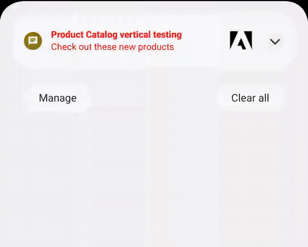

<Variant platform="fcm" template="catalog" repeat="18" />

## Properties

The properties below define the payload sent to FCM:

| **Field** | **Required** | **Key** | **Type** | **Description** |
| :-------- | :----------- | :------ | :------- | :-------------- |
| Payload Version | ✅ | `adb_version` | string | Version of the payload assigned by the ACC authoring UI. |
| Template Type | ✅ | `adb_template_type` | string | Informs the reader which properties may exist in the template object.<br />Product catalog template uses a value of "cat". |
| Title | ✅ | `adb_title` | string | Text shown in the notification's title. |
| Color - Title | ⛔️ | `adb_clr_title` | string | Text color for `adb_title`.<br />Represented as six character hex, e.g. `00FF00`. |
| Body | ✅ | `adb_body` | string | Text shown in message body when notification is collapsed. |
| Expanded Body | ⛔️ | `adb_body_ex` | string | Body of the message when the message is expanded. Note that the expanded body text is subject to the maximum permissible size of notifications as defined by the operating system (Android/iOS). |
| Color - Body | ⛔️ | `adb_clr_body` | string | Text color for `adb_body`, `adb_body_ex`.<br />Represented as six character hex, e.g. `00FF00`. |
| Sound | ⛔️ | `adb_sound` | string | Sound played when notification is delivered.<br />Value should be the name of the sound file without its extension.<br />Sound file should be located in the `assets/raw` directory of your app. |
| Link URI | ⛔️ | `adb_uri` | string | URI to be handled when user clicks the notification. |
| Link Type | ⛔️ | `adb_a_type` | string | Type of link represented in `adb_uri` - one of "WEBURL", "DEEPLINK", "DISMISS", or "OPENAPP".<br />Required if `adb_uri` is specified. |
| Icon | ⛔️ | `adb_icon` | string | Name of a small icon to use in the notification. <br />**Note** - The value referenced by this key is not used if a valid `adb_small_icon` key value pair is present in the payload. |
| Small Icon | ⛔️ | `adb_small_icon` | string | Name of a small icon to use in the notification. The app's drawable resources are checked for an image file with the provided name. |
| Color - Small Icon | ⛔️ | `adb_clr_icon` | string | Color for the notification's small icon.<br />Represented as six character hex, e.g. `00FF00`. |
| Large Icon | ⛔️ | `adb_large_icon` | string | URI or name for a large icon to use in the notification. If the URI is valid, the remote image is downloaded and cached on the device to be used as the large icon. If a name is provided, the app's drawable resources are checked for an image file with the same name. If no valid URI or name is provided then no large icon is set on the notification. |
| Channel ID | ⛔️ | `adb_channel_id` | string | The [notification's channel id](https://developer.android.com/guide/topics/ui/notifiers/notifications#ManageChannels) (new in Android O). The app must create a channel with this channel ID before any notification with this channel ID is received. If you don't send this channel ID in the request, or if the channel ID provided has not yet been created by the app, FCM uses the channel ID specified in the app manifest.<br />If not provided in payload, SDK uses a "default" channel ID of value "General Notifications".<br />If < API 26 (Android O), this value is ignored. |
| Badge Count | ⛔️ | `adb_n_count` | string | Value to be used on app's badge. |
| Priority | ⛔️ | `adb_n_priority` | string | Designates the notification priority for Android - [importance](https://developer.android.com/reference/android/app/NotificationChannel#setImportance(int)) for API >= 26 (Android 8.0) or [priority](https://developer.android.com/reference/androidx/core/app/NotificationCompat.Builder#setPriority(int)) for API < 26. |
| Tag | ⛔️ | `adb_tag` | string | Identifier used to replace existing notifications in the notification drawer. If not specified, each request creates a new notification. If specified and a notification with the same tag is already being shown, the new notification replaces the existing one in the notification drawer. |
| Sticky | ⛔️ | `adb_sticky` | string | Boolean value represented as a string "true" or "false".<br />When set to false or unset, the notification is automatically dismissed when the user clicks it in the panel. When set to true, the notification persists even when the user clicks it. |
| Ticker | ⛔️ | `adb_ticker` | string | Sets the "ticker" text, which is sent to accessibility services. |
| Color - Background | ⛔️ | `adb_clr_bg` | string | Color for notification's background.<br />Represented as six character hex, e.g. `00FF00`. |
| Call to action button text | ✅ | `adb_cta_txt` | string | Text to be shown on the CTA button. |
| Call to action button link | ✅ | `adb_cta_uri` | string | URI to be handled when the user clicks the CTA button. |
| Call to action button color | ✅ | `adb_cta_clr` | string | Color for the CTA button.<br />Represented as six character hex, e.g. `00FF00`. |
| Call to action button text color | ✅ | `adb_cta_txt_clr` | string | Color for the CTA button text. <br />Represented as six character hex, e.g. `00FF00`. |
| Display type | ✅ | `adb_display` | string | Determines the layout of the catalog notification.<br />Value will either be "horizontal" (left-to-right) or "vertical" (top-to-bottom). |
| Catalog Items | ✅ | `adb_items` | string | Three entries describing the items in the product catalog.<br />**The value is an encoded JSON string.**<br />When decoded, the string contains an array of the following objects:<br /><ul><li>`title` (required) - Text to use in the title if this product is selected.</li><li>`body` (required) - Text to use in the body if this product is selected.</li><li>`img` (required) - URI to an image to use in notification when this product is selected.</li><li>`price` (required) - Price of this product to display when the notification is selected.</li><li>`uri` (required) - URI to be handled when the user clicks the large image of the selected item.</li></ul> |

## Example

Vertical Product Catalog:



Horizontal Product Catalog:


Below is a sample of what a payload might look like for a product catalog notification:

```json
{
  "message": {
    "token": "FCM_TOKEN",
    "android": {
      "collapse_key": "new message"
    },    
    "data": {
      "adb_version": "1",
      "adb_title": "Buy some shoes",
      "adb_body": "Click a shoe to learn more",
      "adb_sound": "squeek",
      "adb_uri": "https://sneakerland.com/products/shoe1",
      "adb_a_type": "WEBURL",
      "adb_icon": "ic_shoe",
      "adb_n_count": "1",
      "adb_n_priority": "PRIORITY_LOW",
      "adb_template_type": "cat",
      "adb_clr_body": "00EE00",
      "adb_clr_title": "AABBCC",
      "adb_clr_icon": "123456",
      "adb_clr_bg": "000000",
      "adb_display": "vertical",
      "adb_cta_txt": "Buy Now",
      "adb_cta_txt_clr": "00EE00",
      "adb_cta_uri": "https://sneakerland.com/cart&addItem=shoe1",
      "adb_items": "[{\"title\":\"Cool Shoe\",\"body\":\"Shoe 1 by Cool Sneaker Brand\",\"img\":\"https://sneakerland.com/products/shoe1/shoe1.png\",\"price\":\"49.97\",\"uri\":\"https://sneakerland.com/products/shoe1\"},{\"title\":\"Lame Shoe\",\"body\":\"Shoe 2 by Lame Sneaker Brand\",\"img\":\"https://sneakerland.com/products/shoe2/shoe2.png\",\"price\":\"99.99\",\"uri\":\"https://sneakerland.com/products/shoe2\"}]"
    }
  }
}
```

## Usage recommendations

The tables below contain guidelines for your push notification content. **These recommendations help your text and images display reliably across multiple devices.** These values are guidelines only - you should still test a notification prior to sending it.

### Audio specifications

Custom sound files must be placed within the app's bundle in the `res/raw` directory. Supported formats are `mp3`, `wav`, or `ogg`.

### Image specifications

| **Aspect ratios** | **Image size range** | **Supported file types** |
| :-------- | -----------: | ------: |
| Vertical product catalog: 1:1, 3:2, 5:4, 4:3 <br />Horizontal product catalog: 16:9, 2:1 | < 1 MB | PNG, JPG, WebP |

### Text guidelines

| **Type** |**Recommended max # of characters** | **Supports multiple lines?** |
| :-------- | ------: | -------: |
| Title | ~35 (depends on screen size and device font setting) | No |
| Body | ~35 (depends on screen size and device font setting) | No |
