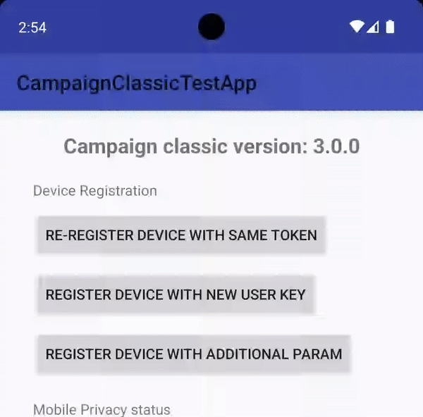

<Variant platform="fcm" template="five-icon" repeat="15" />

## Properties

The properties below define the payload sent to FCM:

| **Field** | **Required** | **Key** | **Type** | **Description** |
| :-------- | :----------- | :------ | :------- | :-------------- |
| Payload Version | ✅ | `adb_version` | string | Version of the payload assigned by the ACC authoring UI. |
| Template Type | ✅ | `adb_template_type` | string | Informs the reader which properties may exist in the template object.<br />Basic template uses a value of "basic". |
| Tag | ⛔️ | `adb_tag` | string | Identifier used to replace existing notifications in the notification drawer. If not specified, each request creates a new notification. If specified and a notification with the same tag is already being shown, the new notification replaces the existing one in the notification drawer. |
| Ticker | ⛔️ | `adb_ticker` | string | Sets the "ticker" text, which is sent to accessibility services. Prior to API level 21 (Lollipop), sets the text that is displayed in the status bar when the notification first arrives. |
| Color - Small Icon | ⛔️ | `adb_clr_icon` | string | Color for the notification's small icon.<br />Represented as six character hex, e.g. `00FF00` |
| Color - Background | ⛔️ | `adb_clr_bg` | string | Color for notification's background.<br />Represented as six character hex, e.g. `00FF00` |
| Image buttons | ✅ | `adb_items` | string | Three to five icon buttons for the notification.<br />**The value is an encoded JSON string.**<br /> When decoded, the string contains an array of the following objects:<br /><ul><li>`img` (required) - URI or bundled image representing this rating</li><li>`uri `(required) - URI to be handled when the user clicks this rating</li><li>`type` (required) - Type of link represented in the value of  `uri`.<br />One of "WEBURL", "DEEPLINK", or "OPENAPP". </li></ul> |

## Example



Below is a sample of what a payload might look like for a five icon notification:

```json
{
  "message": {
    "token": "FCM_TOKEN",
    "android": {
      "collapse_key": "new message"
    },
    "data": {
      "adb_version": "1",
      "adb_template_type": "icon",
      "adb_clr_icon": "123456",
      "adb_clr_bg": "000000",
      "adb_items": "[{\"img\":\"https://sneakerland.com/products/assets/shoe1.png\",\"uri\":\"myapp://chooseShoeType/shoe1\",\"type\":\"DEEPLINK\"},{\"img\":\"https://sneakerland.com/products/assets/shoe2.png\",\"uri\":\"myapp://chooseShoeType/shoe2\",\"type\":\"DEEPLINK\"},{\"img\":\"https://sneakerland.com/products/assets/shoe3.png\",\"uri\":\"myapp://chooseShoeType/shoe3\",\"type\":\"DEEPLINK\"},{\"img\":\"https://sneakerland.com/products/assets/shoe4.png\",\"uri\":\"myapp://chooseShoeType/shoe4\",\"type\":\"DEEPLINK\"},{\"img\":\"https://sneakerland.com/products/assets/shoe5.png\",\"uri\":\"myapp://chooseShoeType/shoe5\",\"type\":\"DEEPLINK\"}]"
    }
  }
}
```

## Usage recommendations

The tables below contain guidelines for your push notification content. **These recommendations help your images display reliably across multiple devices.** These values are guidelines only - it is still recommended to test a notification prior to sending it.

### Image specifications

| **Aspect ratios** | **Image size range** | **Supported file types** |
| :-------- | -----------: | ------: |
| 1:1, 3:2, 5:4, 4:3 | < 1 MB | PNG, JPG, WebP |
