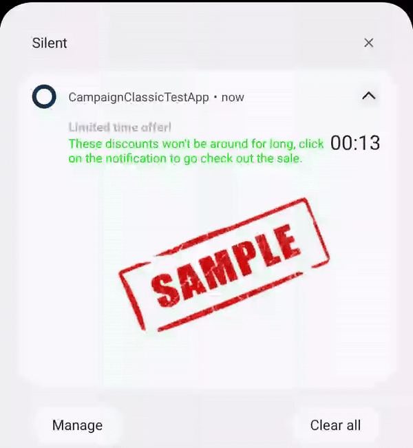
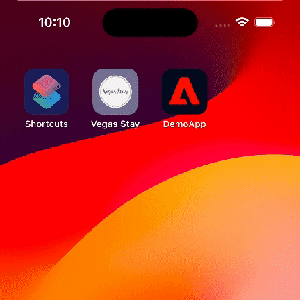

<Variant platform="fcm" template="timer" repeat="15" />

## Properties

The properties below define the payload sent to FCM:

| **Field**               | **Required** | **Key**             | **Type** | **Description**                                              |
| :---------------------- | :----------- | :------------------ | :------- | :----------------------------------------------------------- |
| Payload Version         | ✅            | `adb_version`       | string   | Version of the payload assigned by the ACC authoring UI.     |
| Template Type           | ✅            | `adb_template_type` | string   | Informs the reader which properties may exist in the template object.<br />Timer template uses a value of "timer". |
| Title                   | ✅            | `adb_title`         | string   | Text shown in the notification's title.                      |
| Alternate title         | ✅            | `adb_title_alt`     | string   | Alternate text for title of the notification after the timer has expired. |
| Color - Title           | ⛔️            | `adb_clr_title`     | string   | Text color for `adb_title`.<br />Represented as six character hex, e.g. `00FF00`. |
| Body                    | ✅            | `adb_body`          | string   | Text shown in message body when notification is collapsed.   |
| Alternate body          | ⛔️            | `adb_body_alt`      | String   | Alternate text for body of the notification after the timer has expired. |
| Expanded Body           | ⛔️            | `adb_body_ex`       | string   | Body of the message when the message is expanded.            |
| Alternate expanded body | ⛔️            | `adb_body_ex_alt`   | string   | Alternate text for body of the notification when the message is expanded after the timer has expired. |
| Color - Body            | ⛔️            | `adb_clr_body`      | string   | Text color for `adb_body`, `adb_body_ex`.<br />Represented as six character hex, e.g. `00FF00`. |
| Sound                   | ⛔️            | `adb_sound`         | string   | Sound played when notification is delivered.<br />Value should be the name of the sound file without its extension.<br />Sound file should be located in the `assets/raw` directory of your app. |
| Image                   | ⛔️            | `adb_image`         | string   | URI of an image to be shown when notification is expanded.   |
| Alternate image         | ⛔️            | `adb_image_alt`     | string   | Alternate URI of an image to be shown when notification is expanded after the timer has expired. |
| Link URI                | ⛔️            | `adb_uri`           | string   | URI to be handled when user clicks the notification.         |
| Link Type               | ⛔️            | `adb_a_type`        | string   | Type of link represented in `adb_uri` - one of "WEBURL", "DEEPLINK", "DISMISS", or "OPENAPP".<br />Required if `adb_uri` is specified. |
| Icon                    | ⛔️            | `adb_icon`          | string   | URI or name for Large icon used in notification.             |
| Small Icon              | ⛔️            | `adb_small_icon`    | string   | Name of a small icon to use in the notification. The app's drawable resources are checked for an image file with the provided name. |
| Color - Small Icon      | ⛔️            | `adb_clr_icon`      | string   | Color for the notification's small icon.<br />Represented as six character hex, e.g. `00FF00`. |
| Large Icon              | ⛔️            | `adb_large_icon`    | string   | URI or name for a large icon to use in the notification. If the URI is valid, the remote image is downloaded and cached on the device to be used as the large icon. If a name is provided, the app's drawable resources are checked for an image file with the same name. If no valid URI or name is provided then no large icon is set on the notification. |
| Channel ID              | ⛔️            | `adb_channel_id`    | string   | The [notification's channel id](https://developer.android.com/guide/topics/ui/notifiers/notifications#ManageChannels) (new in Android O). The app must create a channel with this channel ID before any notification with this channel ID is received. If you don't send this channel ID in the request, or if the channel ID provided has not yet been created by the app, FCM uses the channel ID specified in the app manifest.<br />If not provided in payload, SDK uses a "default" channel ID of value "General Notifications".<br />If < API 26 (Android O), this value is ignored. |
| Badge Count             | ⛔️            | `adb_n_count`       | string   | Value to be used on app's badge.                             |
| Priority                | ⛔️            | `adb_n_priority`    | string   | Designates the notification priority for Android - [importance](https://developer.android.com/reference/android/app/NotificationChannel#setImportance(int)) for API >= 26 (Android 8.0) or [priority](https://developer.android.com/reference/androidx/core/app/NotificationCompat.Builder#setPriority(int)) for API < 26. |
| Tag                     | ⛔️            | `adb_tag`           | string   | Identifier used to replace existing notifications in the notification drawer. If not specified, each request creates a new notification. If specified and a notification with the same tag is already being shown, the new notification replaces the existing one in the notification drawer. |
| Sticky                  | ⛔️            | `adb_sticky`        | string   | Boolean value represented as a string "true" or "false".<br />When set to false or unset, the notification is automatically dismissed when the user clicks it in the panel. When set to true, the notification persists even when the user clicks it. |
| Ticker                  | ⛔️            | `adb_ticker`        | string   | Sets the "ticker" text, which is sent to accessibility services. |
| Color - Background      | ⛔️            | `adb_clr_bg`        | string   | Color for notification's background.<br />Represented as six character hex, e.g. `00FF00.` |
| Color - Timer           | ⛔️            | `adb_clr_tmr`       | string   | Color for the text of the timer overlay.                     |
| Timer duration          | ⛔️            | `adb_tmr_dur`       | string   | If present, the timer on the notification will run for the number of seconds provided here. |
| Timer end timestamp     | ⛔️            | `adb_tmr_end`       | string   | If present, the timer on the notification will count down until this epoch time (in seconds).<br />Note - both `adb_tmr_end` and `adb_tmr_dur` are present, the duration will be used and `adb_tmr_end` will be ignored. |

## Example



Below is a sample of what a payload might look like for a timer notification:

```json
{
  "message": {
    "token": "FCM_TOKEN",
    "android": {
      "collapse_key": "new message"
    },
    "data": {     
      "adb_version": "1",
      "adb_title": "Limited time offer!",
      "adb_title_alt": "You missed out on the sale.",
      "adb_body": "Don't miss out on your chance for deep discounts.",
      "adb_body_alt": "Our next flash sale will be sometime next month.",
      "adb_sound": "chaChing",
      "adb_icon": "ic_dollar",
      "adb_n_count": "1",
      "adb_n_priority": "PRIORITY_LOW",
      "adb_image": "https://bigboxretailer.com/sale.png",
      "adb_image_alt": "https://bigboxretailer.com/sale_ended.png",
      "adb_uri": "https://bigboxretailer.com/sale",
      "adb_a_type": "WEBURL",
      "adb_template_type": "timer",
      "adb_body_ex": "These discounts won't be around for long, click on the notification to go check out the sale.",
      "adb_body_ex_alt": "Sorry you missed us this time. Check back next month for some deep discounts.",
      "adb_clr_body": "00EE00",
      "adb_clr_title": "AABBCC",
      "adb_clr_icon": "123456",
      "adb_clr_bg": "000000",
      "adb_tmr_end": "1703462400",
      "adb_clr_tmr": "FFFFFF"
    }
  }
}
```

## Usage recommendations

The tables below contain guidelines for your push notification content. **These recommendations help your text and images display reliably across multiple devices.** These values are guidelines only - you should still test a notification prior to sending it.

### Audio specifications

Custom sound files must be placed within the app's bundle in the `res/raw` directory. Supported formats are `mp3`, `wav`, or `ogg`.

### Image specifications

| **Aspect ratios**             | **Image size range** | **Supported file types** |
| :---------------------------- | -------------------: | -----------------------: |
| 1:1, 3:2, 5:4, 4:3, 2:1, 16:9 |               < 1 MB |           PNG, JPG, WebP |

### Text guidelines

| **Type**    |                   **Recommended max # of characters** | **Supports multiple lines?** |
| :---------- | ----------------------------------------------------: | ---------------------------: |
| Title       |  ~35 (depends on screen size and device font setting) |                           No |
| Description | ~110 (depends on screen size and device font setting) |                          Yes |

<Variant platform="apns" template="timer" repeat="16"/>

For full information on APNS payload keys, see [Apple's documentation](https://developer.apple.com/documentation/usernotifications/generating-a-remote-notification).

The properties below define the payload sent to APNS:

## APS properties

| **Field** | **Required** | **Key** | **Type** | **Description** |
| :-------- | :----------- | :------ | :------- | :-------------- |
| Title | ✅ | `aps.alert.title` | string | Text shown in the notification's title. |
| Subtitle | ⛔️ | `aps.alert.subtitle` | string | Text shown in subtitle of notification. |
| Body | ✅ | `aps.alert.body` | string | Text shown in message body when notification is collapsed. |
| Notification Category | ✅ | `aps.category` | string | The notification’s type. This string must correspond to the identifier of one of the `UNNotificationCategory` objects you register at launch time.<br /><br />Value will always be "AEPNotification" to use an Adobe push template. |
| Mutable content | ✅ | `aps.mutable-content` | number | The notification service app extension flag. If the value is 1, the system passes the notification to your notification service app extension before delivery. Use your extension to modify the notification’s content.<br /><br />Value must always equal 1 so that the app's notification content service is called prior to the notification being displayed to the user. |
| Sound | ⛔️ | `aps.sound` | string | The name of a sound file in your app’s main bundle or in the Library/Sounds folder of your app’s container directory. Specify the string “default” to play the system sound. Use this key for regular notifications. For critical alerts, use the sound dictionary instead. |
| Badge Count | ⛔️ | `aps.badge` | string | The number to display in a badge on your app’s icon. Specify 0 to remove the current badge, if any. |
| Notification Thread ID | ⛔️ | `aps.thread-id` | string | An app-specific identifier for grouping related notifications. This value corresponds to the `threadIdentifier` property in the `UNNotificationContent` object. |

## AEPNotificationContent properties

| **Field** | **Required** | **Key** | **Type** | **Description** |
| :-------- | :----------- | :------ | :------- | :-------------- |
| Payload Version | ✅ | `adb_version` | string | Version of the payload assigned by the Adobe authoring UI. |
| Template Type | ✅ | `adb_template_type` | string | Informs the reader which properties may exist in the template object.<br /><br />Timer template uses a value of "timer". |
| Expanded Title | ⛔️ | `adb_title_ex` | string | Title of the message when the notification is expanded.<br /><br />If an expanded title is not provided, the value in `aps.alert.title` will be used. |
| Expanded Body | ⛔️ | `adb_body_ex` | string | Body of the message when the notification is expanded.<br /><br />If an expanded body is not provided, the value in `aps.alert.body` will be used. |
| Image | ⛔️ | `adb_media` | string | URI of an image to be shown when notification is expanded. |
| Link URI | ⛔️ | `adb_uri` | string | URI to be handled when user clicks the notification body. For example, a deep link to your app or a URI to a webpage.<br /><br />If no value is provided, clicking on the notification will open the host application. |
| Alternate title | ⛔️ | `adb_title_alt` | string | Alternate text for title of the notification after the timer has expired. |
| Alternate body | ⛔️ | `adb_body_alt` | string | Alternate text for body of the notification after the timer has expired. |
| Alternate image | ⛔️ | `adb_media_alt` | string | Alternate URI for an image shown when notification is expanded after the timer has expired. |
| Timer duration | ⛔️ | `adb_tmr_dur` | string | If present, the timer on the notification will run for the number of seconds provided here. |
| Timer end timestamp | ⛔️ | `adb_tmr_end` | string | If present, the timer on the notification will count down until this epoch time (in seconds). <br /><br />**Note** - if both `adb_tmr_end` and `adb_tmr_dur` are present, `adb_tmr_dur` will be used and `adb_tmr_end` will be ignored. |
| Color - Title | ⛔️ | `adb_clr_title` | string | Text color for `adb_title_ex`. Represented as six character hex, e.g. `00FF00`<br /><br />If no value is provided, the system [label color](https://developer.apple.com/documentation/uikit/uicolor/3173131-label) will be used. |
| Color - Body | ⛔️ | `adb_clr_body` | string | Text color for `adb_body_ex`. Represented as six character hex, e.g. `00FF00`<br /><br />If no value is provided, the system [secondaryLabel color](https://developer.apple.com/documentation/uikit/uicolor/3173136-secondarylabel) will be used. |
| Color - Background | ⛔️ | `adb_clr_bg` | string | Color for notification's background. Represented as six character hex, e.g. `00FF00`<br /><br />If no value is provided, the system [systemBackground color](https://developer.apple.com/documentation/uikit/uicolor/3173140-systembackground) will be used. |
| Color - Timer | ⛔️ | `adb_clr_tmr` | string | Color for the text of the timer overlay. Represented as six character hex, e.g. `00FF00`<br /><br />If no value is provided, the system [label color](https://developer.apple.com/documentation/uikit/uicolor/3173131-label) will be used. |

## Example



Below is a sample of what a payload might look like for a notification using the timer template:

```json
{
    "aps" : {
        "alert" : {
            "title" : "Game day 🏀",
            "body" : "Don't miss the thrilling action tonight. Grab last-minute tickets now!"
        },
        "mutable-content" : 1,
        "category" : "AEPNotification"
    },
    "adb_template_type" : "timer",
    "adb_version" : "1.0",
    "adb_title_ex" : "💥 Last-minute deal alert!",
    "adb_body_ex" : "Save big on tonight's basketball game. Get your tickets ASAP!",
    "adb_title_alt" : "Missed out this time?",
    "adb_body_alt" : "Don't worry, more amazing offers are coming your way. Keep an eye out for more great offers soon",
    "adb_media" : "https://<URL_CONTAINING_INITIAL_IMAGE>",
    "adb_media_alt" : "https://<URL_CONTAINING_EXPIRED_IMAGE>",
    "adb_tmr_dur" : "10"
}
```

## Usage recommendations

The tables below contain guidelines for your push notification content. **These recommendations help your text and images display reliably across multiple devices.** These values are guidelines only - you should still test a notification prior to sending it.

### Image specifications

| **Aspect ratio** | **Image size range** | **Supported file types** |
| :-------- | -----------: | ------: |
| 2:1 (e.g. - 400x200 px) | 50 KB to 1 MB | PNG, JPG, WebP |

### Text guidelines

| **Type** |**Recommended max # of characters** | **Supports multiple lines?** |
| :-------- | ------: | -------: |
| Title | 50 | Yes (2 lines max) |
| Description | 450 | Yes |
