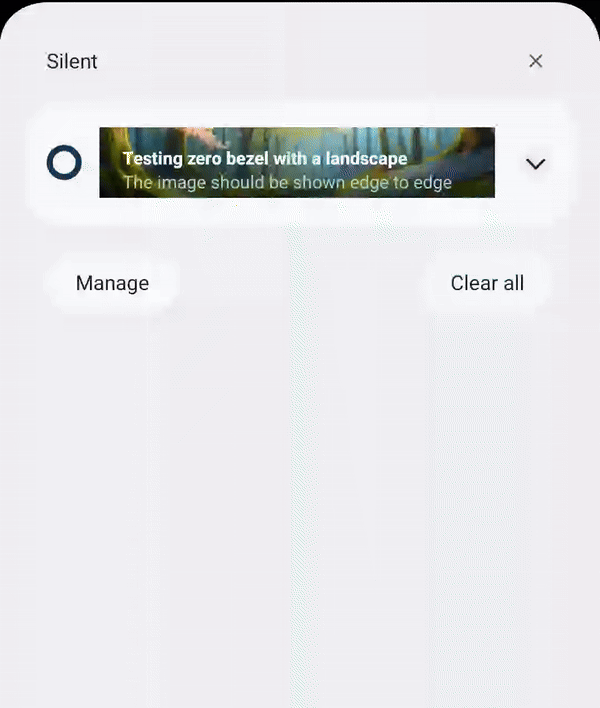

<Variant platform="fcm" template="zero-bezel" repeat="15" />

## Properties

The properties below define the payload sent to FCM:

| **Field** | **Required** | **Key** | **Type** | **Description** |
| :-------- | :----------- | :------ | :------- | :-------------- |
| Payload Version | ✅ | `adb_version` | string | Version of the payload assigned by the ACC authoring UI. |
| Template Type | ✅ | `adb_template_type` | string | Informs the reader which properties may exist in the template object.<br />Zero-bezel template uses a value of "zb". |
| Title | ✅ | `adb_title` | string | Text shown in the notification's title. |
| Color - Title | ⛔️ | `adb_clr_title` | string | Text color for `adb_title`.<br />Represented as six character hex, e.g. `00FF00`. |
| Body | ✅ | `adb_body` | string | Text shown in message body when notification is collapsed. |
| Expanded Body | ⛔️ | `adb_body_ex` | string | Body of the message when the message is expanded. |
| Color - Body | ⛔️ | `adb_clr_body` | string | Text color for `adb_body`, `adb_body_ex`.<br />Represented as six character hex, e.g. `00FF00`. |
| Sound | ⛔️ | `adb_sound` | string | Sound played when notification is delivered.<br />Value should be the name of the sound file without its extension.<br />Sound file should be located in the `assets/raw` directory of your app. |
| Image | ⛔️ | `adb_image` | string | URI of an image to be shown when notification is expanded. |
| Link URI | ⛔️ | `adb_uri` | string | URI to be handled when user clicks the notification. |
| Link Type | ⛔️ | `adb_a_type` | string | Type of link represented in `adb_uri` - one of "WEBURL", "DEEPLINK", "DISMISS", or "OPENAPP".<br />Required if `adb_uri` is specified. |
| Icon | ⛔️ | `adb_icon` | string | Name of a small icon to use in the notification. <br />**Note** - The value referenced by this key is not used if a valid `adb_small_icon` key value pair is present in the payload. |
| Small Icon | ⛔️ | `adb_small_icon` | string | Name of a small icon to use in the notification. The app's drawable resources are checked for an image file with the provided name. |
| Color - Small Icon | ⛔️ | `adb_clr_icon` | string | Color for the notification's small icon.<br />Represented as six character hex, e.g. `00FF00`. |
| Channel ID | ⛔️ | `adb_channel_id` | string | The [notification's channel id](https://developer.android.com/guide/topics/ui/notifiers/notifications#ManageChannels) (new in Android O). The app must create a channel with this channel ID before any notification with this channel ID is received. If you don't send this channel ID in the request, or if the channel ID provided has not yet been created by the app, FCM uses the channel ID specified in the app manifest.<br />If not provided in payload, SDK uses a "default" channel ID of value "General Notifications".<br />If < API 26 (Android O), this value is ignored. |
| Badge Count | ⛔️ | `adb_n_count` | string | Value to be used on app's badge. |
| Priority | ⛔️ | `adb_n_priority` | string | Designates the notification priority for Android - [importance](https://developer.android.com/reference/android/app/NotificationChannel#setImportance(int)) for API >= 26 (Android 8.0) or [priority](https://developer.android.com/reference/androidx/core/app/NotificationCompat.Builder#setPriority(int)) for API < 26. |
| Tag | ⛔️ | `adb_tag` | string | Identifier used to replace existing notifications in the notification drawer. If not specified, each request creates a new notification. If specified and a notification with the same tag is already being shown, the new notification replaces the existing one in the notification drawer. |
| Sticky | ⛔️ | `adb_sticky` | string | Boolean value represented as a string "true" or "false".<br />When set to false or unset, the notification is automatically dismissed when the user clicks it in the panel. When set to true, the notification persists even when the user clicks it. |
| Ticker | ⛔️ | `adb_ticker` | string | Sets the "ticker" text, which is sent to accessibility services. |
| Collapsed notification style | ⛔️ | `adb_col_style` | string | Determines whether the collapsed message should show a zero-bezel image, or text only.<br />Valid value is either "img" or "txt". Defaults to "txt" if none or invalid value is provided. |

## Example



Below is a sample of what a payload might look like for a zero bezel notification:

```json
{
  "message": {
    "token": "FCM_TOKEN",
    "android": {
      "collapse_key": "new message"
    },
    "data": {     
      "adb_version": "1",
      "adb_title": "game request",
      "adb_body": "shall we play a game?",               
      "adb_sound": "bingBong",
      "adb_icon": "ic_knight",
      "adb_n_count": "1",
      "adb_n_priority": "PRIORITY_LOW",
      "adb_image": "https://pictureofchess.com/board.png",
      "adb_uri": "https://chess.com/games",
      "adb_a_type": "WEBURL",
      "adb_template_type": "zb",
      "adb_body_ex": "Bob wants to play a game of chess with you. Click the notification to accept!",
      "adb_clr_body": "00EE00",
      "adb_clr_title": "AABBCC",
      "adb_clr_icon": "123456",
      "adb_col_style": "img"
    }
  }
}
```

## Usage recommendations

The tables below contain guidelines for your push notification content. **These recommendations help your text and images display reliably across multiple devices.** These values are guidelines only - you should still test a notification prior to sending it.

### Audio specifications

Custom sound files must be placed within the app's bundle in the `res/raw` directory. Supported formats are `mp3`, `wav`, or `ogg`.

### Image specifications

| **Aspect ratios** | **Image size range** | **Supported file types** |
| :-------- | -----------: | ------: |
| 1:1, 3:2, 5:4, 4:3 | < 1 MB | PNG, JPG, WebP |

### Text guidelines

| **Type** |**Recommended max # of characters** | **Supports multiple lines?** |
| :-------- | ------: | -------: |
| Title | ~35 (depends on screen size and device font setting) | No |
| Description | ~110 (depends on screen size and device font setting) | Yes |

### Background Color Specifications

* The background color can be customized for Android versions below 11
* For Android 11 and above, the background color will be white by default and cannot be customized
* The color should be specified in hex format (e.g., `#FF0000`)
* The background color will be applied to the entire notification area
