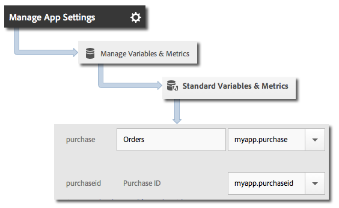

# Products variable

## Set the products variable

Since the products variable cannot be set by processing rules, you need to set serialized events directly on the hits that are sent to Analytics.

To set the products variable, set a context data key to `&&products`, and set the value to the products or merchandising variable. For more information, see the [implementing a merchandising variable tutorial](https://experienceleague.adobe.com/docs/analytics/components/dimensions/evar-merchandising.html).

### Android Java

<CodeBlock slots="heading, code" repeat="2" />

### Syntax

```java
cdata.put("&&products", "Category;Product;Quantity;Price[,Category;Product;Quantity;Price]");
```

### Example

```java
//create a context data dictionary
HashMap cdata = new HashMap<String, String>();
// add products, a purchase id, a purchase context data key, and any other data you want to collect.
// Note the special syntax for products
cdata.put("&&products", ";Running Shoes;1;69.95,;Running Socks;10;29.99");
cdata.put("myapp.purchase", "1");
cdata.put("myapp.purchaseid", "1234567890");
// send the tracking call - use either a trackAction or trackState call.
// trackAction example:
MobileCore.trackAction("purchase", cdata);
// trackState example:
MobileCore.trackState("Order Confirmation", cdata);
```

### Android Kotlin

<CodeBlock slots="heading, code" repeat="1" />

### Example

```kotlin
//create a context data dictionary
val cdata: Map<String, Any?> = mapOf(
    "&&products" to ";Running Shoes;1;69.95,;Running Socks;10;29.99",
    "myapp.purchase" to "1",
    "myapp.purchaseid" to "1234567890"
)

// send a tracking call - use either a trackAction or trackState call.
// trackAction example:
MobileCore.trackAction("purchase", cdata);
// trackState example:
MobileCore.trackState("Order Confirmation", cdata);
```

### iOS Swift

<CodeBlock slots="heading, code" repeat="2" />

### Syntax

```swift
contextData["&&events"] = "event1:12341234"
contextData["&&products"] = "Category;Product;Quantity;Price[,Category;Product;Quantity;Price]"
```

### Example

```swift
//create a context data dictionary
var contextData = [String: Any]() 

// add products, a purchase id, a purchase context data key, and any other data you want to collect.
// Note the special syntax for products
contextData["&&products"] = ";Running Shoes;1;69.95,;Running Socks;10;29.99"
contextData["m.purchaseid"] = "1234567890"
contextData["m.purchase"] = "1"

// send the tracking call - use either a trackAction or trackState call.
// trackAction example:
MobileCore.track(action: "purchase" as String, data: contextData)
// trackState example:
MobileCore.track(state: "Order Confirmation", data: contextData)
```

### iOS Objective-C

<CodeBlock slots="heading, code" repeat="2" />

### Syntax

```objectivec
[contextData setObject:@"Category;Product;Quantity;Price[,Category;Product;Quantity;Price]" forKey:@"&&products"];
```

### Example

```objectivec
//create a context data dictionary
NSMutableDictionary *contextData = [NSMutableDictionary dictionary];

// add products, a purchase id, a purchase context data key, and any other data you want to collect.
// Note the special syntax for products
[contextData setObject:@";Running Shoes;1;69.95,;Running Socks;10;29.99" forKey:@"&&products"];
[contextData setObject:@"1234567890" forKey:@"m.purchaseid"];
[contextData setObject:@"1" forKey:@"m.purchase"];

// send the tracking call - use either a trackAction or trackState call.
// trackAction example:
[AEPMobileCore trackAction:@"purchase" data:contextData];
// trackState example:
[AEPMobileCore trackState:@"Order Confirmation" data:contextData];
```

_`products`_ is set directly on the image request, and the other variables are set as context data. All context data variables must be mapped by using processing rules:



You do **not** need to map the `products` variable using processing rules because it is set directly on the image request by the SDK.

## Products variable with merchandising eVars and product-specific events

The following code samples show an example of the products variable with merchandising eVars and product-specific events.

### Android Java

<CodeBlock slots="heading, code" repeat="1" />

### Example

```java
//create a context data dictionary 
HashMap cdata = new HashMap<String, String>(); 

// add products, a purchase id, a purchase context data key, and any other data you want to collect. 
// Note the special syntax for products. 
// There are two products in this example: Running shoes and Running Socks, they are separated by a comma.
// Attributes event1 and eVar1 only apply to Running Shoes.
cdata.put("&&events", "event1"); 
cdata.put("&&products", ";Running Shoes;1;69.95;event1=5.5;eVar1=Merchandising,;Running Socks;10;29.99"); 
cdata.put("myapp.purchase", "1"); 
cdata.put("myapp.purchaseid", "1234567890"); 

// send the tracking call - use either a trackAction or trackState call.
// trackAction example: 
MobileCore.trackAction("purchase", cdata); 
// trackState example: 
MobileCore.trackState("Order Confirmation", cdata);
```

### Android Kotlin

<CodeBlock slots="heading, code" repeat="1" />

### Example

```kotlin
//create a context data dictionary
val cdata: Map<String, Any?> = mapOf(
    "&&events" to "event1",
    "&&products" to ";Running Shoes;1;69.95;event1=5.5;eVar1=Merchandising,;Running Socks;10;29.99",
    "myapp.purchase" to "1",
    "myapp.purchaseid" to "1234567890"
)

// send a tracking call - use either a trackAction or trackState call.
// trackAction example:
MobileCore.trackAction("purchase", cdata);
// trackState example:
MobileCore.trackState("Order Confirmation", cdata);
```

### iOS Swift

<CodeBlock slots="heading, code" repeat="1" />

### Example

```swift
//create a context data dictionary
var contextData = [String: Any]()

// add products, a purchase id, a purchase context data key, and any other data you want to collect.
// Note the special syntax for products.
// There are two products in this example: Running shoes and Running Socks, they are separated by a comma.
// Attributes event1 and eVar1 only apply to Running Shoes.
contextData["&&events"] = "event1"
contextData["&&products"] = ";Running Shoes;1;69.95;event1=5.5;eVar1=Merchandising,;Running Socks;10;29.99"
contextData["m.purchaseid"] = "1234567890"
contextData["m.purchase"] = "1"

// send the tracking call - use either a trackAction or trackState call.
// trackAction example:

MobileCore.track(action: "purchase" as String, data: contextData)
// trackState example:
MobileCore.track(state: "Order Confirmation" as String, data: contextData)
```

### iOS Objective-C

<CodeBlock slots="heading, code" repeat="1" />

### Example

```objectivec
//create a context data dictionary 
NSMutableDictionary *contextData = [NSMutableDictionary dictionary]; 

// add products, a purchase id, a purchase context data key, and any other data you want to collect. 
// Note the special syntax for products. 
// There are two products in this example: Running shoes and Running Socks, they are separated by a comma.
// Attributes event1 and eVar1 only apply to Running Shoes.
[contextData setObject:@"event1" forKey:@"&&events"]; 
[contextData setObject:@";Running Shoes;1;69.95;event1=5.5;eVar1=Merchandising,;Running Socks;10;29.99" forKey:@"&&products"]; 
[contextData setObject:@"1234567890" forKey:@"m.purchaseid"]; 
[contextData setObject:@"1" forKey:@"m.purchase"]; 

// send the tracking call - use either a trackAction or trackState call. 
// trackAction example: 
[AEPMobileCore trackAction:@"purchase" data:contextData];
// trackState example: 
[AEPMobileCore trackState:@"Order Confirmation" data:contextData];
```

<InlineAlert variant="info" slots="text"/>

If you trigger a product-specific event by using the `&&products` variable, you must also set that event in the `&&events` variable. If you do not set that event, it is filtered out during processing.
