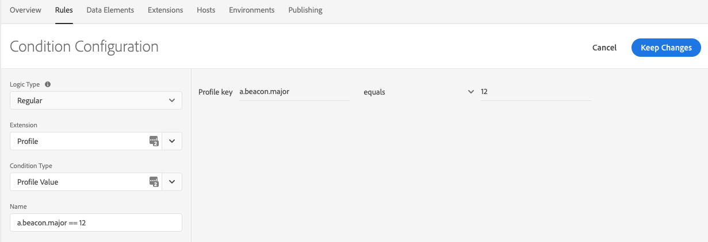
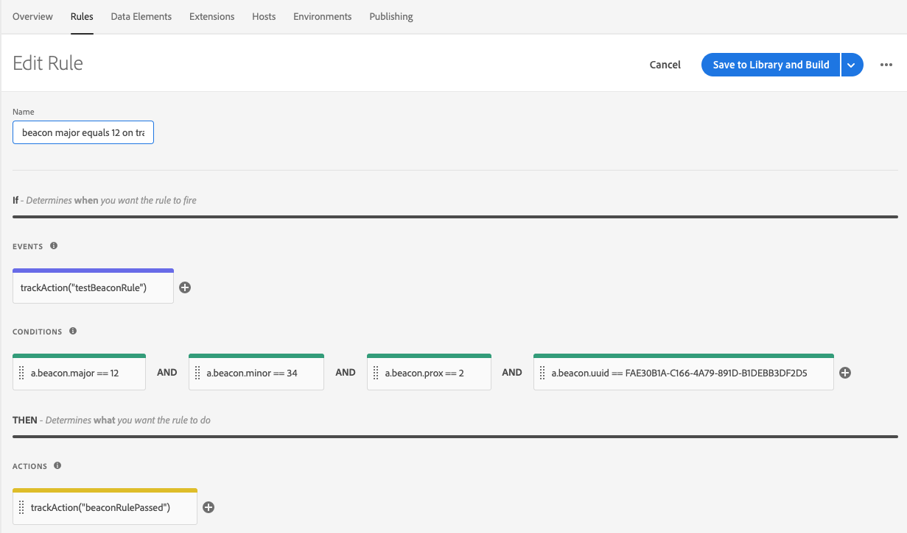
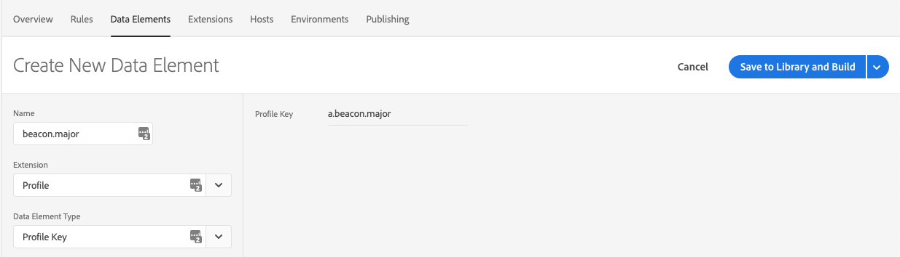
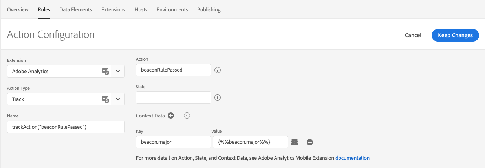

# Tracking beacons

## Emulate the trackBeacon call from the v4 SDKs

Sending beacon data to Adobe Analytics for reporting can be an effective way to understand how your audience can interact with physical landmarks.

The `trackBeacon` API from v4 SDKs is no longer available in the Experience Platform SDKs. Now, you need to manually send beacon tracking data to your Adobe Analytics server and create the rules based on a user's proximity to your beacons. This solution requires the [Profile extension](../../home/base/profile/index.md) to create beacon-related rules.

This topic contains sample code to help you implement your own `trackBeacon` calls.

### Track a beacon

When your user comes within the range of a beacon, call this method to send beacon data to [Adobe Analytics](index.md). This code also saves all beacon-related data in the client-side Profile for use with the Rules Engine.

#### Android Java

In this method, the `proximity` parameter is an `int` that represents the various distances:

* 0 - Unknown
* 1 - Immediate
* 2 - Near
* 3 - Far

```java
import com.adobe.marketing.mobile.Event;
import com.adobe.marketing.mobile.MobileCore;
import com.adobe.marketing.mobile.UserProfile;

static final String BEACON_MAJOR = "a.beacon.major";
static final String BEACON_MINOR = "a.beacon.minor";
static final String BEACON_UUID = "a.beacon.uuid";
static final String BEACON_PROXIMITY = "a.beacon.prox";

void trackBeacon(final String beaconUUID, final String major, final String minor, final int proximity, final Map<String, String> cdata) {
 final Map<String, String> contextData = cdata == null ? new HashMap<>() : new HashMap<>(cdata);
 final Map<String, Object> userAttributes = new HashMap<>();

 if (major != null && !major.isEmpty()) {
  contextData.put(BEACON_MAJOR, major);
  userAttributes.put(BEACON_MAJOR, major);
 } else {
  UserProfile.removeUserAttributes(Arrays.asList(BEACON_MAJOR));
 }

 if (minor != null && !minor.isEmpty()) {
  contextData.put(BEACON_MINOR, minor);
  userAttributes.put(BEACON_MINOR, minor);
 } else {
  UserProfile.removeUserAttributes(Arrays.asList(BEACON_MINOR));
 }

 if (beaconUUID != null && !beaconUUID.isEmpty()) {
  contextData.put(BEACON_UUID, beaconUUID);
  userAttributes.put(BEACON_UUID, beaconUUID);
 } else {
  UserProfile.removeUserAttributes(Arrays.asList(BEACON_UUID));
 }

 contextData.put(BEACON_PROXIMITY, String.valueOf(proximity));
 userAttributes.put(BEACON_PROXIMITY, String.valueOf(proximity));
 UserProfile.updateUserAttributes(userAttributes);

 final HashMap<String, Object> eventData = new HashMap<>();
 eventData.put("trackinternal", true);
 eventData.put("action", "Beacon");
 eventData.put("contextdata", contextData);

 final Event event = new Event.Builder("TrackBeacon", "com.adobe.eventType.generic.track", "com.adobe.eventSource.requestContent")
   .setEventData(eventData)
   .build();

 MobileCore.dispatchEvent(event);
}
```

Currently, `CLBeacon` is only available in iOS. The sample code contains the necessary checks to ensure OS compatibility.

#### iOS Swift

```swift
import AEPCore
import AEPUserProfile

#if os(iOS)
import CoreLocation

private let BEACON_MAJOR = "a.beacon.major"
private let BEACON_MINOR = "a.beacon.minor"
private let BEACON_UUID = "a.beacon.uuid"
private let BEACON_PROXIMITY = "a.beacon.prox"

class func trackBeacon(_ beacon: CLBeacon?, data: [String: String]) {
    var contextData: [String: String] = data
    var userAttributes: [String: Any] = [:]

    if beacon?.major != nil {
        contextData[BEACON_MAJOR] = beacon?.major.stringValue ?? ""
        userAttributes[BEACON_MAJOR] = beacon?.major.stringValue ?? ""
    } else {
        UserProfile.removeUserAttributes(attributeNames: [BEACON_MAJOR])
    }

    if beacon?.minor != nil {
        contextData[BEACON_MINOR] = beacon?.minor.stringValue ?? ""
        userAttributes[BEACON_MINOR] = beacon?.minor.stringValue ?? ""
    } else {
        UserProfile.removeUserAttributes(attributeNames:[BEACON_MINOR])
    }

    if beacon?.proximityUUID.uuidString != nil {
        contextData[BEACON_UUID] = beacon?.proximityUUID.uuidString ?? ""
        userAttributes[BEACON_UUID] = beacon?.proximityUUID.uuidString ?? ""
    } else {
        UserProfile.removeUserAttributes(attributeNames: [BEACON_UUID])
    }

    switch beacon?.proximity {
    case .immediate?:
        contextData[BEACON_PROXIMITY] = "1"
    case .near?:
        contextData[BEACON_PROXIMITY] = "2"
    case .far?:
        contextData[BEACON_PROXIMITY] = "3"
    case .unknown?:
        fallthrough
    default:
        contextData[BEACON_PROXIMITY] = "0"
    }
    userAttributes[BEACON_PROXIMITY] = contextData[BEACON_PROXIMITY] ?? ""
    UserProfile.updateUserAttributes(attributeDict: userAttributes)

    let eventData:[String: Any] = [
        "trackinternal": true,
        "action": "Beacon",
        "contextdata": contextData
    ]

    var event = Event(name: "TrackBeacon",
                      type: "com.adobe.eventType.generic.track",
                      source: "com.adobe.eventSource.requestContent",
                      data: eventData)
     MobileCore.dispatch(event: event)
}
#endif
```

#### iOS Objective-C

```objectivec
@import AEPCore;
@import AEPUserProfile;
@import CoreLocation;

#if TARGET_OS_IOS
static NSString* const BEACON_MAJOR = @"a.beacon.major";
static NSString* const BEACON_MINOR = @"a.beacon.minor";
static NSString* const BEACON_UUID = @"a.beacon.uuid";
static NSString* const BEACON_PROXIMITY = @"a.beacon.prox";

+ (void) trackBeacon:(CLBeacon *)beacon data:(NSDictionary*)data {
    NSMutableDictionary *contextData = data ? [data mutableCopy] : [@{} mutableCopy];
    NSMutableDictionary *userAttributes = [@{} mutableCopy];

    if (beacon.major) {
        contextData[BEACON_MAJOR] = [beacon.major stringValue];
        userAttributes[BEACON_MAJOR] = [beacon.major stringValue];
    } else {
        [AEPMobileUserProfile removeUserAttributesWithAttributeNames: @[BEACON_MAJOR]];
    }

    if (beacon.minor) {
        contextData[BEACON_MINOR] = [beacon.minor stringValue];
        userAttributes[BEACON_MINOR] = [beacon.minor stringValue];
    } else {
        [AEPMobileUserProfile removeUserAttributesWithAttributeNames: @[BEACON_MINOR]];
    }

    if (beacon.proximityUUID.UUIDString) {
        contextData[BEACON_UUID] = beacon.proximityUUID.UUIDString;
        userAttributes[BEACON_UUID] = beacon.proximityUUID.UUIDString;
    } else {
        [AEPMobileUserProfile removeUserAttributesWithAttributeNames: @[BEACON_UUID]];
    }

    switch (beacon.proximity) {
        case CLProximityImmediate:
            contextData[BEACON_PROXIMITY] = @"1";
            break;
        case CLProximityNear:
            contextData[BEACON_PROXIMITY] = @"2";
            break;
        case CLProximityFar:
            contextData[BEACON_PROXIMITY] = @"3";
            break;
        case CLProximityUnknown:
        default:
            contextData[BEACON_PROXIMITY] = @"0";
    }
    userAttributes[BEACON_PROXIMITY] = contextData[BEACON_PROXIMITY];
    [AEPMobileUserProfile updateUserAttributesWithAttributeDict:userAttributes];

    NSDictionary *eventData = @{
                                @"trackinternal":@(YES),
                                @"action":@"Beacon",
                                @"contextdata":contextData
                                };

    AEPEvent *event = [[AEPEvent alloc] initWithName:@"TrackBeacon"
                                                type:@"com.adobe.eventType.generic.track"
                                              source:@"com.adobe.eventSource.requestContent"
                                                data:eventData];
    [AEPMobileCore dispatch:event];
}
#endif
```

### Clear the current beacon

The `clearCurrentBeacon` code removes the user attributes that were previously set in the Profile extension. To keep rules working as expected, this method should be called when the user is no longer within range of your beacon.

#### Android Java

This example uses `static` constant strings that were provided in the `trackBeacon` code sample above.

```java
void clearCurrentBeacon() {
 UserProfile.removeUserAttributes(Arrays.asList(BEACON_MAJOR, BEACON_MINOR, BEACON_UUID, BEACON_PROXIMITY));
}
```

Currently, `CLBeacon` is only available on iOS. The sample code contains the necessary checks to ensure OS compatibility.

This example uses `static` constant strings that were provided in the `trackBeacon` code sample above.

#### iOS Swift

```swift
#if os(iOS)
class func clearCurrentBeacon() {
    UserProfile.removeUserAttributes(attributeNames: [BEACON_MAJOR, BEACON_MINOR, BEACON_UUID, BEACON_PROXIMITY])
}
#endif
```

#### iOS Objective-C

```objectivec
#if TARGET_OS_IOS
+ (void) clearCurrentBeacon {
    [AEPMobileUserProfile removeUserAttributesWithAttributeNames: @[BEACON_MAJOR, BEACON_MINOR, BEACON_UUID, BEACON_PROXIMITY]];
}
#endif
```

## Use beacon values in tag rules

In the code samples above, attributes are set in the client-side user profile. You can use these attributes when creating a rule in the Data Collection UI to provide a custom experience or to take a specific action when the user is near a beacon.

### Beacon data in rule conditions

In conditions, you can mix and match beacon data to determine the specific audience for your action. You can use the following beacon-related variables:

* UUID (`a.beacon.uuid`)
* Major ID (`a.beacon.major`)
* Minor ID (`a.beacon.minor`)
* User Proximity (`a.beacon.prox`)

Configure your condition by selecting the **Profile** extension, selecting **Profile Value** as the condition type, and typing the variable. The following graphic shows an example of a condition that passes when the Major ID (`a.beacon.major`) of the beacon is equal to 12:





### Beacon data in rule actions

Before you can use beacon data in your actions, create a data element for each variable that you want to use in your actions. The following graphic shows an example of creating a data element called `beacon.major` for the `a.beacon.major` key in our profile:



After creating a data element, you can use this data element as a token replacement in our actions. The graphic below shows an action that sends data to Adobe Analytics and attaches the `beacon.major` data element as additional context data:


