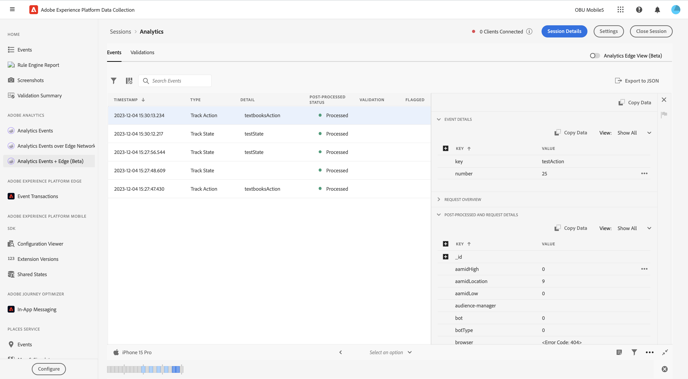
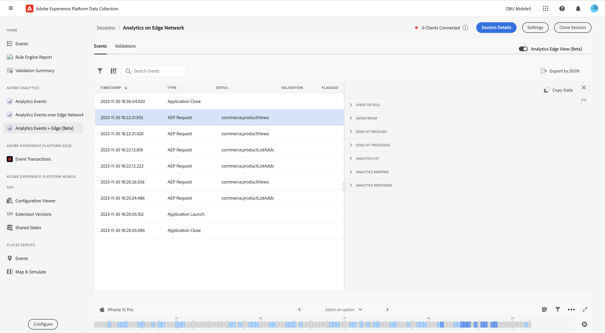
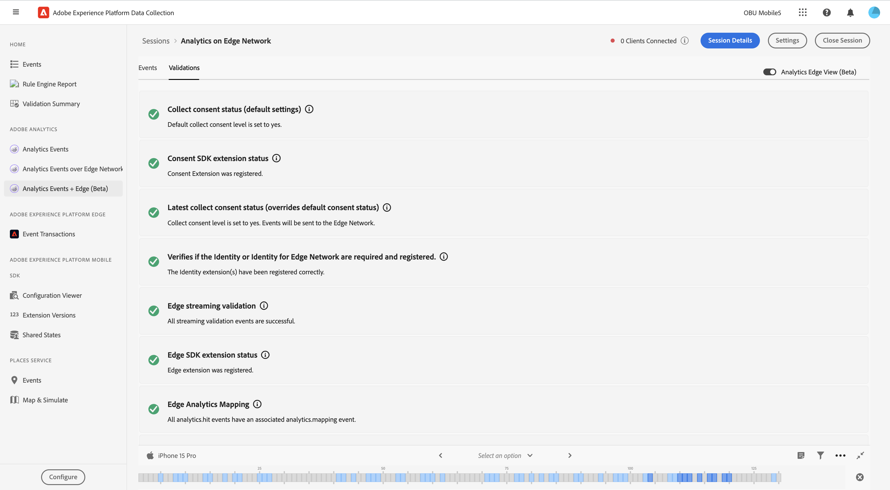

# Analytics + Edge Beta Assurance View

## Overview

The Adobe Analytics + Edge view provides a richer view of SDK events to users debugging and validating their Adobe Analytics implementation. The view shows events sent to Adobe Analytics from the [Adobe Experience Platform SDK](../../../using-mobile-extensions/adobe-analytics/) as well as the [Adobe Edge SDK](./solution/adobe-analytics/migrate-to-edge-network.md). The view also features a details panel, which provides context on how the event was processed by the SDK and platform after it was sent.

## Getting Started

To use this view, complete the following steps:

1. [Set up Adobe Experience Platform Assurance](../set-up.md)
2. [Create](./index.md#creating-sessions) and [connect](./index.md#connecting-to-a-session) to an Assurance session
3. In the **Home** view, select **Analytics + Edge Events - Beta**

### Analytics Events View

Using this view, you can easily view Analytics Events sent from your connected client, including Track Action, Track State, and Lifecycle events. By selecting one of the Analytics events in the table, details of how the event were processed can be viewed on the right panel.

### Post-processed status

After the SDK makes a network request with Adobe Analytics, the status will tell you if Griffon was able to retrieve the post-processing information for the Adobe Analytics request.

Please note that in order to retrieve post-processing information, the logged-in user must have access to the corresponding report suite.

| Status | Description |
| :--- | :--- |
| `Queued` | The network request is fetching the post-processing information. |
| `Processed` | The network request was successful, and the post-processing information is received. |
| `Delayed` | The maximum number of requests retries to fetch the post-processing information has been exceeded. |
| `Error` | An error caused the network request to fail. More details about the error are displayed in the event details view. |
| `Unauthorized` | The user does not have access to the Adobe Analytics report suite. |
| `Unavailable` | The Adobe Analytics request does not have a corresponding `AnalyticsResponse` event. |
| `No Debug Flag` | The current Adobe Analytics or Assurance SDK version might not support the Analytics Debugging feature. For more information, please read the [Troubleshooting guide](../troubleshoot-project-griffon.md#Adobe Analytics Debugging). |
| `Expired` | The `AnalyticsTrack` or `LifecycleStart` event is older than 24 hours. |

## Viewing Edge Analytics

Using the toggle on the top left, you can choose to view all the edge analytics events that have been sent in your current session. This includes all events that have been fired by Lifecycle events, Edge requests and Edge Bridge events.

The Edge Analytics view contains information on Analytics related Edge Requests and Lifecycle methods dispatched by the client. By choosing an event in the list, the right panel displays all the Edge events that were processed by the SDK and Platform, so you can easily view the chain of events that resulted from a call.

## Validation

The validation view allows you to easily view the results on validation scripts related to Analytics. The validation scripts shown will be dynamically displayed based on your chosen analytics implementation. Errors displayed by validators may contain links to where they should be fixed, or display events that are in an error state.
