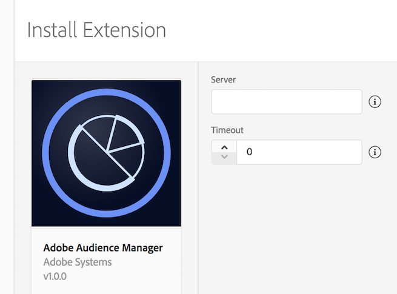

# Adobe Audience Manager

Adobe Audience Manager is a versatile audience data management platform. With the SDK, you can update audience profiles for users and retrieve user segment information from your mobile app. For more information, see [Adobe Audience Manager](https://business.adobe.com/products/audience-manager/adobe-audience-manager.html).

## Configuring the Audience Manager extension in the Data Collection UI



1. In the Data Collection UI, select the **Extensions** tab.
2. Choose **Catalog**, locate the **Adobe Audience Manager** extension, and select **Install**.
3. Type your Audience Manager server.
4. Type a timeout value. This value is the period, in seconds, to wait for a response from Audience Manager before timing out. For best practices, you should use a default value of 2s.
5. Select **Save**.
6. Follow the publishing process to update the SDK configuration.

## Add the Audience Manager extension to your app

### Include Audience Manager extension as an app dependency

Add MobileCore and Audience extensions as dependencies to your project.

#### Android Kotlin

Add the required dependencies to your project by including them in the app's Gradle file.

```kotlin
implementation(platform("com.adobe.marketing.mobile:sdk-bom:3.+"))
implementation("com.adobe.marketing.mobile:core")
implementation("com.adobe.marketing.mobile:identity")
implementation("com.adobe.marketing.mobile:audience")
```

<InlineAlert variant="warning" slots="text"/>

Using dynamic dependency versions is **not** recommended for production apps. Please read the [managing Gradle dependencies guide](../../resources/manage-gradle-dependencies.md) for more information.

#### Android Groovy

Add the required dependencies to your project by including them in the app's Gradle file.

```java
implementation platform('com.adobe.marketing.mobile:sdk-bom:3.+')
implementation 'com.adobe.marketing.mobile:core'
implementation 'com.adobe.marketing.mobile:identity'
implementation 'com.adobe.marketing.mobile:audience'
```

<InlineAlert variant="warning" slots="text"/>

Using dynamic dependency versions is **not** recommended for production apps. Please read the [managing Gradle dependencies guide](../../resources/manage-gradle-dependencies.md) for more information.

#### iOS CocoaPods

Add the required dependencies to your project using CocoaPods. Add following pods in your `Podfile`:

```swift
use_frameworks!

target 'YourTargetApp' do
  pod 'AEPCore', '~> 5.0'
  pod 'AEPAudience', '~> 5.0'
  pod 'AEPIdentity', '~> 5.0'
end
```

### Initialize Adobe Experience Platform SDK with Audience Manager Extension

Next, initialize the SDK by registering all the solution extensions that have been added as dependencies to your project with Mobile Core. For detailed instructions, refer to the [initialization](../../home/getting-started/get-the-sdk.md#2-add-initialization-code) section of the getting started page.

Using the `MobileCore.initialize` API to initialize the Adobe Experience Platform Mobile SDK simplifies the process by automatically registering solution extensions and enabling lifecycle tracking.

#### Android Kotlin

<InlineAlert variant="warning" slots="text"/>

This API is available starting from **Android BOM version 3.8.0**.

```kotlin
import com.adobe.marketing.mobile.LoggingMode
import com.adobe.marketing.mobile.MobileCore
...
import android.app.Application
...

class MainApp : Application() {
  override fun onCreate() {
    super.onCreate()
    MobileCore.setLogLevel(LoggingMode.DEBUG)
    MobileCore.initialize(this, "ENVIRONMENT_ID")
  }
}
```

#### Android Java

<InlineAlert variant="warning" slots="text"/>

This API is available starting from **Android BOM version 3.8.0**.

```java
import com.adobe.marketing.mobile.LoggingMode;
import com.adobe.marketing.mobile.MobileCore;
...
import android.app.Application;
...
public class MainApp extends Application {
  @Override
  public void onCreate(){
    super.onCreate();
    MobileCore.setLogLevel(LoggingMode.DEBUG);
    MobileCore.initialize(this, "ENVIRONMENT_ID");
  }
}
```

#### iOS Swift

<InlineAlert variant="warning" slots="text"/>

This API is available starting from **iOS version 5.4.0**.

```swift
// AppDelegate.swift
import AEPCore
import AEPServices
...

final class AppDelegate: NSObject, UIApplicationDelegate {
  func application(_: UIApplication, didFinishLaunchingWithOptions _: [UIApplication.LaunchOptionsKey: Any]? = nil) -> Bool {
    MobileCore.setLogLevel(.debug)
    MobileCore.initialize(appId: "ENVIRONMENT_ID")
    ...
  }
}
```

#### iOS Objective-C

<InlineAlert variant="warning" slots="text"/>

This API is available starting from **iOS version 5.4.0**.

```objectivec
// AppDelegate.m
#import "AppDelegate.h"
@import AEPCore;
@import AEPServices;
...
@implementation AppDelegate
- (BOOL)application:(UIApplication *)application didFinishLaunchingWithOptions:(NSDictionary *)launchOptions {
  [AEPMobileCore setLogLevel: AEPLogLevelDebug];  
  [AEPMobileCore initializeWithAppId:@"ENVIRONMENT_ID" completion:^{
      NSLog(@"AEP Mobile SDK is initialized");
  }];
  ...
  return YES;
}
@end
```

## Implement Audience Manager APIs

For more information about implementing Audience Manager APIs, please read the [Audience Manager API reference](api-reference.md).

## Configuration keys

To update SDK configuration programmatically, use the following information to change your Audience Manager configuration values. For more information, see the [Configuration API reference](../../home/base/mobile-core/configuration/api-reference.md).

| Key | Required | Description | Data Type |
| :--- | :--- | :--- | :--- |
| `audience.server` | Yes | Server endpoint used to collect Audience Manager data | String |
| `audience.timeout` | No | Time, in seconds, to wait for a response from Audience Manager before timing out. Default value is 2 seconds. | Integer |

## Additional information

* How do you find your Audience Manager server?
* Want to know more about setting up Adobe Analytics server-side forwarding to Audience Manager?
  * [Server-side forwarding overview](https://experienceleague.adobe.com/docs/analytics/admin/admin-tools/server-side-forwarding/ssf.html)
  * [Set up server-side forwarding with Audience Manager](../adobe-analytics/index.md#server-side-forwarding-with-audience-manager)
