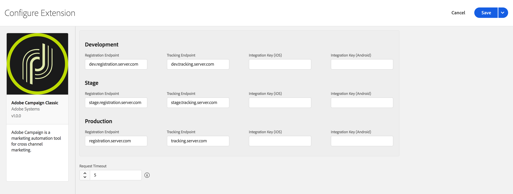

import Tabs from './tabs/index.md'
import InitializeSDK from '/src/pages/resources/initialize.md'

# Adobe Campaign Classic

## Configure Campaign Classic extension in the Data Collection UI

1. In the Data Collection UI, select the **Extensions** tab.
2. On the **Catalog** tab, locate the **Adobe Campaign Classic** extension, and select **Install**.
3. Type in the settings for your extension.
4. Select **Save**.
5. Complete the publishing process to update the SDK configuration.

   For more information about publishing, see the [publishing overview](https://experienceleague.adobe.com/docs/launch/using/publish/overview.html).

### Configure Campaign Classic extension

<InlineAlert variant="info" slots="text"/>

You can retrieve your Campaign Classic registration or tracking endpoint URLs in the Campaign Classic interface under the **Tools > Advanced > Deployment wizard** menu. The endpoint for push notifications is usually the same as the URL that is used for web forms and surveys.

#### Registration endpoints

Type the registration endpoint URL(s) for your Campaign Classic instances. You can specify up to three unique endpoints for your development, staging, and production environments.

<InlineAlert variant="warning" slots="text"/>

For this extension, the registration endpoint URLs should be entered **without** a prefixing `https://.`

#### Tracking endpoints

Type the tracking endpoint URL(s) for your Campaign Classic instances. Like the registration URLs, you can specify up to three unique endpoints for your development, staging, and production environments.

<InlineAlert variant="warning" slots="text"/>

For this extension, the tracking endpoint URLs should be entered **without** a prefixing `https://.`

#### Integration key (iOS)

You can specify up to three unique iOS integration keys for your development, staging, and production environments. iOS integration keys are generated after creating a service that contains iOS applications using the [Campaign Classic client console](https://experienceleague.adobe.com/docs/campaign-classic/using/installing-campaign-classic/connect-to-campaign/installing-the-client-console.html). For more information on where to find the integration key, see the tutorial on [configuring the mobile application in Adobe Campaign](https://experienceleague.adobe.com/docs/campaign-classic/using/sending-messages/sending-push-notifications/configure-the-mobile-app/configuring-the-mobile-application.html).

#### Integration key (Android)

You can specify up to three unique Android integration keys for your development, staging, and production environments. Android integration keys are generated after creating a service that contains Android applications using the [Campaign Classic client console](https://experienceleague.adobe.com/docs/campaign-classic/using/installing-campaign-classic/connect-to-campaign/installing-the-client-console.html). For more information on where to find the integration key, see the tutorial on [configuring the mobile application in Adobe Campaign](https://experienceleague.adobe.com/docs/campaign-classic/using/sending-messages/sending-push-notifications/configure-the-mobile-app/configuring-the-mobile-application-android.html).

#### Request timeout

The request timeout is the amount of time, in seconds, to wait for a response from the registration or tracking endpoint before timing out. The SDK default timeout value is 30 seconds.

## Add Campaign Classic extension to your app

### Include Campaign Classic extension as an app dependency

Add the MobileCore and Campaign Classic dependencies in your app's Gradle file.

<TabsBlock orientation="horizontal" slots="heading, content" repeat="3"/>

Kotlin (Android)

<Tabs query="platform=android-kotlin&task=add"/>

Groovy (Android)

<Tabs query="platform=android-groovy&task=add"/>

CocoaPods (iOS)

<Tabs query="platform=ios-pods&task=add"/>

### Initialize Adobe Experience Platform SDK with Campaign Classic Extension

Next, initialize the SDK by registering all the solution extensions that have been added as dependencies to your project with Mobile Core. For detailed instructions, refer to the [initialization](/src/pages/home/getting-started/get-the-sdk/#2-add-initialization-code) section of the getting started page.

Using the `MobileCore.initialize` API to initialize the Adobe Experience Platform Mobile SDK simplifies the process by automatically registering solution extensions and enabling lifecycle tracking.

<InitializeSDK query="componentClass=TabsBlock"/>

## Configuration keys

To update SDK configuration programmatically, use the following information to change your Campaign Classic configuration values. For more information, see the [Configuration API reference](../../home/base/mobile-core/configuration/api-reference.md).

| Key | Required | Description | Data Type |
| :--- | :--- | :--- | :--- |
| `build.environment` | Yes | Specifies which environment to use (prod, dev, or staging) when sending registration and tracking information. It is also used to specify which mobile app integration key to use. | String |
| `campaignclassic.timeout` | No | Specifies the amount of time to wait for a response from the Campaign Classic registration or tracking server. | Integer |
| `campaignclassic.marketingServer` | Yes | Sets the marketing server, which receives registration requests. | String |
| `campaignclassic.trackingServer` | Yes | Sets the tracking server, which receives tracking requests. | String |
| `campaignclassic.ios.integrationKey` | Yes | Sets the iOS mobile app integration key, which links the app to an iOS application campaign in Campaign Classic. | String |
| `campaignclassic.android.integrationKey` | Yes | Sets the Android mobile app integration key, which links the app to an Android application campaign in Campaign Classic. | String |
