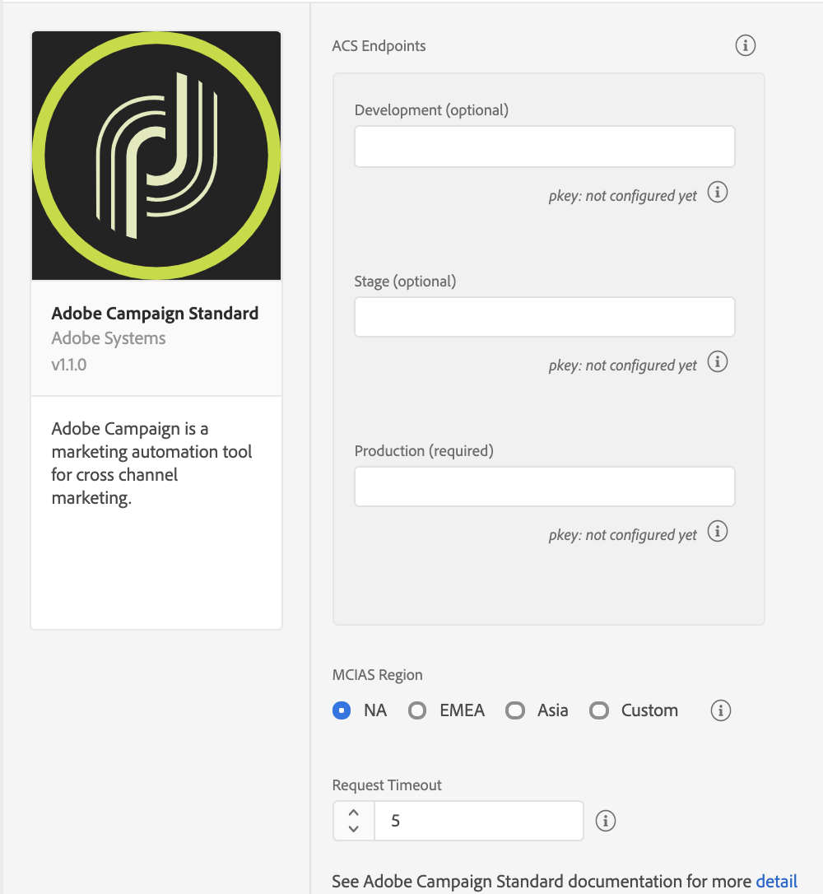

# Adobe Campaign Standard

<InlineAlert variant="info" slots="text"/>

**Before** you install or configure the Campaign Standard extension, please read the [getting started guide](../../home/getting-started/create-a-mobile-property.md) and the [configuring a mobile application using Adobe Experience Platform SDKs guide](https://experienceleague.adobe.com/docs/campaign-standard/using/administrating/configuring-channels/configuring-a-mobile-application.html).

## Configure the Campaign Standard extension in the Data Collection UI

1. In the Data Collection UI, select the **Extensions** tab.
2. On the **Catalog** tab, locate the **Adobe Campaign Standard** extension, and select **Install**.
3. Provide the extension settings.
4. Select **Save**.
5. Follow the publishing process to update SDK configuration.

### Configure the Campaign Standard extension



### Campaign Standard endpoints

Provide endpoint URL(s) for your Campaign Standard instances. You can specify up to three unique endpoints for your development, staging, and production environments. In most cases, the server endpoint is the root URL address, such as `companyname.campaign.adobe.com`.

<InlineAlert variant="warning" slots="text"/>

For this extension, these endpoint URLs **do not** contain the `http://` or `https://` and **cannot** end with a forward slash.

#### pKey

A unique, automatically generated identifier for a mobile app that was configured in Adobe Campaign Standard. After you configure this extension in the Data Collection UI, configure your mobile property in Campaign Standard. For more information, please read the tutorial on [configuring a mobile application in Adobe Campaign](https://experienceleague.adobe.com/docs/campaign-standard/using/administrating/configuring-channels/configuring-a-mobile-application.html).

After the configuration is successful in Campaign, the pKey is automatically generated and configured in the Campaign extension for a successful validation.

#### MCIAS region

Select an MCIAS region based on your customer's location or enter a custom endpoint. The SDK retrieves all in-app messaging rules and definition payloads from this endpoint.

<InlineAlert variant="warning" slots="text"/>

For this extension, the custom MCIAS endpoint URL **do not** contain the `http://` or `https://` and **cannot** end with a forward slash.

#### Request timeout

The request timeout is the time in seconds to wait for a response from the in-app messaging service before timing out. The default timeout value is 5 seconds, and the minimum timeout value is 1 second.

<InlineAlert variant="warning" slots="text"/>

The request timeout value must be a non-zero number.

### Add the Campaign Standard extension to your app

Remember the following information when you add the Campaign extension to your app:

| Extension | Information |
| :--- | :--- |
| Campaign Standard | The Campaign Standard extension requires the [Mobile Core](../../home/base/mobile-core/index.md), [Profile](../../home/base/profile/index.md), [Lifecycle](../../home/base/mobile-core/lifecycle/index.md), and [Signal](../../home/base/mobile-core/signal/index.md) extensions. You should always ensure that you get the latest version of the extensions. |
| Profile | The Profile extension is required for in-app trigger frequencies to work accurately. For more information, see [Profile](../../home/base/profile/index.md). |
| Signal | The Signal extension is required for all postback rules to work. For more information, see [Signal](../../home/base/mobile-core/signal/index.md). |
| Lifecycle | The Lifecycle extension is required for a profile to be registered in Campaign. In order to do this, you will need to implement the Lifecycle APIs. For more information, please read either the [Lifecycle API (Android)](../../home/base/mobile-core/lifecycle/android.md) or the [Lifecycle API (iOS)](../../home/base/mobile-core/lifecycle/ios.md) documentation. |

<InlineAlert variant="info" slots="text"/>

The instructions to add these extensions to your mobile app are also available in the Data Collection UI. To access the installation dialog box, open your mobile property, select the **Environments** tab, followed by **Install**.

Add MobileCore, Campaign Standard and Profile extensions as dependencies to your project.

#### Include Campaign Standard extension as an app dependency

##### Android Kotlin

Add the required dependencies to your project by including them in the app's Gradle file.

```kotlin
implementation(platform("com.adobe.marketing.mobile:sdk-bom:3.+"))
implementation("com.adobe.marketing.mobile:campaign")
implementation("com.adobe.marketing.mobile:core")
implementation("com.adobe.marketing.mobile:identity")
implementation("com.adobe.marketing.mobile:lifecycle")
implementation("com.adobe.marketing.mobile:signal")
implementation("com.adobe.marketing.mobile:userprofile")
```

<InlineAlert variant="warning" slots="text"/>

Using dynamic dependency versions is **not** recommended for production apps. Please read the [managing Gradle dependencies guide](../../resources/manage-gradle-dependencies.md) for more information.

##### Android Groovy

Add the required dependencies to your project by including them in the app's Gradle file.

```java
implementation platform('com.adobe.marketing.mobile:sdk-bom:3.+')
implementation 'com.adobe.marketing.mobile:campaign'
implementation 'com.adobe.marketing.mobile:core'
implementation 'com.adobe.marketing.mobile:identity'
implementation 'com.adobe.marketing.mobile:lifecycle'
implementation 'com.adobe.marketing.mobile:signal'
implementation 'com.adobe.marketing.mobile:userprofile'
```

<InlineAlert variant="warning" slots="text"/>

Using dynamic dependency versions is **not** recommended for production apps. Please read the [managing Gradle dependencies guide](../../resources/manage-gradle-dependencies.md) for more information.

##### iOS CocoaPods

Add the required dependencies to your project using CocoaPods. Add following pods in your `Podfile`:

```swift
use_frameworks!
target 'YourTargetApp' do
  pod 'AEPCampaign', '~> 5.0'
  pod 'AEPCore', '~> 5.0'
  pod 'AEPIdentity', '~> 5.0'
  pod 'AEPLifecycle', '~> 5.0'
  pod 'AEPSignal', '~> 5.0'
  pod 'AEPUserProfile', '~> 5.0'
end
```

### Initialize Adobe Experience Platform SDK with Campaign Standard Extension

Next, initialize the SDK by registering all the solution extensions that have been added as dependencies to your project with Mobile Core. For detailed instructions, refer to the [initialization](../../home/getting-started/get-the-sdk.md#2-add-initialization-code) section of the getting started page.

Using the `MobileCore.initialize` API to initialize the Adobe Experience Platform Mobile SDK simplifies the process by automatically registering solution extensions and enabling lifecycle tracking.

#### Android Kotlin

<InlineAlert variant="warning" slots="text"/>

This API is available starting from **Android BOM version 3.8.0**.

```kotlin
import com.adobe.marketing.mobile.LoggingMode
import com.adobe.marketing.mobile.MobileCore
...
import android.app.Application
...

class MainApp : Application() {
  override fun onCreate() {
    super.onCreate()
    MobileCore.setLogLevel(LoggingMode.DEBUG)
    MobileCore.initialize(this, "ENVIRONMENT_ID")
  }
}
```

#### Android Java

<InlineAlert variant="warning" slots="text"/>

This API is available starting from **Android BOM version 3.8.0**.

```java
import com.adobe.marketing.mobile.LoggingMode;
import com.adobe.marketing.mobile.MobileCore;
...
import android.app.Application;
...
public class MainApp extends Application {
  @Override
  public void onCreate(){
    super.onCreate();
    MobileCore.setLogLevel(LoggingMode.DEBUG);
    MobileCore.initialize(this, "ENVIRONMENT_ID");
  }
}
```

#### iOS Swift

<InlineAlert variant="warning" slots="text"/>

This API is available starting from **iOS version 5.4.0**.

```swift
// AppDelegate.swift
import AEPCore
import AEPServices
...

final class AppDelegate: NSObject, UIApplicationDelegate {
  func application(_: UIApplication, didFinishLaunchingWithOptions _: [UIApplication.LaunchOptionsKey: Any]? = nil) -> Bool {
    MobileCore.setLogLevel(.debug)
    MobileCore.initialize(appId: "ENVIRONMENT_ID")
    ...
  }
}
```

#### iOS Objective-C

<InlineAlert variant="warning" slots="text"/>

This API is available starting from **iOS version 5.4.0**.

```objectivec
// AppDelegate.m
#import "AppDelegate.h"
@import AEPCore;
@import AEPServices;
...
@implementation AppDelegate
- (BOOL)application:(UIApplication *)application didFinishLaunchingWithOptions:(NSDictionary *)launchOptions {
  [AEPMobileCore setLogLevel: AEPLogLevelDebug];  
  [AEPMobileCore initializeWithAppId:@"ENVIRONMENT_ID" completion:^{
      NSLog(@"AEP Mobile SDK is initialized");
  }];
  ...
  return YES;
}
@end
```

### Set up tracking

To initialize the SDK and set up tracking, see the [initialize the SDK and set up tracking tutorial](../../home/getting-started/track-events.md).

#### Android

#### Set up in-app messaging

To learn how to create an in-app message using Adobe Campaign, see the [tutorial on preparing and sending an in-app message](https://experienceleague.adobe.com/docs/campaign-standard/using/communication-channels/in-app-messaging/preparing-and-sending-an-in-app-message.html).

#### Set up local notifications

To set up local notifications in Android, update the AndroidManifest.xml file:

```markup
<receiver android:name="com.adobe.marketing.mobile.LocalNotificationHandler"/>
```

To configure the notification icons that the local notification will use, see the [configuring notification icons section](../../home/base/mobile-core/api-reference.md#setsmalliconresourceid--setlargeiconresourceid) within the Mobile Core.

#### IOS

No additional setup is needed for iOS in-app messaging and local notifications.

### Set up push messaging

To enable push messaging with Adobe Campaign, call `setPushIdentifer` to send the push identifier that is received from the Apple Push Notification Service (APNS) or Firebase Cloud Messaging Platform (FCM) to the Adobe Identity service. For more information about the `setPushIdentifer` API, see the [setPushIdentifier section of the Adobe Identity API guide](../../home/base/mobile-core/identity/api-reference.md#setpushidentifier).

For more information about setting up your iOS app to connect to APNS and retrieve a device token that will be used as a push identifier, see the tutorial on [registering your app with APNs](https://developer.apple.com/documentation/usernotifications/registering_your_app_with_apns?language=objc). For more information about setting up your Android app to connect to FCM and retrieve a device registration token that will be used as a push identifier, see the tutorial on [setting up a Firebase Cloud Messaging client app on Android](https://firebase.google.com/docs/cloud-messaging/android/client).

<InlineAlert variant="info" slots="text"/>

To learn more about creating a push notification using Adobe Campaign, see the tutorial on [preparing and sending a push notification](https://experienceleague.adobe.com/docs/campaign-standard/using/communication-channels/push-notifications/preparing-and-sending-a-push-notification.html).

#### Android Java

<CodeBlock slots="heading, code" repeat="1" />

#### Example

```java
FirebaseInstanceId.getInstance().getInstanceId()
        .addOnCompleteListener(new OnCompleteListener<InstanceIdResult>() {
            @Override
            public void onComplete(@NonNull Task<InstanceIdResult> task) {
                if (!task.isSuccessful()) {
                    return;
                }
                // Get new Instance ID token
                String registrationID = task.getResult().getToken();
                // Log and toast
                System.out.println("Received new registration token: " + registrationID);
                // invoke the API to send the push identifier to the Identity Service
                MobileCore.setPushIdentifier(registrationID);
            }
});
```

iOS simulators do **not** support push messaging.

#### iOS Swift

<CodeBlock slots="heading, code" repeat="1" />

#### Example

```swift
func application(_ application: UIApplication, didRegisterForRemoteNotificationsWithDeviceToken deviceToken: Data) {
  // Set the deviceToken that the APNS has assigned to the device
  MobileCore.setPushIdentifier(deviceToken: deviceToken)
  //...
}
```

#### iOS Objective-C

<CodeBlock slots="heading, code" repeat="1" />

#### Example

```objective-c
- (void) application:(UIApplication *)application didRegisterForRemoteNotificationsWithDeviceToken:(NSData *)deviceToken {
  // Set the deviceToken that the APNS has assigned to the device
  [AEPMobileCore setPushIdentifier:deviceToken];
  //...
}
```

### Tracking local and push notification message interactions

User interactions with local or push notifications can be tracked by invoking the `collectMessageInfo` API. After the API is invoked, a network request is made to Campaign that contains the message interaction event.

<InlineAlert variant="warning" slots="text"/>

The code samples below are provided as examples on how to correctly invoke the `collectMessageInfo` API. For more specific details, please read the tutorials on [implementing local notification tracking](https://experienceleague.adobe.com/docs/campaign-standard/using/administrating/configuring-mobile/local-tracking.html) and [configuring push tracking](https://experienceleague.adobe.com/docs/campaign-standard/using/administrating/configuring-mobile/push-tracking.html) within the Adobe Campaign documentation.

#### Android Java

* _messageInfo_ is a map that contains the delivery ID, message ID, and action type for a local or push notification for which there were interactions. The delivery and message IDs are extracted from the notification payload.

<CodeBlock slots="heading, code" repeat="2" />

#### Syntax

```java
public static void collectMessageInfo(final Map<String, Object> messageInfo)
```

#### Example

```java
@Override
protected void onResume() {
  super.onResume();
  handleTracking();
}

// handle notification open and click tracking
private void handleTracking() {
  Intent intent = getIntent();
  Bundle data = intent.getExtras();
  HashMap<String, Object> userInfo = null;

  if (data != null) {
    userInfo = (HashMap)data.get("NOTIFICATION_USER_INFO");
  } else {
    return;
  }

  // Check if we have notification user info.
  // If it is present, this view was opened based on a notification.
  if (userInfo != null) {
    String deliveryId = (String)userInfo.get("deliveryId");
    String broadlogId = (String)userInfo.get("broadlogId");

    HashMap<String, Object> contextData = new HashMap<>();

    if (deliveryId != null && broadlogId != null) {
      contextData.put("deliveryId", deliveryId);
      contextData.put("broadlogId", broadlogId);

      // Send Click Tracking since the user did click on the notification
      contextData.put("action", "2");
      MobileCore.collectMessageInfo(contextData);

      // Send Open Tracking since the user opened the app
      contextData.put("action", "1");
      MobileCore.collectMessageInfo(contextData);
    }
  }
}
```

#### iOS Swift

* _messageInfo_ is a dictionary that contains the delivery ID, message ID, and action type for a local or push notification for which there were interactions. The delivery and message IDs are extracted from the notification payload.

<CodeBlock slots="heading, code" repeat="2" />

#### Syntax

```swift
static func collectMessageInfo(_ messageInfo: [String: Any])
```

#### Example

```swift
// Handle notification interaction from background or closed
func userNotificationCenter(_ center: UNUserNotificationCenter, didReceive response: UNNotificationResponse, withCompletionHandler completionHandler: @escaping () -> Void) {
  DispatchQueue.main.async(execute: {
    let userInfo = response.notification.request.content.userInfo
    var broadlogId:String = (userInfo["_mId"] ?? userInfo["broadlogId"]) as! String
    var deliveryId:String = (userInfo["_dId"] ?? userInfo["deliveryId"]) as! String

    if (broadlogId.count == 0 || deliveryId.count == 0) {
      return
    }
    // Send Click Tracking since the user did click on the notification
    MobileCore.collectMessageInfo([
      "broadlogId": broadlogId,
      "deliveryId": deliveryId,
      "action": "2"
    ])
    // Send Open Tracking since the user opened the app
    MobileCore.collectMessageInfo([
      "broadlogId": broadlogId,
      "deliveryId": deliveryId,
      "action": "1"
    ])
  })
}
```

#### iOS Objective-C

* _messageInfo_ is a dictionary that contains the delivery ID, message ID, and action type for a local or push notification for which there were interactions. The delivery and message IDs are extracted from the notification payload.

<CodeBlock slots="heading, code" repeat="2" />

#### Syntax

```objective-c
+ (void) collectMessageInfo:(NSDictionary<NSString *,id> * _Nonnull)
```

#### Example

```objectivec
// Handle notification interaction from background or closed
-(void)userNotificationCenter:(UNUserNotificationCenter *)center didReceiveNotificationResponse:(UNNotificationResponse *)response withCompletionHandler:(void(^)(void))completionHandler{
  dispatch_async(dispatch_get_main_queue(), ^{
    NSDictionary *userInfo = response.notification.request.content.userInfo;
    NSString *broadlogId = userInfo[@"_mId"] ?: userInfo[@"broadlogId"];
    NSString *deliveryId = userInfo[@"_dId"] ?: userInfo[@"deliveryId"];

    if(!broadlogId.length || !deliveryId.length){
      return;
    }

    // Send Click Tracking since the user did click on the notification
    [AEPMobileCore collectMessageInfo:@{
      @"broadlogId" : broadlogId,
      @"deliveryId": deliveryId,
      @"action": @"2"
    }];
    // Send Open Tracking since the user opened the app
    [AEPMobileCore collectMessageInfo:@{
      @"broadlogId" : broadlogId,
      @"deliveryId": deliveryId,
      @"action": @"1"
    }];
  });
}
```

### Deleting mobile properties in the Data Collection UI

<InlineAlert variant="warning" slots="text"/>

Deleting your property in the Experience Platform Data Connection UI might cause disruption to your recurring push and in-app messaging activities.

In the Data Collection UI, if you delete your mobile property, review your mobile property status in the Campaign Standard extension and ensure that the property displays an updated **Deleted in Launch** status. For more information about deleting a property, please read the [delete a property](https://experienceleague.adobe.com/docs/experience-platform/tags/admin/companies-and-properties.html#delete-a-property) section within the Data Collection UI documentation.

To remove the corresponding mobile app in Campaign Standard, select **Remove from ACS**. For more information, see the section on [deleting your tags-enabled mobile application](https://experienceleague.adobe.com/docs/campaign-standard/using/administrating/configuring-channels/configuring-a-mobile-application.html#delete-app).

<InlineAlert variant="warning" slots="text"/>

Deleting your mobile property in the Data Collection UI does not automatically delete your Campaign Standard mobile app.

### Handling clickthrough destinations included in Campaign in-app messages

A destination URL can be added to in-app messages that are delivered from Adobe Campaign. The destination can be a website URL such as [https://www.adobe.com](https://www.adobe.com) or a deep link such as `campaigndemoapp://signupactivity?paidaccount=true` which can be used to direct the user to a specific area of your app.

<InlineAlert variant="info" slots="text"/>

The Android Core's `UIService` provides a new API  `setURIHandler` for safer loading of in-app  `URIs`. More information regarding the Android security vulnerability can be seen at the Google support article [Remediation for Intent Redirection Vulnerability](https://support.google.com/faqs/answer/9267555?hl=en). The following Android example has been updated to use these newly added API.

#### Handling in-app message website URLs on Android

Website URL's are handled without any additional action by the app developer. If an in-app message is clicked through and contains a valid URL, the device's default web browser will redirect to the URL contained in the in-app notification payload. The location of the URL differs for each notification type:

* The `url` key is present in the alert message payload
* The `url` is present in the query parameters of a fullscreen message button (`data-destination-url`)
* The `adb_deeplink` key is present in the local notification payload
* The `uri` key is present in the push notification payload

#### Handling in-app message deep links on Android

To handle deep links in the notification payload, you need to set up URL schemes in the app. For more information about setting URL schemes for Android, please read the tutorial on [creating deep links to app content](https://developer.android.com/training/app-links/deep-linking). Once the desired activity is started by the newly added intent filter, the data present in the deep link can be retrieved. After that point, any further actions based on the data present in the deep link can be made.

#### Android Java

```java
@Override
public void onCreate(Bundle savedInstanceState) {
    super.onCreate(savedInstanceState);
    setContentView(R.layout.main);

    Intent intent = getIntent();
    String action = intent.getAction();
    Uri data = intent.getData();

    Map<String, Intent> urlToIntentMap = new HashMap<>();
    // add url string to Intent object mappings
    // e.g. urlToIntentMap.put("https://validUrl.com", new Intent());
    if (data != null) {
      ServiceProvider.getInstance().getUriService().setUriHandler(new URIHandler() {
        @Override
        public Intent getURIDestination(String uri) {
          return urlToIntentMap.get(uri);
        }
      });
    }
}
```

#### Handling in-app message app links on Android

Android app links were introduced with Android OS 6.0. They are similar to deep links in functionality, although they have the appearance of a standard website URL. The intent filter previously set up for deep links is modified to handle `http` schemes and verification of the app link needs to be set up on [Google Search Console](https://support.google.com/webmasters/answer/9008080).

For more information on the additional verification setup needed, please read the tutorial on [verifying Android app links](https://developer.android.com/training/app-links/verify-site-associations.html). The resulting app link can be used to redirect to specific areas of your app if the app is installed or redirect to your app's website if the app isn't installed. For more information on Android app links, please read the guide on [handling Android app links](https://developer.android.com/training/app-links/index.html#add-app-links).

#### Handling alert or fullscreen notification website URLs on iOS

Website URL's included in alert or fullscreen messages are handled without any additional action by the app developer. If an alert of fullscreen message is clicked through and contains a valid URL, the Safari browser will be used to load the URL contained in the notification payload. The location of the URL differs for each notification type:

* The `url` key is present in the alert message payload
* The `url` is present in the query parameters of a fullscreen message button (`data-destination-url`)
* The `adb_deeplink` key is present in the local notification payload
* The `uri` key is present in the push notification payload

#### Handling local notification website URLs on iOS

**Swift**

The website URL in the local notification response can be loaded using the UrlService's `openUrl` method.

```swift
func userNotificationCenter(_ center: UNUserNotificationCenter, didReceive response: UNNotificationResponse, withCompletionHandler completionHandler: @escaping () -> Void) {
    DispatchQueue.main.async(execute: {
        let userInfo = response.notification.request.content.userInfo
        let urlString = userInfo["adb_deeplink"] as? String
        if (urlString?.count ?? 0) != 0 {
            if let url = URL(string: urlString ?? "") {
              ServiceProvider.shared.urlService.openUrl(url)
            }
        }
        completionHandler()
    })
}
```

**Objective-C**

The website URL in the local notification response can be loaded using the [openURL:options:completionHandler:](https://developer.apple.com/documentation/uikit/uiapplication/1648685-openurl?language=objc) instance method.

```objective-c
-(void)userNotificationCenter:(UNUserNotificationCenter *)center didReceiveNotificationResponse:(UNNotificationResponse *)response withCompletionHandler:(void(^)(void))completionHandler{
    dispatch_async(dispatch_get_main_queue(), ^{
      NSDictionary *userInfo = response.notification.request.content.userInfo;
      NSString *urlString = userInfo[@"adb_deeplink"];
      if(urlString.length){
          [[UIApplication sharedApplication] openURL:[NSURL URLWithString: urlString] options:@{} completionHandler:^(BOOL success) {
            NSLog(@"Open %@: %d",urlString,success);
        }];
            }
        completionHandler();
        });   
}
```

#### Handling push notification website URLs on iOS

**Swift**

The website URL in the push notification response can be loaded using the UrlService's `openUrl` method.

```swift
func application(_ application: UIApplication, didReceiveRemoteNotification userInfo: [AnyHashable : Any], fetchCompletionHandler completionHandler: @escaping (UIBackgroundFetchResult) -> Void) {
    DispatchQueue.main.async(execute: {
        let urlString = userInfo["uri"] as? String
        if (urlString?.count ?? 0) != 0 {
            if let url = URL(string: urlString ?? "") {
                ServiceProvider.shared.urlService.openUrl(url)
            }
        }
        completionHandler(UIBackgroundFetchResultNoData)
    })
}
```

**Objective-C**

The website URL in the push notification can be loaded using the [openURL:options:completionHandler:](https://developer.apple.com/documentation/uikit/uiapplication/1648685-openurl?language=objc) instance method.

```objective-c
- (void)application:(UIApplication *)application didReceiveRemoteNotification:(NSDictionary *)userInfo
fetchCompletionHandler:(void (^)(UIBackgroundFetchResult result))completionHandler {
    dispatch_async(dispatch_get_main_queue(), ^{
      NSString *urlString = userInfo[@"uri"];
      if(urlString.length){
          [[UIApplication sharedApplication] openURL:[NSURL URLWithString: urlString] options:@{} completionHandler:^(BOOL success) {
            NSLog(@"Open %@: %d",urlString,success);
        }];
            }
        completionHandler(UIBackgroundFetchResultNoData);
    });
}
```

#### Handling local or push notification deep links on iOS

When a local or push notification is clicked through, the `didReceiveNotificationResponse` instance method is called with the notification response being passed in as a parameter. For more information, see the Apple developer docs at [userNotificationCenter:didReceiveNotificationResponse:withCompletionHandler:](https://developer.apple.com/documentation/usernotifications/unusernotificationcenterdelegate/1649501-usernotificationcenter?language=objc).

The deep link URL can be retrieved from the response object passed into the handler method. An example for retrieving the deep link URL and loading web links is provided below. The retrieved URL can then be parsed to aid with app navigation decision making. For more information about handling deep links and setting URL schemes for iOS, see the tutorial on [defining a custom URL scheme for your app](https://developer.apple.com/documentation/xcode/defining-a-custom-url-scheme-for-your-app).

**Swift**

```swift
func userNotificationCenter(_ center: UNUserNotificationCenter, didReceive response: UNNotificationResponse, withCompletionHandler completionHandler: @escaping () -> Void) {
    DispatchQueue.main.async(execute: {
        let userInfo = response.notification.request.content.userInfo
        let urlString = userInfo["adb_deeplink"] as? String
        let urlString2 = userInfo["uri"] as? String
        if (urlString?.count ?? 0) != 0 {
            // handle the local notification deep link (parse any data present in the deep link and/or redirect to a desired area within the app)
        } else if (urlString2?.count ?? 0) != 0 {
            // handle the push notification deep link (parse any data present in the deep link and/or redirect to a desired area within the app)
        }
        completionHandler()
    })
}
```

**Objective-C**

```objective-c
-(void)userNotificationCenter:(UNUserNotificationCenter *)center didReceiveNotificationResponse:(UNNotificationResponse *)response withCompletionHandler:(void(^)(void))completionHandler{
    dispatch_async(dispatch_get_main_queue(), ^{
      NSDictionary *userInfo = response.notification.request.content.userInfo;
      NSString *urlString = userInfo[@"adb_deeplink"];
      NSString *urlString2 = userInfo[@"uri"];
      if(urlString.length){
            // handle the local notification deep link (parse any data present in the deep link and/or redirect to a desired area within the app)
            }else if(urlString2.length){
        // handle the push notification deep link (parse any data present in the deep link and/or redirect to a desired area within the app)
      }
        completionHandler();
        });   
}
```

#### Handling in-app message universal links on iOS

Universal links are available for devices on iOS 9.0 or later. They can be used to redirect to specific areas of your app if the app is installed or redirect to your app's website if the app isn't installed. For more information, see the guide on [allowing apps and websites to link to your content](https://developer.apple.com/documentation/xcode/allowing-apps-and-websites-to-link-to-your-content).

Universal links are typically used from outside your installed app. For example, a universal link would be used from a link present on a website or a link included in an email message. iOS will **not** open a universal link if it determines that the link is being opened from within the app it links to. For more information on this limitation, see the "Preparing Your App to Handle Universal Links" section within the documentation on [supporting universal links](https://developer.apple.com/library/archive/documentation/General/Conceptual/AppSearch/UniversalLinks.html#//apple_ref/doc/uid/TP40016308-CH12-SW2). If a universal link is included as a Campaign clickthrough destination, the link must be handled by the app developer in a similar fashion as a deep link. More information can be seen in the [handling alert or fullscreen notification deep links on iOS](#handling-alert-or-fullscreen-notification-deep-links-on-ios) and [handling local or push notification deep links on iOS](#handling-local-or-push-notification-deep-links-on-ios) sections.

### Customizing the frequency of registration requests sent to Campaign

The frequency of registration requests sent to Campaign are reduced starting with Campaign Standard Android extension version 1.0.7 and iOS extension version 1.0.6. The default registration delay is seven days since the last successful registration. This registration delay can be configured to provide more flexibility on when to send a registration request.

<InlineAlert variant="warning" slots="text"/>

The configuration setting to pause registration requests is provided for specific use cases only. The use of this configuration setting should be **avoided** when possible.

#### Android Java

<CodeBlock slots="heading, code" repeat="1" />

#### Example

```java
MobileCore.updateConfiguration(new HashMap<String, Object>() {
  {
    put("campaign.registrationDelay", 30); // number of days to delay sending a registration request.
    put("campaign.registrationPaused", false); // boolean signaling if registration requests should be paused
  }
});
```

#### iOS Swift

<CodeBlock slots="heading, code" repeat="1" />

#### Example

```swift
var config = [AnyHashable: Any]()
config["campaign.registrationDelay"] = 30 // number of days to delay sending a registration request.
config["campaign.registrationPaused"] = false // boolean signaling if registration requests should be paused
MobileCore.updateConfiguration(config)
```

#### iOS Objective-C

<CodeBlock slots="heading, code" repeat="1" />

#### Example

```objective-c
NSMutableDictionary *config = [@{} mutableCopy];
config[@"campaign.registrationDelay"] = @30; // number of days to delay sending a registration request.
config[@"campaign.registrationPaused"] = [NSNumber numberWithBool:NO]; // boolean signaling if registration requests should be paused
[AEPMobileCore updateConfiguration:config];
```

Giving a value of `0` when setting `campaign.registrationDelay` will send a registration request on every launch event. This is the previous behavior seen before the registration request reduction enhancement was added.

### Using a bundled image asset within a full page, large modal, or small modal in-app message

A bundled image asset may be specified on the Campaign Standard UI to be used as a primary image or as a fallback image in the case where a specified remote image URL is inaccessible. The bundled image should be specified on the Campaign Standard UI with the file name and file extension. For example, in the  `Bundled Image` text entry field on the Campaign Standard UI, a JPEG file with the file name `example` can be provided in the following format:

```text
example.jpg
```

The specified bundled image must then be included with your app when it is built. To do so:

#### Android

```text
The image must be placed in your app's `assets` directory. This directory is found in the `src/main/` directory of the app. If the directory is not present, it can be created following a  `src/main/assets` directory structure.
```

#### IOS

```text
Add the image file to your project by going to Xcode's `File > Add Files to "Your App Name"...` menu and locating the image file that will be bundled with the app. Ensure that the targets that will be using the image file are checked in the `Add to targets` selection menu.
```

## Configuration keys

To update SDK configuration programmatically, use the following information to change your Campaign Standard configuration values. For more information, see the [Configuration API reference](../../home/base/mobile-core/configuration/api-reference.md).

| Key | Required | Description | Data Type |
| :--- | :--- | :--- | :--- |
| `campaign.timeout` | Yes | Sets the amount of time to wait for a response from the in-app messaging service. | Integer |
| `campaign.mcias` | Yes | Sets the in-app messaging service URL endpoint. | String |
| `campaign.server` | Yes | Sets the endpoint URL for the production environment in the Adobe Campaign Standard instance. | String |
| `campaign.pkey` | Yes | Sets the identifier for a mobile app that was configured in the production environment in the Adobe Campaign Standard. | String |
| `build.environment` | Yes | Specifies which environment to use (prod, dev, or staging) when sending registration information. | String |
| `__dev__campaign.pkey` | No | Sets the identifier for a mobile app that was configured in the development environment in Adobe Campaign Standard. | String |
| `__dev__campaign.server` | No | Sets the endpoint URL for the development environment in the Adobe Campaign Standard instance. | String |
| `__stage__campaign.pkey` | No | Sets the identifier for a mobile app that was configured in the staging environment in Adobe Campaign Standard. | String |
| `__stage__campaign.server` | No | Sets the endpoint URL for the staging environment in the Adobe Campaign Standard instance. | String |
| `campaign.registrationDelay` | No | Sets the number of days to delay the sending of the next Adobe Campaign Standard registration request. | Integer |
| `campaign.registrationPaused` | No | Sets the Adobe Campaign Standard registration request paused status. | Boolean |
