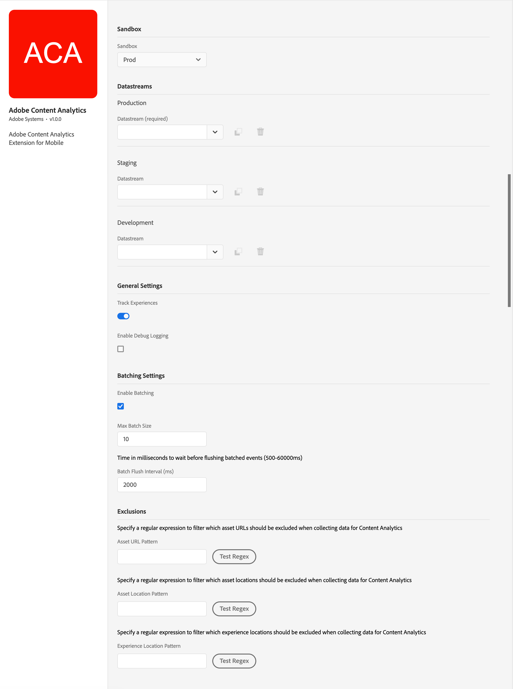

import Tabs from './tabs/index.md'
import InitializeSDK from '/src/pages/resources/initialize.md'

# Adobe Content Analytics

## Configure Content Analytics extension in the Data Collection UI

1. In the Data Collection UI, select the **Extensions** tab.
1. On the **Catalog** tab, locate the **Adobe Content Analytics** extension, and select **Install**.
1. Configure the extension settings. For more information, see [Configure Media Analytics Extension](#configure-media-analytics-extension).
1. Select **Save**.
1. Follow the publishing process to update your SDK configuration.

## Configure the Content Analytics extension

To configue the Content Analytics extension, complete the following steps:

### Sandbox

Select a Sandbox to use for Content Analytics.

### Datastreams

Select the datastream to use for Content Analytics for the Production (required), Staging, and Development environment.

### General Settings

Enable or disable **Track Experiences** to track experiences in Content Analytics or not. Default is enabled (true).

Select **Enable Debug Logging** to enable verbose debug logging for Content Analytics. Default is disabled (false).

### Batching Settings

Select **Enable Batching** to enable batching for Content Analytics.

Enter a value in **Max Batch Size** to define the maximum batch size. Default is `10`.

Enter a value in **Batch Flush Interval (ms)** to define a time in miliseconds to wait before flusing batched events. Default is `2000` (2 seconds).

### Exclusions

Specify exclusions for asset URLs, assets locations, and experience locations.

* Enter an **Asset URL Pattern** to specify a regular expression to filter which asset URLs should be excluded when collecting data for Content Analytics. For example: `.*\\.gif$|.*\\.svg$` to exclude GIF or SVG files. Use **Test Regex** to open the **Regular Expression Tester** where you can validate your regular expression. An example regular expression
* Enter an **Asset Location Pattern** to specify a regular expression to filter which asset locations should be excluded when collecting data for Content Analytics. For example: `^(debug|test).*` to exclude asset location that contain `debug` or `test`.  Use **Test Regex** to open the **Regular Expression Tester** where you can validate your regular expression.
* Enter an **Experience Location Pattern** to specify a regular expression to filter which experience locations should be excluded when collecting data for Content Analytics. For example: `^test\\..*|^dev\\..*` to exclude any experience location that contains `test.` or `dev.`  Use **Test Regex** to open the **Regular Expression Tester** where you can validate your regular expression.

## Add Content Analytics extension to your app

### Include Content Analytics extension as an app depencency.

Add MobileCore, Edge, EdgeIdentity, and Content Analytics as dependencies to your project.

<TabsBlock orientation="horizontal" slots="heading, content" repeat="3"/>

Kotlin (Android)

<Tabs query="platform=android-kotlin&task=add"/>

Groovy (Android)

<Tabs query="platform=android-groovy&task=add"/>

CocoaPods (iOS)

<Tabs query="platform=ios-pods&task=add"/>