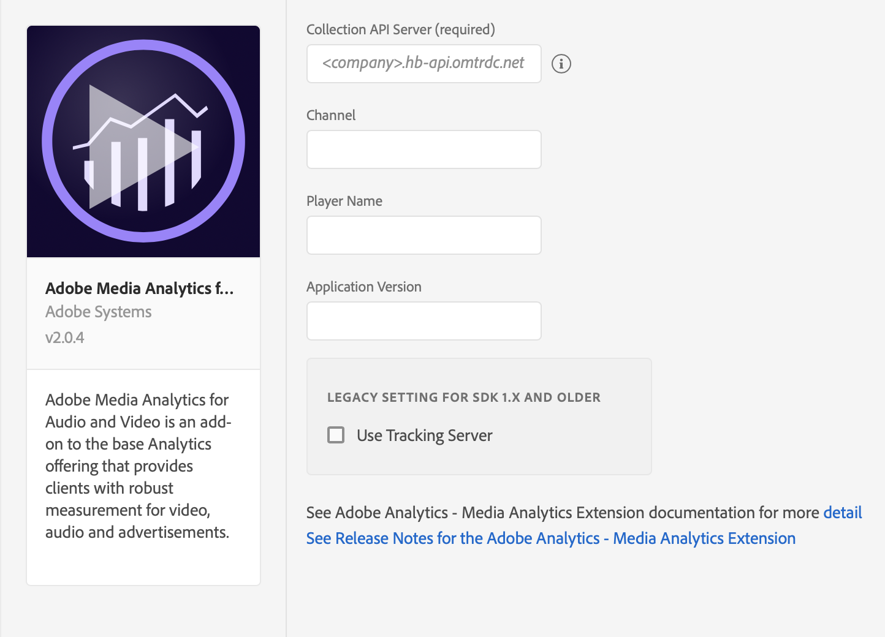

import Tabs from './tabs/index.md'
import InitializeSDK from '/src/pages/resources/initialize.md'

# Adobe Analytics - Media Analytics for Audio and Video

<InlineAlert variant="success" slots="header, text"/>
Adobe Streaming Media for Edge Network extension is now available!

Refer to the [Migrating to Media for Edge Network Guide](migration-guide.md) and [Media for Edge Network extension](../../edge/media-for-edge-network/index.md) documentation to learn more about implementing Streaming Media using Adobe Experience Edge Network.

<InlineAlert variant="warning" slots="text"/>

This extension requires the [Adobe Analytics for Media](https://experienceleague.adobe.com/docs/media-analytics/using/media-overview.html) add-on SKU. To learn more, contact your Adobe Customer Success Manager.

## Configure Media Analytics extension in the Data Collection UI

1. In the Data Collection UI, select the **Extensions** tab.
2. On the **Catalog** tab, locate the **Adobe Media Analytics for Audio and Video** extension, and select **Install**.
3. Type the extension settings. For more information, see [Configure Media Analytics Extension](#configure-media-analytics-extension).
4. Select **Save**.
5. Follow the publishing process to update your SDK configuration.

## Configure the Media Analytics extension

<InlineAlert variant="info" slots="text"/>

If you update the Adobe Media Analytics for Audio and Video tag extension to v2.x in your tag property, you must make sure to update and use AEP SDK Media extension v2.0.0 and higher.

To configure the Media Analytics extension, complete the following steps:

### Collection API Server

Type the name of the media collection API server. This is the server where the downloaded media tracking data is sent. Important: You need to contact your Adobe account representative for this information.

### Channel

Type the channel name property.

### Player name

Type the name of the media player in use (for example, _AVPlayer_, _Native Player_, or _Custom Player_).

### Application version

Type the version of the media player application/SDK.

<InlineAlert variant="info" slots="text"/>

Legacy settings should not be configured for Media Extension v2.x and higher. Those settings are only for backwards compatibility.

If you are using Media Extension v1.x, then go to Legacy settings section 1. Enable the `Use Tracking Server` checkbox. 2. In **Tracking Server**, Type the name of the tracking server to which all media tracking data should be sent.

## Add Media Analytics to your app

### Include Media Analytics extension as an app dependency

<InlineAlert variant="info" slots="text"/>

This extension requires the [Adobe Analytics extension](../adobe-analytics/index.md). You must add the Analytics extension to your mobile property and make sure the extension is correctly configured.

Add MobileCore, Analytics, Media Analytics extensions as dependencies to your project.

<TabsBlock orientation="horizontal" slots="heading, content" repeat="3"/>

Kotlin (Android)

<Tabs query="platform=android-kotlin&task=add"/>

Groovy (Android)

<Tabs query="platform=android-groovy&task=add"/>

CocoaPods (iOS)

<Tabs query="platform=ios-pods&task=add"/>

### Initialize Adobe Experience Platform SDK with Media Analytics Extension

Next, initialize the SDK by registering all the solution extensions that have been added as dependencies to your project with Mobile Core. For detailed instructions, refer to the [initialization](/src/pages/home/getting-started/get-the-sdk/#2-add-initialization-code) section of the getting started page.

Using the `MobileCore.initialize` API to initialize the Adobe Experience Platform Mobile SDK simplifies the process by automatically registering solution extensions and enabling lifecycle tracking.

<InitializeSDK query="componentClass=TabsBlock"/>

## Configuration keys

To update your SDK configuration programmatically, use the following information to change your Media configuration values. For more information, see [Configuration API reference](../../home/base/mobile-core/configuration/api-reference.md).

| Key | Required | Description | Data Type |
| :--- | :--- | :--- | :--- |
| `media.collectionServer` | Yes | Media Collection Server endpoint to which all the media tracking data is sent. For more information, see [Collection Server](#collection-api-server). | String |
| `media.channel` | No | Channel name. For more information, see [Channel](#channel). | String |
| `media.playerName` | No | Name of the media player in use, i.e., "AVPlayer", "HTML5 Player", "My Custom Player". For more information, see [Player Name](#player-name). | String |
| `media.appVersion` | No | Version of the media player app/SDK. For more information, see [Application Version](#application-version). | String |
