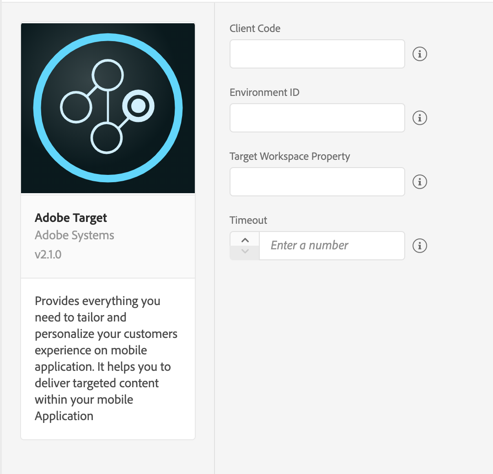

# Adobe Target

Adobe Target helps test, personalize, and optimize mobile app experiences based on user behavior and mobile context. You can deliver interactions that engage and convert through iterative testing and rules-based and AI-powered personalization.

To get started with Target, follow these steps:

1. Configure the Target extension in the Data Collection UI.
2. Add the Target Extension to your app.
3. Implement Target APIs to:
   * Request mbox offers.
   * Prefetch mbox offers.
   * Track mboxes.
   * Enter visual preview mode.

## Configure the Target extension in the Data Collection UI



1. In the Data Collection UI, select the **Extensions** tab.
2. On the **Catalog** tab, locate the Adobe Target extension, and select **Install**.
3. Your **Target** client code will be detected automatically.
4. Optionally, provide your Environment ID.
5. Set the timeout value to at least 5 seconds.
6. Optionally, enter the Target workspace property token that was generated from Target UI.
7. Select **Save**.
8. Follow the publishing process to update SDK configuration.

## Add the Target extension to your app

### Include Target extension as an app dependency

Add the MobileCore, Identity and Target extensions to your project using the app's Gradle file.

#### Android Kotlin

Add the required dependencies to your project by including them in the app's Gradle file.

```kotlin
implementation(platform("com.adobe.marketing.mobile:sdk-bom:3.+"))
implementation("com.adobe.marketing.mobile:core")
implementation("com.adobe.marketing.mobile:identity")
implementation("com.adobe.marketing.mobile:target")
```

<InlineAlert variant="warning" slots="text"/>

Using dynamic dependency versions is **not** recommended for production apps. Please read the [managing Gradle dependencies guide](../../resources/manage-gradle-dependencies.md) for more information.

#### Android Groovy

Add the required dependencies to your project by including them in the app's Gradle file.

```java
implementation platform('com.adobe.marketing.mobile:sdk-bom:3.+')
implementation 'com.adobe.marketing.mobile:core'
implementation 'com.adobe.marketing.mobile:identity'
implementation 'com.adobe.marketing.mobile:target'
```

<InlineAlert variant="warning" slots="text"/>

Using dynamic dependency versions is **not** recommended for production apps. Please read the [managing Gradle dependencies guide](../../resources/manage-gradle-dependencies.md) for more information.

#### iOS CocoaPods

Add the required dependencies to your project using CocoaPods. Add following pods in your `Podfile`:

```swift
use_frameworks!

target 'YourTargetApp' do
  pod 'AEPCore','~>5.0'    
  pod 'AEPIdentity','~>5.0'
  pod 'AEPTarget','~>5.0'
end
```

### Initialize Adobe Experience Platform SDK with Target Extension

Next, initialize the SDK by registering all the solution extensions that have been added as dependencies to your project with Mobile Core. For detailed instructions, refer to the [initialization](../../home/getting-started/get-the-sdk.md#2-add-initialization-code) section of the getting started page.

Using the `MobileCore.initialize` API to initialize the Adobe Experience Platform Mobile SDK simplifies the process by automatically registering solution extensions and enabling lifecycle tracking.

#### Android Kotlin

<InlineAlert variant="warning" slots="text"/>

This API is available starting from **Android BOM version 3.8.0**.

```kotlin
import com.adobe.marketing.mobile.LoggingMode
import com.adobe.marketing.mobile.MobileCore
...
import android.app.Application
...

class MainApp : Application() {
  override fun onCreate() {
    super.onCreate()
    MobileCore.setLogLevel(LoggingMode.DEBUG)
    MobileCore.initialize(this, "ENVIRONMENT_ID")
  }
}
```

#### Android Java

<InlineAlert variant="warning" slots="text"/>

This API is available starting from **Android BOM version 3.8.0**.

```java
import com.adobe.marketing.mobile.LoggingMode;
import com.adobe.marketing.mobile.MobileCore;
...
import android.app.Application;
...
public class MainApp extends Application {
  @Override
  public void onCreate(){
    super.onCreate();
    MobileCore.setLogLevel(LoggingMode.DEBUG);
    MobileCore.initialize(this, "ENVIRONMENT_ID");
  }
}
```

#### iOS Swift

<InlineAlert variant="warning" slots="text"/>

This API is available starting from **iOS version 5.4.0**.

```swift
// AppDelegate.swift
import AEPCore
import AEPServices
...

final class AppDelegate: NSObject, UIApplicationDelegate {
  func application(_: UIApplication, didFinishLaunchingWithOptions _: [UIApplication.LaunchOptionsKey: Any]? = nil) -> Bool {
    MobileCore.setLogLevel(.debug)
    MobileCore.initialize(appId: "ENVIRONMENT_ID")
    ...
  }
}
```

#### iOS Objective-C

<InlineAlert variant="warning" slots="text"/>

This API is available starting from **iOS version 5.4.0**.

```objectivec
// AppDelegate.m
#import "AppDelegate.h"
@import AEPCore;
@import AEPServices;
...
@implementation AppDelegate
- (BOOL)application:(UIApplication *)application didFinishLaunchingWithOptions:(NSDictionary *)launchOptions {
  [AEPMobileCore setLogLevel: AEPLogLevelDebug];  
  [AEPMobileCore initializeWithAppId:@"ENVIRONMENT_ID" completion:^{
      NSLog(@"AEP Mobile SDK is initialized");
  }];
  ...
  return YES;
}
@end
```

## Parameters in a Target request

Here is some information about the parameters in a Target request:

### Target Order class

The `TargetOrder` class encapsulates the order ID, the order total, and the purchased product IDs. You can instantiate this class to create order parameters.

#### Android Java

<CodeBlock slots="heading, code" repeat="2" />

#### Syntax

```java
public TargetOrder(final String id, final double total, final List<String> purchasedProductIds)
```

#### Example

```java
List<String> purchasedProductIds = new ArrayList<String>();
purchasedProductIds.add("34");
purchasedProductIds.add("125");
TargetOrder targetOrder = new TargetOrder("123", 567.89, purchasedProductIds);
```

#### iOS Swift

<CodeBlock slots="heading, code" repeat="2" />

#### Syntax

```swift
public init(id: String, total: Double = 0, purchasedProductIds: [String]? = nil)
```

#### Example

```swift
let order = TargetOrder(id: "id1", total: 1.0, purchasedProductIds: ["ppId1"])
```

#### iOS Objective-C

<CodeBlock slots="heading, code" repeat="2" />

#### Syntax

```objectivec
- (nonnull instancetype) initWithId: (nonnull NSString*) id total: (double) total purchasedProductIds: (nullable NSArray<NSString*>*) purchasedProductIds;
```

#### Example

```objectivec
AEPTargetOrder *order = [[AEPTargetOrder alloc] initWithId:@"id1" total:1.0 purchasedProductIds:@[@"ppId1"]];
```

\<!--- React Native

\<Tabs query="platform=react-native&task=target-order"/\> ---\>

### Target Product class

The `TargetProduct` class encapsulates the product ID and the product category ID, and you can instantiate this class to create order parameters.

#### Android Java

<CodeBlock slots="heading, code" repeat="2" />

#### Syntax

```java
public TargetProduct(final String id, final String categoryId)
```

#### Example

```java
TargetProduct targetProduct = new TargetProduct("123", "Books");
```

#### iOS Swift

<CodeBlock slots="heading, code" repeat="2" />

#### Syntax

```swift
public init(productId: String, categoryId: String? = nil)
```

#### Example

```swift
let product = TargetProduct(productId: "pId1", categoryId: "cId1")
```

#### iOS Objective-C

<CodeBlock slots="heading, code" repeat="2" />

#### Syntax

```objectivec
- (nonnull instancetype) initWithProductId:(nonnull NSString*) productId categoryId:(nullable NSString*) categoryId;
```

#### Example

```objectivec
AEPTargetProduct *product =[[AEPTargetProduct alloc] initWithProductId:@"pId1" categoryId:@"cId1"];
```

\<!--- React Native

\<Tabs query="platform=react-native&task=target-product"/\> ---\>

### Target Parameters

`TargetParameters` encapsulates `mboxParameters`, `profileParameters`, `orderParameters`, and `productParameters`, and allows you easily pass these parameters in a Target request.

#### Android Java

<CodeBlock slots="heading, code" repeat="2" />

#### Syntax

```java
TargetParameters targetParameters = new TargetParameters.Builder()
.parameters(new HashMap<String, String>())
.profileParameters(new HashMap<String, String>())
.product(new TargetProduct("productId", "productCategoryId"))
.order(new TargetOrder("orderId", 0.0, new ArrayList<String>()))
.build();
```

#### Example

```java
List<String> purchasedProductIds = new ArrayList<String>();
purchasedProductIds.add("34");
purchasedProductIds.add("125");
TargetOrder targetOrder = new TargetOrder("123", 567.89, purchasedProductIds);

TargetProduct targetProduct = new TargetProduct("123", "Books");

Map<String, String> mboxParameters = new HashMap<String, String>();
mboxParameters1.put("status", "platinum");

Map<String, String> profileParameters = new HashMap<String, String>();
profileParameters1.put("gender", "male");

TargetParameters targetParameters = new TargetParameters.Builder()
.parameters(mboxParameters)
.profileParameters(profileParameters)
.product(targetProduct)
.order(targetOrder)
.build();
```

#### iOS Swift

<CodeBlock slots="heading, code" repeat="2" />

#### Syntax

```swift
public init(parameters: [String: String]? = nil, profileParameters: [String: String]? = nil, order: TargetOrder? = nil, product: TargetProduct? = nil)
```

#### Example

```swift
let mboxParameters = [
"status": "Platinum"
]
let profileParameters = [
"gender": "female"
]

let order = TargetOrder(id: "id1", total: 1.0, purchasedProductIds: ["ppId1"])

let product = TargetProduct(productId: "pId1", categoryId: "cId1")

let targetParameters = TargetParameters(parameters: mboxParameters, profileParameters: profileParameters, order: order, product: product))
```

#### iOS Objective-C

<CodeBlock slots="heading, code" repeat="2" />

#### Syntax

```objectivec
- (nonnull instancetype) initWithParameters:(nullable NSDictionary<NSString*, NSString*>*) parameters profileParameters:(nullable NSDictionary<NSString*, NSString*>*) profileParameters order:(nullable AEPTargetOrder*) order product:(nullable AEPTargetProduct*) product;
```

#### Example

```objectivec
NSDictionary *mboxParameters = @{@"status":@"Platinum"};
NSDictionary *profileParameters = @{@"gender":@"female"};

AEPTargetProduct *product =[[AEPTargetProduct alloc] initWithProductId:@"pId1" categoryId:@"cId1"];

AEPTargetOrder *order = [[AEPTargetOrder alloc] initWithId:@"id1" total:1.0 purchasedProductIds:@[@"ppId1"]];

AEPTargetParameters * targetParams = [[AEPTargetParameters alloc] initWithParameters:mboxParameters profileParameters:profileParameters order:order product:product];
```

\<!--- React Native

\<Tabs query="platform=react-native&task=target-parameters"/\> ---\>

### Merge behavior of Target parameters

`TargetParameters`, such as `mboxParameters`, `profileParameters`, `orderParameters`, and `productParameters`, can be passed in the Target APIs and can also be passed in when you create `TargetPrefetch` or `TargetRequest` objects. The `TargetParameters` that are passed in the public APIs are global parameters and are merged with the corresponding parameters in the individual `TargetRequest` or `TargetPrefetch` objects.

When merging, the new keys in the mbox parameters or the profile parameters are appended to the final dictionary, and the keys with the same name are overwritten in each `TargetRequest` or `TargetPrefetch` object by the keys from the global parameters. For `TargetOrder` or `TargetProduct` objects, the object that is passed to the global parameters replaces the corresponding object in the `TargetRequest` or `TargetPrefetch` objects.

## Target sessions

The Target extension supports persistent sessions. When a Target request is received, if a session ID does not exist, a new ID is generated and is sent in the request. This ID, with the Edge Host that is returned from Target, is kept in persistent storage for the configured `target.sessionTimeout` period. If the timeout value is not configured, the default value is 30 minutes.

If no Target request is received during the configured `target.sessionTimeout` or if the [resetExperience](api-reference.md#resetexperience) API is called, these variables are reset and removed from persistent storage.

## Visual preview

The visual preview mode allows you to easily perform end-to-end QA activities by enrolling and previewing these activities on your device. This mode does not require a specialized testing set up. To get started, set up a URL scheme and generate the preview links. For more information about setting up Target visual preview, see [Target mobile preview](https://experienceleague.adobe.com/docs/target/using/implement-target/mobile-apps/target-mobile-preview.html). For more information about setting URL schemes for iOS, see [Defining a Custom URL Scheme for Your App](https://developer.apple.com/documentation/uikit/inter-process_communication/allowing_apps_and_websites_to_link_to_your_content/defining_a_custom_url_scheme_for_your_app). For more information about setting URL schemes for Android, see [Create Deep Links to App Content](https://developer.android.com/training/app-links/deep-linking).

You can also set an application deep link that can be triggered when selections are made in the preview mode by using the [setPreviewRestartDeeplink](api-reference.md#setpreviewrestartdeeplink) API.

To enter the preview visual mode, use the `collectLaunchInfo` API to enable the mode and select the red floating button that appears on the app screen. For more information, see [collectLaunchInfo](../../home/base/mobile-core/api-reference.md#collectlaunchinfo).

### Android

On Android, when the application is launched as a result of a deep link, the Mobile Core's [collectLaunchInfo](../../home/base/mobile-core/api-reference.md#collectlaunchinfo) API is internally invoked, and the Target activity and deep link information is extracted from the Intent extras.

The SDK can only collect information from the launching Activity if [setApplication](../../home/base/mobile-core/api-reference.md#setapplication) has been called. Setting the Application is only necessary on an Activity that is also an entry point for your application. However, setting the Application on each Activity has no negative impact and ensures that the SDK always has the necessary reference to your Application. We recommend that you call `setApplication` API in each of your Activities.

### iOS Swift

On iOS, the Mobile Core's [collectLaunchInfo](../../home/base/mobile-core/api-reference.md#collectlaunchinfo) API can be invoked with the Target preview deep link as shown below:

<CodeBlock slots="heading, code" repeat="1" />

#### Example

```swift
    MobileCore.collectLaunchInfo(["adb_deeplink" : "com.adobe.targetpreview://app.adobetarget.com?at_preview_token=tokenFromTarget"])
```

### iOS Objective-C

<CodeBlock slots="heading, code" repeat="1" />

#### Example

```objectivec
 [AEPMobileCore collectLaunchInfo:@{@"adb_deeplink" : @"com.adobe.targetpreview://app.adobetarget.com?at_preview_token=tokenFromTarget"}];
```

## Offer Prefetch

The SDK can minimize the number of times it reaches out to Target servers to fetch offers by caching server responses. With a successful prefetch call for mbox locations, offer content is retrieved and cached in the SDK. This content is retrieved from the cache for all future [retrieveLocationContent](api-reference.md#retrievelocationcontent) API calls for the specified mbox names. This prefetch process reduces the offer load time and network calls that were made to the Target servers, and the process allows Target to be notified which mbox was visited by the mobile app user.

<InlineAlert variant="warning" slots="text"/>

Prefetched offer content does not persist across application launches. The prefetch content is cached as long as the application lives in memory or until the API to clear the cache is called. For more information, see [clearPrefetchCache](api-reference.md#clearprefetchcache).

<InlineAlert variant="warning" slots="text"/>

Offer prefetch is not available while visual preview mode is enabled.

## Target with Analytics (A4T)

To track the performance of your Target activities for certain segments, set up the Analytics for Target (A4T) cross-solution integration by enabling the A4T campaigns. This integration allows you to use Analytics reports to examine your results. If you use Analytics as the reporting source for an activity, all reporting and segmentation for that activity is based on Analytics data collection. For more information, see [Adobe Analytics for Adobe Target (A4T)](https://experienceleague.adobe.com/docs/target/using/integrate/a4t/a4t.html).

Once Analytics is listed as the reporting source for an activity on Target UI, A4T works out of the box in the Target SDK. The Target SDK extension extracts the A4T payload from the Target server response, dispatches an event for Analytics SDK extension to send an internal track action request to the configured Analytics server.

The A4T payload returned from Target servers is sent to Adobe Analytics in the following cases:

* When one or more locations are retrieved using [retrieveLocationContent](api-reference.md#retrievelocationcontent) API call.
* When one or more prefetched locations are loaded and a subsequent [locationsDisplayed](api-reference.md#displayedlocations) API call is made for the location(s).

<InlineAlert variant="warning" slots="text"/>

For A4T data to be sent to Adobe Analytics client-side, make sure Analytics SDK extension is installed and registered in your mobile application. For more information on Adobe Analytics, please read the [Adobe Analytics guide](../adobe-analytics/index.md).

## Configuration keys

To programmatically update SDK configuration, use the following information to change your Target configuration values:

For more information, see [Programmatic updates to Configuration](../../home/base/mobile-core/configuration/index.md#programmatic-updates-to-configuration).

| Key | Description | Data Type |
| :--- | :--- | :--- |
| target.clientCode | Client code for your account. | String |
| target.timeout | Time, in seconds, to wait for a response from Target servers before timing out. | Integer |
| target.environmentId | Environment ID you want to use. If the value is left blank, the default production environment will be used. | Integer |
| target.propertyToken | `at_property` token value, which is generated from the Target UI. If this value is left blank, no token is sent in the Target network calls. | String |
| target.previewEnabled | Boolean parameter, which can be used to enable/disable Target Preview. If not specified, then Preview will be enabled by default. | Boolean |
| target.sessionTimeout | The duration, in seconds, during which the Target session ID and Edge Host are persisted. If this value is not specified, the default timeout value is 30 minutes. | Integer |
| target.server | _Optional_. If provided, all Target requests will be sent to this host. e.g. - `mytargetdomain.com` | String |

<InlineAlert variant="warning" slots="text"/>

Currently, the `target.sessiontimeout` value can only be configured programmatically. For more information, see [updateConfiguration](../../home/base/mobile-core/configuration/api-reference.md#updateconfiguration).
