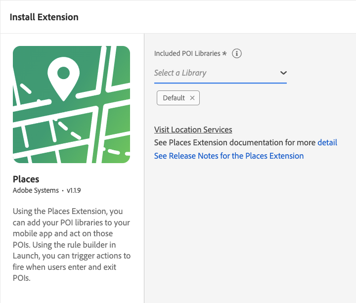

# Adobe Experience Platform Location Service

Places is the Adobe Experience Platform Mobile SDK extension that enables actions based on user location. It serves as the interface to the [Location Service Web Services APIs](https://experienceleague.adobe.com/docs/places/using/web-service-api/places-web-services.html).  

Places listens for events that contain GPS coordinates and geofence region events, then dispatches new events processed by the Rules Engine. It retrieves and delivers a list of the nearest points of interest (POI) based on app data obtained from the APIs. The regions returned by the APIs are stored in cache and persistence, allowing limited offline processing.  

## Configure the Places extension in Data Collection UI

1. In the Data Collection UI, from your mobile property, select the **Extensions** tab.
2. On the **Catalog** tab, locate or search for the **Places** extension, and select **Install**.
3. Select the **POI Library (or libraries)** you wish to use in the app.
4. Select **Save**.
5. Follow the publishing process to update SDK configuration.



## Add the Places extension to your app

### Include Places extension as an app dependency

Add the Mobile Core and Places extensions to your project using the app's Gradle file.

#### Android Kotlin

Add the required dependencies to your project by including them in the app's Gradle file.

```kotlin
implementation(platform("com.adobe.marketing.mobile:sdk-bom:3.+"))
implementation("com.adobe.marketing.mobile:core")
implementation("com.adobe.marketing.mobile:places")
```

<InlineAlert variant="warning" slots="text"/>

Using dynamic dependency versions is **not** recommended for production apps. Please read the [managing Gradle dependencies guide](../../resources/manage-gradle-dependencies.md) for more information.

#### Android Groovy

Add the required dependencies to your project by including them in the app's Gradle file.

```java
implementation platform('com.adobe.marketing.mobile:sdk-bom:3.+')
implementation 'com.adobe.marketing.mobile:core'
implementation 'com.adobe.marketing.mobile:places'
```

<InlineAlert variant="warning" slots="text"/>

Using dynamic dependency versions is **not** recommended for production apps. Please read the [managing Gradle dependencies guide](../../resources/manage-gradle-dependencies.md) for more information.

#### iOS CocoaPods

Add the required dependencies to your project using CocoaPods. Add following pods in your `Podfile`:

```swift
use_frameworks!
target 'YourTargetApp' do
   pod 'AEPCore', '~> 5.0'
   pod 'AEPPlaces', '~> 5.0'
end
```

### Initialize Adobe Experience Platform SDK with Places Extension

Next, initialize the SDK by registering all the solution extensions that have been added as dependencies to your project with Mobile Core. For detailed instructions, refer to the [initialization](../../home/getting-started/get-the-sdk.md#2-add-initialization-code) section of the getting started page.

Using the `MobileCore.initialize` API to initialize the Adobe Experience Platform Mobile SDK simplifies the process by automatically registering solution extensions and enabling lifecycle tracking.

#### Android Kotlin

<InlineAlert variant="warning" slots="text"/>

This API is available starting from **Android BOM version 3.8.0**.

```kotlin
import com.adobe.marketing.mobile.LoggingMode
import com.adobe.marketing.mobile.MobileCore
...
import android.app.Application
...

class MainApp : Application() {
  override fun onCreate() {
    super.onCreate()
    MobileCore.setLogLevel(LoggingMode.DEBUG)
    MobileCore.initialize(this, "ENVIRONMENT_ID")
  }
}
```

#### Android Java

<InlineAlert variant="warning" slots="text"/>

This API is available starting from **Android BOM version 3.8.0**.

```java
import com.adobe.marketing.mobile.LoggingMode;
import com.adobe.marketing.mobile.MobileCore;
...
import android.app.Application;
...
public class MainApp extends Application {
  @Override
  public void onCreate(){
    super.onCreate();
    MobileCore.setLogLevel(LoggingMode.DEBUG);
    MobileCore.initialize(this, "ENVIRONMENT_ID");
  }
}
```

#### iOS Swift

<InlineAlert variant="warning" slots="text"/>

This API is available starting from **iOS version 5.4.0**.

```swift
// AppDelegate.swift
import AEPCore
import AEPServices
...

final class AppDelegate: NSObject, UIApplicationDelegate {
  func application(_: UIApplication, didFinishLaunchingWithOptions _: [UIApplication.LaunchOptionsKey: Any]? = nil) -> Bool {
    MobileCore.setLogLevel(.debug)
    MobileCore.initialize(appId: "ENVIRONMENT_ID")
    ...
  }
}
```

#### iOS Objective-C

<InlineAlert variant="warning" slots="text"/>

This API is available starting from **iOS version 5.4.0**.

```objectivec
// AppDelegate.m
#import "AppDelegate.h"
@import AEPCore;
@import AEPServices;
...
@implementation AppDelegate
- (BOOL)application:(UIApplication *)application didFinishLaunchingWithOptions:(NSDictionary *)launchOptions {
  [AEPMobileCore setLogLevel: AEPLogLevelDebug];  
  [AEPMobileCore initializeWithAppId:@"ENVIRONMENT_ID" completion:^{
      NSLog(@"AEP Mobile SDK is initialized");
  }];
  ...
  return YES;
}
@end
```

## Configuration keys

To update SDK configuration programmatically, use the following information to modify Places configuration values. For additional details, refer to the [Configuration API reference](../../home/base/mobile-core/configuration/api-reference.md).  

| Key | Required | Description | Data Type |
| :--- | :--- | :--- | :--- |
| `places.endpoint` | Yes | Defines the endpoint used by the Places extension to retrieve POI data. The default value is `"query.places.adobe.com"`. | String |
| `places.libraries` | Yes | Defines the Places libraries that supply POI data. The default value is configured through the Data Collection tags mobile property settings for the Places extension. Example format: `[{"id": "123e4567-e89b-12d3-a456-426614174000"}]` | Array of objects |
| `places.membershipttl` | No | Specifies the duration, in seconds, that POI states remain valid. The default value is one hour (`3600`). | Double |

## Additional Location Service resources

For more information about implementing and using Adobe Experience Platform Location Service, refer to the following documentation links:

* [Overview](https://experienceleague.adobe.com/docs/places/using/home.html)
* [Places SDK implementation](https://experienceleague.adobe.com/en/docs/platform-learn/implement-mobile-sdk/app-implementation/places)
* [React Native Places SDK](https://github.com/adobe/aepsdk-react-native/tree/main/packages/places)
